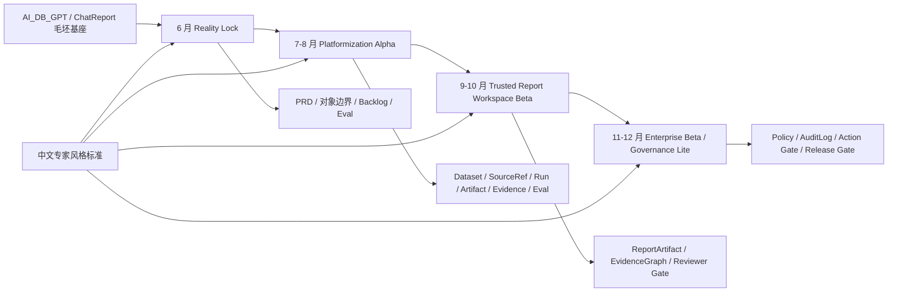

# t-agent 2026 H2 现实路线图

本文件是 2026 年下半年的现实执行 overlay。

它不替代 `02-roadmap/t-agent-roadmap.md`。canonical roadmap 定义 V1 / V2 / V3 / V4 的版本含义；本文件定义在当前团队、当前 AI_DB_GPT 毛坯代码基座、当前产品组织成熟度下，6 月到 12 月应该如何对齐、建设、验证和交付。

## 1. 产品委员会结论

Decision: `narrow`

2026 H2 不应承诺“完整完成 V2 -> V3 -> V4”。现实目标应该定义为：

> 基于 AI_DB_GPT / ChatReport 垂直切片，建设一个可信分析平台 Beta，而不是宣称已经完成企业级 Data Agent Core。

更具体地说：

- 6 月底前把 ChatReport 单点试点固化为团队共识、PRD、对象边界、backlog、eval 和 demo 路径。
- 7-8 月完成平台对象的 Alpha 化：Dataset、SourceRef、AnalysisRun、Artifact、Evidence、Eval 从 ChatReport 本地对象变成共享候选契约。
- 9-10 月形成可信报告工作台 Beta：报告、证据、评测、reviewer gate 可见。
- 11-12 月补 Governance Lite：权限、审计、发布门禁、action gate 的轻量骨架。

## 2. 现实判断

### Evidence

- AI_DB_GPT 是已有 DB-GPT 派生的毛坯 / 半成品代码基座，不是从零开始。
- AI_DB_GPT 已有 ChatExcel、ChatBI / ChatData、Knowledge、Agent、AWEL、ChatReport、文档治理、脚本、测试和验收材料。
- 当前最强产品切片仍然是 ChatReport v1.0：Excel-first、SourceRef / Dataset、受控运行、artifact、evidence、Markdown / HTML report、本地 acceptance record。
- `KnowledgeAsset`、`AnalysisRun`、`Artifact`、`Evidence`、`Eval` 等对象目前更像 ChatReport 局部概念或候选契约，还没有被完整锁定为团队共享平台目标。
- ProductFactory 检索命中：`2026-06-13 AI 产品思想源地图`、`2026-06-13 ProductFactory x ChatReport 对接研究记录`、`google-agentic-architecture-components`、`anthropic-agent-evals`、`openai-practical-guide-agents`、`openai-agents-sdk-evolution`、`openai-agent-evals`。
- 外部研究命中：OpenAI 强调从真实任务判断 agent 必要性，并把 agent、tool、handoff、guardrail、tracing、evals 作为工程对象；Anthropic 强调 agent 系统要简单、可组合、可评测；Google PAIR 强调以用户需求、信任校准和可解释交互为中心；Google ML engineering 强调先建立可靠指标、数据、基础设施和回归能力。

### Assumption

- 下一步最有价值的工作不是抽象一个完整平台，而是从 ChatReport 中提取一组共享平台对象和可见工作台路径。
- 6 月剩余时间最重要的是锁定共同迭代目标，而不是扩大功能列表。
- 当前团队可以做出“可信分析平台 Beta”，但无法在 6 个月内稳定交付完整 V2、V3、V4。

### Unknown

- AI_DB_GPT 哪些代码路径在当前部署环境里可以稳定复用。
- 真实业务数据、golden questions、指标定义、预期报告标准是否足够。
- 后端资源能否及时承接平台对象持久化、API、权限和审计。
- Product / Agent 研发团队能否形成稳定的 PRD -> contract -> backlog -> eval -> release ritual。

## 3. 团队资源可行性判断

当前资源假设：

- 1 位中级算法工程师；
- 3 位初级到中级算法 / Agent 研发工程师；
- 2 位初级 AI 产品经理；
- 1 位 AI 产品负责人；
- 可能再补 1-2 位资深 Agent 研发工程师；
- 可能有 2-3 位后端工程师参与。

判断：

| 问题 | 结论 | 原因 |
|---|---|---|
| 6 个月完整完成 V2 + V3 + V4 是否合理 | 不合理 | V4 涉及 Core Service、IAM、Action Governance、AgentOps、EvalOps、FinOps、多租户和企业级运维，已超过当前团队成熟度和资源带宽。 |
| 6 个月完成可信分析平台 Beta 是否合理 | 合理但要收敛 | 依赖 AI_DB_GPT / ChatReport 基座，可以通过垂直切片先验证对象、证据、eval 和 reviewer gate。 |
| 是否应该继续喊“企业级迭代平台” | 可以，但定义要降级 | 今年的企业级不是完整平台，而是企业级质量标准：可追溯、可评测、可审阅、可治理、可交接。 |
| 是否要新建大目录 | 暂不需要 | 现有 `01-product` 到 `09-agents` 足够，新增内容应进入已有目录，避免再开一个平行工作台。 |

产品委员会建议：

> 今年的企业级迭代平台 = 一套围绕可信分析闭环的团队工作台和对象契约，而不是完整企业级平台服务。

## 4. 中文与专家风格要求

从本次更新开始，本仓库重要文档默认使用中文。

写作风格要求：

- 产品经理风格：像 Anthropic / Google 级 AI 产品团队一样写，先讲用户任务、产品承诺、非目标、验收，不写空泛愿景。
- AI researcher 风格：把 evidence、assumption、unknown 分开；保留来源、实验、反例和置信度。
- 技术专家风格：把系统边界、对象契约、数据流、控制流、失败模式、权限、eval、observability 和成本写清楚。
- 交付风格：每个阶段必须能落到 PRD、contract、backlog、eval、demo artifact 或 decision。
- 图示风格：系统性文档必须有可读架构图。Git-native 文档优先用 Mermaid；需要视觉精修和导出时再补 draw.io。

详细规范见：

- `09-agents/expert-style-guide.md`
- `04-sources/evidence-cards/2026-06-15-ai-product-expert-style-benchmarks.md`
- `03-architecture/diagrams/reality-roadmap-operating-architecture.md`

## 5. 专家风格标杆

这些不是“模拟某个人”，而是为团队文档和评审建立风格标杆。

| 标杆 | 建议采用的能力 | 在 t-agent 中的使用方式 |
|---|---|---|
| OpenAI practical agents | 从真实任务判断是否需要 agent；围绕 tools、handoffs、guardrails、tracing、evals 建设 | Agent Architect / Eval Lead 写多 agent、tool-use、AgentOps、EvalOps 时必须参考。 |
| OpenAI Agents SDK | agent、tool、handoff、guardrail、trace 的工程对象化 | V3 / V4 设计 runtime contract、trace、guardrail 和 release gate 时使用。 |
| Anthropic agent engineering | 简单 agent loop、workflow / agent 区分、routing、parallelization、orchestrator、evaluator、eval-first | Agent Architect / Eval Lead 写 runtime、tool、eval、trace 时使用。 |
| Anthropic eval / context engineering | 任务分解、上下文组织、agent eval、失败样例、可复现实验 | 所有 PRD 和 roadmap 必须把“怎么验收”写在范围内。 |
| Mike Krieger 式产品工程口径 | PM、设计、工程一体化，面向真实用户交付 | Product Lead 写产品承诺、团队协作和最小切片时使用。 |
| Google PAIR | user needs、trust calibration、explainability、feedback、human-centered AI | User Research / Product Lead 写用户场景、可解释状态和用户控制时使用。 |
| Google ML engineering / Martin Zinkevich | 指标、数据、基础设施、回归、简单系统优先 | Data Product / Eval Lead 写 golden cases、metric definition 和质量门禁时使用。 |
| Google DeepMind / Google Research systems lens | 长周期研究目标、系统规模、模型能力与工程边界 | Agent Architect 写 V4 Core Service、AgentOps、EvalOps 时使用。 |
| Google Cloud agent architecture | 按工作负载选择 agent 组件、工具、编排和治理 | 技术方案不要一上来做通用 multi-agent，要从受控工作流开始。 |

## 6. 路线图分层

| 层级 | 文件 | 用途 | 变更规则 |
|---|---|---|---|
| 项目 SSOT | `agent.md` | 定义产品事实、版本事实、写作风格、权威顺序 | 重大变更必须同步相关 roadmap / PDR |
| 版本北极星 | `02-roadmap/t-agent-roadmap.md` | 定义 V1 / V2 / V3 / V4 含义和非目标 | 只能通过 accepted PDR 改版本含义 |
| 现实执行 overlay | 本文件 | 定义 H2 阶段、团队对齐、工作流和验收 | 每个 planning cycle 可更新 |
| 专家风格指南 | `09-agents/expert-style-guide.md` | 定义中文文档、专家面板、来源使用和图示要求 | 风格研究变化时更新 |
| 产品决策 | `05-decisions/product-decisions/PDR-2026-06-15-reality-roadmap-management.md` | 解释为什么需要 reality roadmap | 方向变化时更新 |
| Backlog | `02-roadmap/backlog/product-backlog.md` | 跟踪 shaped work items 和 owner | 每轮迭代更新 |
| PRD / Contract / Eval | `01-product/prd/`, `03-architecture/contracts/`, `07-evals/` | 把路线图变成团队可执行验收 | `ready` 前必须具备 |

## 7. 2026 H2 现实目标

到 2026 年底，现实目标是：

```text
可信分析平台 Beta
  = AI_DB_GPT / ChatReport 真实业务质量关闭
  + Dataset / SourceRef / Run / Artifact / Evidence / Eval 共享契约
  + 一个可见工作台路径
  + 一个或两个验证过的业务工作流
  + Governance Lite
```

不要宣称：

- 完整 V4 Enterprise Data Agent Core；
- 完整多租户 IAM / RBAC / ABAC；
- 完整 AgentOps / EvalOps / FinOps；
- 开放 SkillHub 或 marketplace；
- 任意动态 DAG 或用户自定义 agents；
- 真实业务报告已达生产质量，除非真实数据、golden questions、指标定义和预期报告标准通过 review。

## 8. H2 操作架构图



更完整的图示 artifact 见 `03-architecture/diagrams/reality-roadmap-operating-architecture.md`。

## 9. 6 月 15-30 日：Reality Lock

目的：

> 把 ChatReport 单点试点固化成团队共享迭代目标。

### 交付物

| 工作流 | 6 月 30 日前交付 | Owner 视角 | 验收 |
|---|---|---|---|
| 产品对齐 | V2 Reality PRD 大纲和一页产品 brief | Product Lead, AI Product Owner | 团队能用一句话说清同一个目标 |
| 代码基线 | AI_DB_GPT baseline demo / handoff map | Agent Architect, Knowledge Librarian | 所有人知道 README、主文档、脚本、测试、ChatReport 路径在哪里 |
| 对象锁定 | Dataset / SourceRef / AnalysisRun / Artifact / Evidence / Eval gap map | Data Product, Agent Architect | 每个对象有 owner、当前位置、gap、下一步 |
| 真实业务验证 | 数据 / golden question / 指标定义 / 报告标准 intake checklist | User Research, Eval Lead | 缺口显性化，不藏在“后面补” |
| 工作台打样 | 一个 task-first ChatReport review path | Product, Design, Frontend / Agent Engineer | 能看到 run、plan、artifact、evidence、warning、eval status |
| 工程拆分 | Workstream backlog 和 owner map | Product Lead, Tech Lead | 每个 work item 有 owner、输出、依赖、验证 |
| 治理 | Reality roadmap 管理 PDR 和专家风格指南 | Product Lead, Red Team | 旧 roadmap、reality roadmap、风格规则关系清楚 |

### 6 月工作流

| ID | 工作流 | 关键问题 | 输出目标 |
|---|---|---|---|
| RR-JUN-01 | Current-state audit | AI_DB_GPT 已经有什么，在哪里？ | `04-sources/ai-dbgpt/project-baseline-index.md` |
| RR-JUN-02 | Product target | 下一轮用户和团队到底会看到什么？ | `01-product/prd/PRD-V2-reality-platformization-and-chatreport-closure.md` |
| RR-JUN-03 | Object boundary | 哪些 ChatReport 局部对象要升级为共享平台候选？ | `03-architecture/contracts/platform-object-gap-map-v0.md` |
| RR-JUN-04 | Real-business eval | 从 `Accepted with Warning` 到真实质量关闭需要哪些输入？ | `07-evals/` |
| RR-JUN-05 | Workbench UX | PM、分析师、工程师如何检查 run / artifact / evidence / warning？ | `08-design-prototypes/flows/` |
| RR-JUN-06 | Backlog and owners | 每位工程师 / PM 下一步具体负责什么？ | `02-roadmap/backlog/product-backlog.md` |

## 10. 7-8 月：Platformization Alpha

目的：

> 让平台对象可见、可复用，但不提前拆成独立平台服务。

范围：

- 把 ChatReport `SourceRef`、`Dataset`、`AnalysisRun`、`ReportArtifact`、`EvidenceRecord`、`EvalResult` 对齐到 t-agent contracts。
- 只在直接影响报告、回答、证据引用的地方建设 `KnowledgeAsset Lite`。
- 工作台展示发生了什么：数据源、plan、steps、artifacts、evidence、warnings、eval result。
- 保持 ChatReport 是验证垂直，但避免把可复用对象藏在 ChatReport-only 假设里。

非目标：

- 不抽完整 Core Service；
- 不做开放 skill search；
- 不支持任意 multi-agent topology；
- 不在一个 workflow 过关前扩到多个业务域。

验收：

- 一个真实或代表性业务 workflow 可以端到端运行；
- 重要 claim 有 artifact / evidence；
- failure 进入 eval case 或 backlog；
- 团队能说明哪些是 ChatReport 垂直逻辑，哪些是平台候选能力。

## 11. 9-10 月：Trusted Report Workspace Beta

目的：

> 把单点垂直切片变成可 review 的产品工作流。

范围：

- Report planning、artifact shelf、evidence drawer、reviewer gate、warning states。
- 真实业务 validation pack：golden questions、metric definitions、expected report sections、quality rules。
- ChatBI / 现有 BI adapter spike 只在目标数据路径有 owner 时进入。
- Dashboard insight 限制在受控 artifact / view model 消费范围内。

验收：

- 没有 evidence 和 eval status 的报告不能标记 publishable；
- reviewer gate 能阻断 unsupported claim；
- 至少一个 workflow 有可重复 eval 结果。

## 12. 11-12 月：Enterprise Beta / Governance Lite

目的：

> 为企业试点准备可信 Beta，但不宣称完整 V4。

范围：

- PermissionAdapter / Policy / AuditLog Lite；
- export、share、write-back、external publishing 的 action policy；
- 带 eval 和 reviewer decision 的 release gate；
- 为未来 ChatExcel、ChatBI、ChatReport、Dashboard 复用起草 platform API / contract。

验收：

- 高风险 action 默认 dry-run 或 approval-gated；
- 已发布 artifact 能追溯到 run、data、evidence 和 reviewer decision；
- V4 未完成项被显式记录为 future work。

## 13. 如何回答当前问题

### 今年能不能完成 V2 到 V3 到 V4？

不能按完整版本含义完成。当前资源可以完成的是：

```text
V2 核心能力可见化
  + V3 可信报告工作台的 Beta 形态
  + V4 Governance Lite 的骨架
```

这应该被描述为“可信分析平台 Beta”，不是“完整企业级 Data Agent Core”。

### 当前应该迭代什么？

迭代共享可信分析闭环：

```text
SourceRef / Dataset
  -> AnalysisRun / StepRun / ToolCall
  -> Artifact / Evidence
  -> ReportArtifact / Workbench
  -> Eval / ReviewerDecision / Feedback
```

`KnowledgeAsset` 先做 Lite，并且只在明确影响输出质量和 evidence 的地方做。

### 怎么对齐团队？

6 月 Reality Lock 会议只对齐四个东西：

- 产品目标一页纸；
- AI_DB_GPT 代码基线图；
- 对象 / 契约 gap map；
- 带 owner 和验收标准的 backlog。

### 怎么形成 PRD？

创建 V2 Reality PRD，而不是泛 V2 平台 PRD。

最小章节：

- target workflow；
- users and jobs；
- 复用哪些 AI_DB_GPT 资产；
- 平台候选对象；
- ChatReport 垂直职责；
- 非目标；
- acceptance gates；
- owner map；
- eval pack。

### 产品和研发怎么协作？

按 workstream，不按抽象版本：

- Product Owner 负责目标工作流、非目标、业务 intake、评审节奏；
- 2 位 AI PM 负责 PRD hygiene、backlog、会议对齐、用户验证记录；
- Agent 研发负责 runtime、planner、artifact、evidence、eval integration；
- 后端负责 persistence、API、permission、audit、deployment path；
- 资深 Agent 研发如果到位，优先负责对象边界、runtime 契约、eval harness，而不是临时堆功能。

### 需要新建目录吗？

不需要新的顶级目录。

使用现有目录：

| 需求 | 目录 |
|---|---|
| 现实路线图 | `02-roadmap/` |
| Backlog 和 owner 拆分 | `02-roadmap/backlog/` |
| PRD | `01-product/prd/` |
| 共享对象契约 | `03-architecture/contracts/` |
| 架构图 artifact | `03-architecture/diagrams/` |
| AI_DB_GPT 来源和代码基线 | `04-sources/ai-dbgpt/` |
| 外部风格研究证据 | `04-sources/evidence-cards/` |
| Product Decision | `05-decisions/product-decisions/` |
| 迭代草稿和 messy input | `06-iteration/` |
| Golden questions / eval / failures | `07-evals/` |
| Workbench flow 和 mockups | `08-design-prototypes/` |
| 专家风格、agent routing、review protocol | `09-agents/` |

只在现有目录拥挤时新增子目录。

## 14. 立即下一批产物

建议顺序：

1. `01-product/prd/PRD-V2-reality-platformization-and-chatreport-closure.md`
2. `03-architecture/contracts/platform-object-gap-map-v0.md`
3. `07-evals/golden-questions/V2-reality-chatreport-quality-closure.md`
4. `08-design-prototypes/flows/chatreport-trusted-analysis-workbench-flow.md`
5. `02-roadmap/backlog/product-backlog.md` owner/status update

## 15. 主风险

主风险不是做不出 demo，而是团队一边说自己在做平台，一边仍然只在实现 ChatReport 局部逻辑。

缓解方式：

- canonical roadmap 保持北极星；
- reality roadmap 作为执行计划；
- 每一个“平台化”主张都必须指向至少一个 contract、一个 code path、一个 eval、一个 owner；
- 每个重要文档默认中文，并强制写 evidence / assumption / unknown；
- 每个系统性方案配图，避免文字抽象漂浮。

## 16. 来源

ProductFactory 检索：

- `10 Research/2026-06-13 AI 产品思想源地图.md`
- `08 Runs/2026-06-13 ProductFactory x ChatReport 对接研究记录.md`
- `17 Review Queue/google-agentic-architecture-components.md`
- `17 Review Queue/anthropic-agent-evals.md`
- `17 Review Queue/openai-practical-guide-agents.md`
- `17 Review Queue/openai-agents-sdk-evolution.md`
- `17 Review Queue/openai-agent-evals.md`

外部来源：

- [OpenAI: A practical guide to building agents](https://openai.com/business/guides-and-resources/a-practical-guide-to-building-ai-agents/)
- [OpenAI: Agents SDK](https://developers.openai.com/api/docs/guides/agents)
- [OpenAI Agents SDK: Orchestration](https://developers.openai.com/api/docs/guides/agents/orchestration)
- [OpenAI Agents SDK: Guardrails and approvals](https://developers.openai.com/api/docs/guides/agents/guardrails-and-approvals)
- [OpenAI Agents SDK: Integrations and observability](https://developers.openai.com/api/docs/guides/agents/integrations-observability)
- [OpenAI: Agent Evals](https://developers.openai.com/api/docs/guides/agent-evals)
- [OpenAI: Tools](https://developers.openai.com/api/docs/guides/tools)
- [Anthropic: Building effective agents](https://www.anthropic.com/engineering/building-effective-agents)
- [Anthropic: Demystifying evals for AI agents](https://www.anthropic.com/engineering/demystifying-evals-for-ai-agents)
- [Anthropic: Effective context engineering for AI agents](https://www.anthropic.com/engineering/effective-context-engineering-for-ai-agents)
- [Google PAIR: People + AI Guidebook](https://pair.withgoogle.com/guidebook/)
- [Google PAIR: User Needs + Defining Success](https://pair.withgoogle.com/chapter/user-needs/)
- [Google PAIR: Explainability + Trust](https://pair.withgoogle.com/chapter/explainability-trust/)
- [Google: Rules of Machine Learning](https://developers.google.com/machine-learning/guides/rules-of-ml)
- [Google Cloud: AI agents](https://cloud.google.com/discover/what-are-ai-agents)
