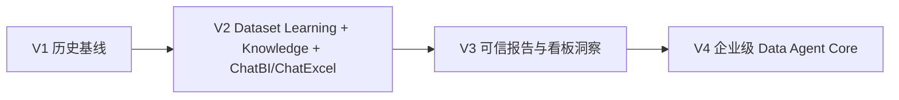

# t-agent 版本路线图

本文件是 t-agent V1/V2/V3/V4 的版本路线 SSOT。  
`agent.md` 是项目级入口；本文件只定义版本边界和核心能力，不写长篇背景。

## 1. 读取规则

冲突时按以下顺序判断：

1. `agent.md`
2. 本文件
3. `05-decisions/` 下已接受的 PDR / ADR
4. 当前 active PRD、backlog、contract、eval
5. AI_DB_GPT canonical context / accepted ADR
6. AI_DB_GPT research / inspiration
7. `idealization/5月/` 历史材料

写作规则：路线图只写阶段目标、核心能力、非目标、验收门槛；不要在这里展开研究过程和长篇解释。

## 1.1 路线图分层

本文件是 canonical version roadmap，只定义 V1 / V2 / V3 / V4 的版本含义、非目标和进入条件。

现实执行排期使用：

- `02-roadmap/t-agent-reality-roadmap-2026-h2.md`

管理规则：

- canonical roadmap 是北极星，不等于今年全部承诺交付。
- reality roadmap 是执行 overlay，用于团队对齐、PRD、backlog、owner 和验收。
- 如果 reality roadmap 改变版本含义，必须新增或更新 PDR，并同步更新 `agent.md` 与本文件。

## 2. 总览

| 版本 | 阶段定位 | 一句话目标 | 当前状态 |
|---|---|---|---|
| V1 | 历史基线 | 证明 DB-GPT / t-agent 能承载 ChatBI、ChatExcel 类 Data Agent 入口。 | 历史输入，不是当前建设目标 |
| V2 | 平台能力迭代 + 入口集成 | 做 Dataset Learning、Knowledge Base，并接入现有 ChatBI 与 ChatExcel 单文件/单表分析报告。 | 当前主目标 |
| V3 | 可信洞察与报告工作台 | 在 V2 底座上建设 ChatReport、Dashboard Insight、EvidenceGraph、Reviewer Gate、Report Eval。 | 下一阶段 |
| V4 | 企业级 Data Agent Core | 把稳定能力抽象为企业核心服务，补齐治理、Action Control、AgentOps、EvalOps、FinOps。 | 长期平台化 |

## 3. V1：历史基线

**定位**：双入口 MVP / 历史验证。

**核心能力**：

- ChatExcel / ChatBI 两类入口雏形。
- Dataset Learning 早期方案。
- 个人知识上传与问数上下文雏形。
- Run Trace / Eval 的早期判断。

**当前处理**：

- V1 只作为历史输入。
- 不继续以 V1 口径扩需求。
- 有价值内容沉淀到 V2 的 Dataset Learning、Knowledge Base、ChatBI Adapter、ChatExcel 入口。

## 4. V2：平台能力迭代 + 入口集成

**定位**：当前建设目标。

**一句话**：

> V2 = Dataset Learning + Knowledge Base + 现有 ChatBI 集成 + ChatExcel 单文件/先单表分析报告迭代。

### 4.1 核心能力

| 能力域 | V2 要做到什么 |
|---|---|
| Dataset Learning | 形成 `Dataset`、`DatasetVersion`、`DatasetField`、`DatasetProfile`、`LearningJob`；支持字段画像、语义标签、同义词、可问范围、敏感标记、人工校正和版本记录。 |
| Knowledge Base | 支持个人/项目知识导入、来源记录、scope、trust level、绑定到用户/会话/数据集/任务，并在回答或报告草稿中引用。 |
| ChatBI Adapter | 不重做 ChatBI；通过 adapter 调用现有 ChatBI，传递权限上下文，标准化结果，并写入 t-agent run trace。 |
| ChatExcel | 支持单文件，初期限制单主表；完成字段学习、问数、表格/图表/摘要、分析报告草稿。 |
| 可见分析过程 | 展示 plan、字段选择、SQL/计算步骤、tool call、table/chart artifact、evidence、warning、可编辑 checkpoint。 |
| Trace / Eval Lite | 记录 QueryRun / AnalysisRun Lite、ToolTrace、FieldHit、KnowledgeHit、Artifact Lite、Feedback；支持 10-20 条 golden cases 回放。 |

### 4.2 V2 不做

- 不把销售经营报告作为 V2 定义。
- 不做完整 ChatReport。
- 不做完整 Dashboard Insight。
- 不做完整 Skill Hub / Asset Hub。
- 不做完整 Semantic / Metric Center。
- 不做企业多租户、SSO、完整权限治理。
- 不把飞书发布作为 V2 gate。
- 不暴露隐藏模型 chain-of-thought；只展示可审计的分析过程。

### 4.3 V2 验收门槛

- ChatExcel 单文件/单表能生成可复用 Dataset Learning 结果。
- 字段语义、同义词、可问范围、敏感标记可人工校正并版本化。
- KnowledgeAsset 能影响输出，并能被引用。
- ChatBI 能通过 Adapter 被调用，结果进入统一 run trace。
- 分析报告草稿只引用可追踪的数据、SQL/计算、图表或知识。
- 用户能看到 plan、步骤、artifact、evidence、warning 和可编辑节点。
- 至少 10-20 条 V2 golden cases 可回放，有 pass/fail 和失败原因。

## 5. V3：可信洞察与报告工作台

**定位**：从“可信问数/单表分析”进入“可信报告/看板洞察”。

**进入条件**：V2 的 Dataset Learning、Knowledge Base、ChatBI Adapter、ChatExcel、Trace、Artifact、Eval Lite 已可用。

### 5.1 核心能力

| 能力域 | V3 要做到什么 |
|---|---|
| ChatReport MVP | 报告意图理解、Report Planner、报告大纲、分章节撰写、Markdown-first ReportArtifact、人工编辑。 |
| EvidenceGraph | 建立 claim -> metric / SQL / table / chart / knowledge / rule / reviewer decision 的证据链。 |
| Artifact Hub Lite+ | 管理 report、chart、table、SQL、insight card、dashboard view model、material basket、artifact version/status。 |
| Dashboard Insight | 支持单图解读、看板摘要、趋势解释、异常解释、贡献分析；只消费受控 view model / artifact。 |
| Reviewer Gate | 产品、商分、技术/治理 reviewer 能阻断无证据、越权或质量不足的报告。 |
| Report / Dashboard Eval | 检查数字准确性、引用完整性、证据支持、口径一致性、叙事边界。 |
| Workbench UX | 任务优先工作台：run timeline、artifact shelf、evidence drawer、warning state。 |

### 5.2 V3 不做

- 不做开放 skill 市场。
- 不做任意动态 multi-agent DAG。
- 不允许用户运行时创建 agent。
- 不做自动业务行动。
- 不拆企业 Core Service。
- 不做完整多租户治理。

### 5.3 V3 验收门槛

- 报告关键 claim 都能追到 evidence。
- Dashboard insight 只基于受控 artifact / view model。
- Reviewer Gate 能阻断不可发布报告。
- Report Eval 能发现数字、引用、口径、证据边界问题。
- V3 产物能复用 V2 的 Dataset、Knowledge、Run、Artifact。

## 6. V4：企业级 Data Agent Core

**定位**：从应用能力升级为企业核心服务。

**进入条件**：V2/V3 能力经过真实报告、看板、证据、reviewer、eval 工作流验证。

### 6.1 核心能力

| 能力域 | V4 要做到什么 |
|---|---|
| Core Service | dataset learning、knowledge、run trace、artifact、eval、capability、governance 形成清晰服务边界。 |
| OpenAPI | 为 ChatBI、ChatExcel、ChatReport、Dashboard、DAW、未来垂直 agents 提供稳定 API。 |
| Permission / IAM | SSO/IAM、RBAC/ABAC、数据集/字段/知识/tool/export 权限策略。 |
| Tool / Action Governance | Action registry、风险等级、审批、dry-run、幂等、回滚、审计、ShareRecord。 |
| AgentOps | capability 版本、runtime trace、模型路由 guardrail、回归测试、发布控制。 |
| EvalOps | golden cases、reviewer rubric、deterministic checks、run replay、release gate、质量趋势。 |
| FinOps / Ops | token/model/query/storage 成本、配额、延迟、失败率、环境隔离、部署控制。 |
| Asset / Skill Operations | Skill Hub、Asset Hub、case library、analysis framework library、受控发布和复用。 |

### 6.2 V4 不做

- 不跳过 V2/V3 直接建设通用平台。
- 不允许各应用继续私有化 Dataset Learning、Knowledge、Trace、Artifact、Eval。
- 不把 RAG 当成 Semantic / Metric Contract。
- 不把 tool registry 当成 Action Governance。
- 不把垂直 Domain Agent 作为 V4 起点；它们是 V4+ 扩展。

### 6.3 V4 验收门槛

- 多应用能通过统一 API 消费平台能力。
- 高风险 action 默认 dry-run，外发/写回必须审批和审计。
- Dataset、Knowledge、Artifact、Eval、Permission 具备跨应用一致性。
- AgentOps / EvalOps 能支撑版本回归和发布门禁。

## 7. 版本依赖

关键依赖：

- V3 依赖 V2：没有稳定 Dataset / Knowledge / Trace / Artifact / Eval，就不能做可信报告和看板洞察。
- V4 依赖 V3：没有经过报告、看板、证据、reviewer、eval 验证的能力，不应抽象成企业 Core Service。

## 8. 旧材料处理

| 旧说法 | 当前处理 |
|---|---|
| V2 = 销售经营黄金数据集平台化试点 | 降级为候选 golden workflow / eval pack。 |
| V2 包含深度报告生成和飞书交付 | 移到 V3；V2 只保留必要的报告草稿和 artifact 引用。 |
| V3 = 泛企业增强 | 拆分为 V3 可信洞察/报告工作台，V4 企业 Core。 |
| V4 = 行动型 Agent | V4 先做 Action Governance；自动业务行动属于 V4+。 |
| Skill Hub / Asset Hub 直接进 V3 | V3 可沉淀资产；市场化、运营化放到 V4。 |

## 9. 下一步

1. 评审 `02-roadmap/t-agent-reality-roadmap-2026-h2.md`，明确 2026 H2 现实执行 overlay。
2. 建 V2 Reality PRD：围绕 AI_DB_GPT / ChatReport 基座，把下一轮平台化和真实业务质量关闭说清楚。
3. 建 V2 domain-neutral eval pack：Dataset Learning、Knowledge Base、ChatBI Adapter、ChatExcel 单文件/单表分析报告。
4. 决定销售经营问题集归属：V2 candidate eval 还是 V3 report workflow eval。
5. 建 V3 report / dashboard eval plan。
6. 建 V4 governance 和 action-control 架构说明。
