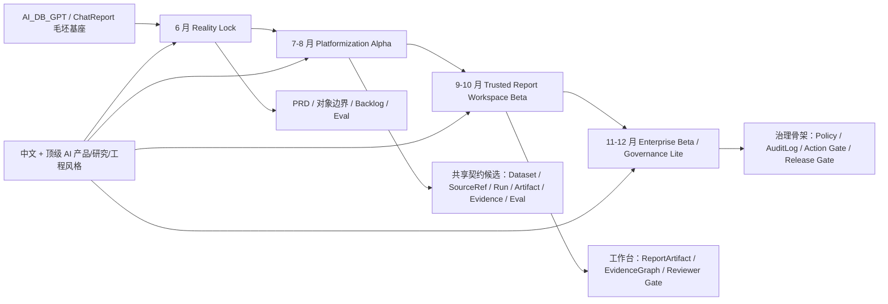
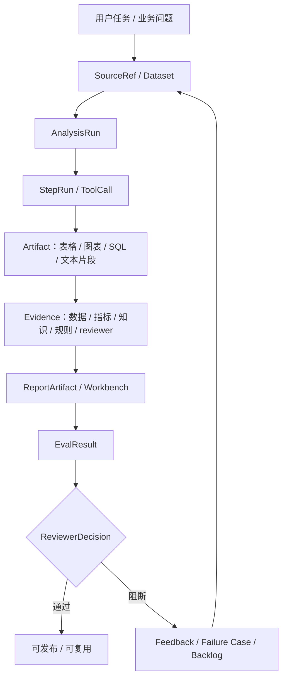
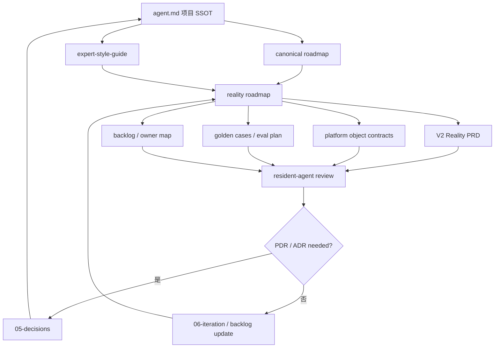
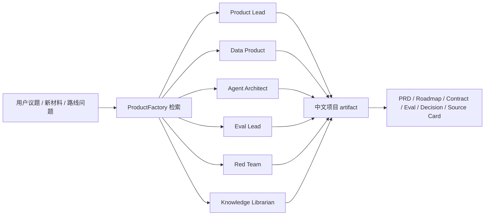

# Reality Roadmap 操作架构图

本文件是 `02-roadmap/t-agent-reality-roadmap-2026-h2.md` 的图示 artifact。

## 1. H2 阶段架构

## 2. 可信分析闭环

## 3. 文档与评审操作系统

## 4. 专家面板路由

## 5. 使用规则

- roadmap、PRD、architecture、eval 文档涉及三个以上组件时，优先补 Mermaid 图。
- 图必须表达结构、依赖、流转或门禁，不用于装饰。
- 若要对外汇报、导出图片、做精细视觉布局，再补 draw.io 版本。
- 图中的对象名必须与 contract / roadmap 中的对象名一致。
