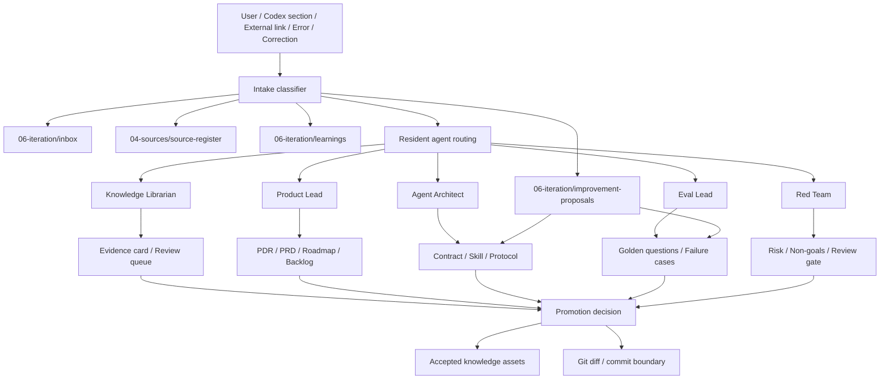

# t-agent 知识库能力建设蓝图

## 1. 能力定义

本能力不是“多写几份文档”，而是 t-agent 产品建设工作台的知识操作层。

目标：

> 把随机议题、外部链接、用户纠偏、agent 评审、PRD 变化、失败样例和技能沉淀，转成可追踪、可评审、可晋升、可评测的项目资产。

一句话：

```text
Knowledge Base Capability = Intake + Source + Evidence + Decision + Artifact + Eval + Learning + Skill Promotion
```

## 2. 用户与任务

| 用户 | 高频任务 | 成功标准 |
|---|---|---|
| AI 产品负责人 | 把讨论收敛成路线、PRD、决策和 backlog | 不再依赖聊天记忆，能看到权威版本和候选材料 |
| AI 产品经理 | 输入外部来源、用户反馈、方案草稿 | 自动进入正确目录，有来源、状态和下一步 |
| Agent 研发工程师 | 把重复 workflow 固化为 skill / harness | 有触发条件、输入输出、eval 和反例 |
| 后端 / 平台工程师 | 对象契约、运行记录、权限和 artifact 需要稳定 | 合同、eval、ADR 与 backlog 对齐 |
| 知识编辑 / 研究角色 | 维护来源、证据卡、冲突和晋升 | raw / candidate / accepted / superseded 清楚 |

## 3. 核心对象

| 对象 | 位置 | 含义 |
|---|---|---|
| `IntakeItem` | `06-iteration/inbox/` | 尚未判断的输入、片段、链接、想法 |
| `SourceRef` | `04-sources/source-register.md` | 可追溯来源记录 |
| `EvidenceCard` | `04-sources/evidence-cards/` | 经过提炼的证据与适用边界 |
| `RoundtableRecord` | `06-iteration/roundtables/` | resident agents 的争议、判断和决策 |
| `DecisionRecord` | `05-decisions/` | PDR / ADR，改变产品或架构方向 |
| `KnowledgeAsset` | `01-product/`, `02-roadmap/`, `03-architecture/`, `07-evals/`, `09-agents/` | 已进入工作台的正式资产 |
| `LearningEvent` | `06-iteration/learnings/` | 错误、纠正、缺失能力、重复模式 |
| `FeedbackSignal` | conversation / `06-iteration/learnings/` | 用户对 agent 行为、风格、路由、skill 或工作流的正负反馈 |
| `ImprovementProposal` | `06-iteration/improvement-proposals/` | 将反馈转成可评审、可批准、可回滚的一文件改进提案 |
| `SkillCandidate` | `.agents/skills/` 或 `06-iteration/review-queue/` | 可复用 workflow 的候选封装 |
| `EvalCase` | `07-evals/` | 验证知识更新和 agent 行为是否正确 |

## 4. 标准架构



## 5. 写入策略

| 输入类型 | 默认位置 | 必须触发的 agent |
|---|---|---|
| 未整理想法 | `06-iteration/inbox/` | knowledge-librarian |
| 外部链接 / repo / 文章 | `04-sources/source-register.md` + evidence card | knowledge-librarian, red-team |
| 影响产品方向 | `05-decisions/product-decisions/` | product-lead, red-team |
| 影响架构 / 协议 | `05-decisions/` 或 `03-architecture/` | agent-architect, data-product, red-team |
| 影响验收 | `07-evals/` | eval-lead |
| 重复 workflow | `.agents/skills/` 候选或 `09-agents/` 协议 | agent-architect, eval-lead |
| 用户纠正 / 错误 | `06-iteration/learnings/` | knowledge-librarian, eval-lead |
| 用户反馈 agent 行为 / 默认偏好 | `06-iteration/improvement-proposals/` + `09-agents/feedback-driven-improvement-protocol.md` | knowledge-librarian, agent-architect, eval-lead, red-team |

## 6. Productivity Skills 作为能力组件

| Skill | 在本能力中的角色 | 搭配 agent |
|---|---|---|
| `grill-me` | 对 PRD、路线、架构、skill 设计进行追问压测 | red-team, product-lead, eval-lead |
| `handoff` | 长任务、跨会话、跨 agent 的上下文交接 | knowledge-librarian, agent-architect |
| `write-a-skill` | 将重复知识更新 workflow 固化成 local skill | agent-architect, knowledge-librarian, eval-lead |
| `teach` | 新成员理解知识库规则、对象模型和更新路径 | product-lead, knowledge-librarian |
| `caveman` | 低 token 快速沟通模式，不用于正式 canonical 文档 | product-lead |
| `self-improvement` | 错误、纠正、缺失能力、重复模式的学习日志 | knowledge-librarian, eval-lead, red-team |
| `feedback improvement` | 将正负反馈转成 learning event、improvement proposal、eval 或 skill 修正 | knowledge-librarian, agent-architect, eval-lead, red-team |

详细搭配见 `09-agents/productivity-skills-integration.md`。

## 7. 分阶段建设

| 阶段 | 目标 | 可验收产物 |
|---|---|---|
| KB-0 | 文档规范和路由可用 | governance、router、local skill、templates、eval questions |
| KB-1 | 候选到 accepted 的晋升闭环 | intake template、promotion checklist、Obsidian Base 状态视图、eval runner、真实外部 repo 演练 |
| KB-2 | 学习闭环可复盘 | learning events、feedback signals、improvement proposals、failure cases、skill candidates、eval 回归 |
| KB-3 | 工作台视图 | Obsidian Bases / Canvas 或轻量 dashboard 展示状态、来源、决策、eval 覆盖 |
| KB-4 | 产品化能力 | 在 t-agent UI 中暴露 source intake、artifact evidence、review gate 和 agent skill ops |

## 8. 反模式

- 直接把聊天结论写进 roadmap。
- 外部链接未登记来源就进入 PRD。
- `self-improve` 自动改 `agent.md`。
- 用户一句“以后都这样”就自动改 `AGENTS.md`、`agent.md` 或 local skill。
- `grill-me` 只做聊天追问，不产出 decision / eval / backlog 变化。
- skill 没有触发条件、反触发条件、输出契约和验收。
- 只更新文档，不更新 eval、backlog 或 source register。
