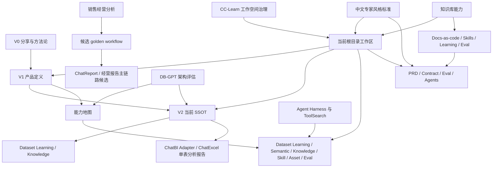

# t-agent 来源登记与分类

本表用于把历史材料按版本、类型、关联关系纳入当前 t-agent 工作空间。旧材料暂不搬迁，统一以路径引用。

## 1. 版本分类

| 版本层 | 时间 | 含义 | 代表材料 |
|---|---|---|---|
| V0.1 分享整合 | 2026-05-26 | 将企业 Data Agent 建设抽象为对外分享和方法论 | `transsion-enterprise-data-agent-sharing-draft.md`, `datafun-speaker-submission-data-agent.md` |
| V1 产品定义 | 2026-05 下旬 | 明确 Enterprise Data Agent 的产品定义、应用矩阵和平台能力 | `gather/基本共识.md`, `gather/能力清单.md`, `gather/v2/产品规划v1.md` |
| V2 历史试点规划 | 2026-05-28 | 历史版本边界，聚焦销售经营分析报告；现降级为候选 golden workflow 来源 | `gather/v2/v2.0需求收敛与版本边界.md`, `gather/v2/v2迭代方向.md` |
| V2 当前 SSOT | 2026-06-15 | Dataset Learning、Knowledge Base、ChatBI Adapter、ChatExcel 单文件/单表分析报告 | `02-roadmap/t-agent-roadmap.md`, `01-product/prd/PRD-V2-platform-capability-and-entry-apps.md` |
| 架构评估 | 2026-05 下旬 | DB-GPT 架构、改造边界、工作量和技术路线 | `plan/*.md`, `enterprise-buildups.md` |
| 知识工作台更新 | 2026-06-08 到 2026-06-13 | Agent Harness、知识更新、ToolSearch、企业技术部门定位 | `_workbench/`, `主题库/` |
| 当前工作区 | 2026-06-15 | 根目录升级为 t-agent 产品建设工作空间 | `README.md`, `00-入口.md`, `01-product/`, `02-roadmap/`, `03-architecture/` |
| 产品团队操作系统 | 2026-06-15 | 补齐 PRD、backlog、契约、eval、agents 和持续迭代机制 | `01-product/product-team-operating-model.md`, `06-iteration/operating-system.md`, `09-agents/` |
| 中文专家风格标准 | 2026-06-15 | 重要文档默认中文，吸收 OpenAI / Anthropic / Google / Google DeepMind 风格，要求来源、证据、eval 和图示 | `09-agents/expert-style-guide.md`, `04-sources/evidence-cards/2026-06-15-ai-product-expert-style-benchmarks.md` |
| 知识库能力 | 2026-06-15 | 把随机 Codex 更新、外部来源、用户纠正、失败样例、productivity skills 和 self-improvement 管成可晋升的项目能力 | `03-architecture/knowledge-base-capability-blueprint.md`, `06-iteration/docs-as-code-governance.md`, `09-agents/productivity-skills-integration.md`, `09-agents/self-improvement-protocol.md` |

## 2. 来源总表

| 路径 | 类型 | 版本/阶段 | 关联主题 | 当前用途 |
|---|---|---|---|---|
| `idealization/5月/enterprise-buildups.md` | synthesis / benchmark | 架构评估 | DB-GPT、QuickBI、小Q、可信问数、报告 | 产品边界和建设模块依据 |
| `idealization/5月/transsion-enterprise-data-agent-sharing-draft.md` | presentation draft | V0.1 | 企业 Data Agent 方法论、路线、风险 | 对外表述和产品叙事依据 |
| `idealization/5月/datafun-speaker-submission-data-agent.md` | submission / talk outline | V0.1 / V1.0 | 演讲提报、议程、关键词 | 统一术语和核心卖点 |
| `idealization/5月/gather/基本共识.md` | product synthesis | V1 | 产品定义、DB-GPT 定位、ChatBI、ChatExcel、资产沉淀 | 当前产品简报核心来源 |
| `idealization/5月/gather/能力清单.md` | capability inventory | V1 | L0-A 平台能力、Dataset Learning、Semantic、Knowledge、Runtime | 能力地图来源 |
| `idealization/5月/gather/产品功能共识.md` | product consensus | V1 | 产品功能共识 | 待后续抽取到 PRD |
| `idealization/5月/gather/v1/solution/chat_excel_dataset_learning_solution.md` | solution | V1 | ChatExcel、数据集学习 | MVP 样板场景 |
| `idealization/5月/gather/v1/solution/chatbi_dbgpt_dataset_learning_architecture_decision.md` | architecture decision | V1 | ChatBI、DB-GPT、数据集学习 | 资产归属边界 |
| `idealization/5月/gather/v2/产品规划v1.md` | product plan | V1 / V2 | 应用矩阵、Skill Hub、Asset Hub、ChatReport | 产品定义和模块拆分 |
| `idealization/5月/gather/v2/v2.0需求收敛与版本边界.md` | roadmap / scope | historical V2 | 销售经营分析试点、黄金数据集、报告链路 | 候选 golden workflow 来源 |
| `idealization/5月/gather/v2/v2迭代方向.md` | roadmap | V2 | 迭代方向 | 待合并到路线图细节 |
| `idealization/5月/gather/v2/v2.0代码基础审计与迭代合理性评估.md` | technical audit | V2 | 代码基础、迭代合理性 | 后续工程拆解来源 |
| `04-sources/ai-dbgpt/project-baseline-index.md` | codebase baseline index | 当前工作区 | AI_DB_GPT 半成品代码基座、README、主文档目录、脚本、测试和验收信号 | 后续路线、资源、可行性和企业化评估的必读来源 |
| `idealization/5月/plan/CC-MASTER-enterprise-transformation-plan.md` | master plan | 架构评估 | 企业转型、深度报告、差异化 | V2/V3 战略依据 |
| `idealization/5月/plan/CC-PM-product-capability-gap.md` | product gap | 架构评估 | 产品能力缺口 | PRD backlog 来源 |
| `idealization/5月/plan/CC-ARCH-architecture-evaluation.md` | architecture | 架构评估 | DB-GPT 架构、Capability API、报告 Pipeline | 架构设计来源 |
| `idealization/5月/plan/CC-ENG-effort-estimation.md` | engineering estimate | 架构评估 | 工作量、阶段投入、技术选型 | 路线图投入依据 |
| `idealization/5月/plan/enterprise-analysis-scenario-map-and-capability-matrix.md` | scenario map | 架构评估 | 企业分析场景和能力矩阵 | 场景库来源 |
| `idealization/5月/presentation/` | presentation output | V0 | HTML 汇报和构建脚本 | 可视化复用资产 |
| `idealization/5月/visuals/0.1/` | demo | V0 / V1 | 可视化 demo | 产品原型参考 |
| `idealization/5月/_workbench/sessions/2026-06-09-Anthropic-Skills-官方仓库与-harness-思想.md` | discussion session | 知识更新 | Agent Harness、Skill 生命周期、评测 | Skill Hub 设计依据 |
| `idealization/5月/_workbench/sessions/2026-06-13-ToolSearch与知识更新机制审计.md` | discussion session | 知识更新 | ToolSearch、能力检索、知识候选发现 | Tool Registry 和知识更新机制依据 |
| `idealization/5月/主题库/大数据AI智能范式/专业知识/02-企业Data-Agent能力分层.md` | formal knowledge | 知识库 | Data Agent 能力分层 | 能力地图补充来源 |
| `idealization/5月/主题库/企业技术部门AI转型/专业知识/01-企业技术部门在-Agent-时代的定位.md` | formal knowledge | 知识库 | 企业技术部门定位 | 组织与运营方向来源 |
| `idealization/5月/主题库/Agent协作与Harness/专业知识/01-真正的-Agent-harness-思想.md` | formal knowledge | 知识库 | Harness 思想 | Skill/Agent 工程方向来源 |
| `../CC-Learn/README.md` | workspace reference | 父级项目参考 | Obsidian handbook、inbox、registry、promote | 工作空间治理模式来源 |
| `../CC-Learn/knowledge/schema.md` | schema reference | 父级项目参考 | frontmatter、状态、动态维度 | t-agent 文档状态和归类启发 |
| `../CC-Learn/knowledge/agent-harness/harness-model.md` | pattern reference | 父级项目参考 | Tools + Knowledge + Observation + Action + Permissions | 常驻产品 agents harness 来源 |
| `../CC-Learn/knowledge/agent-harness/governance-checklist.md` | checklist reference | 父级项目参考 | 工具、权限、上下文、运行治理 | agents 治理检查清单来源 |
| `04-sources/evidence-cards/2026-06-15-cc-learn-workspace-governance.md` | evidence-card | 当前工作区 | 父级项目实施阶段和可迁移经验 | 支撑本轮工作空间治理迭代 |
| `04-sources/evidence-cards/2026-06-15-ai-product-expert-style-benchmarks.md` | evidence-card | 当前工作区 | OpenAI / Anthropic / Google / Google DeepMind 风格研究、ProductFactory 命中来源 | 支撑中文专家风格指南和 reality roadmap 更新 |
| `09-agents/expert-style-guide.md` | operating-standard | 当前工作区 | 中文默认、专家标杆、文档模板、图示规则 | 后续 PRD、roadmap、架构、eval、PDR / ADR 的写作标准 |
| `03-architecture/diagrams/reality-roadmap-operating-architecture.md` | architecture-diagram | 当前工作区 | H2 reality roadmap 操作架构、可信分析闭环、专家面板路由 | 支撑路线图沟通和团队对齐 |
| `04-sources/evidence-cards/2026-06-15-docs-as-code-self-improvement-sources.md` | evidence-card | 当前工作区 | Docs-as-code、self-improvement、productivity skills、ProductFactory 来源 | 支撑知识库能力建设 |
| `06-iteration/roundtables/2026-06-15-knowledge-base-capability-and-productivity-skills.md` | roundtable | 当前工作区 | resident agents 对知识库能力和 productivity skills 搭配的建设判断 | 支撑 PDR 和能力蓝图 |
| `05-decisions/product-decisions/PDR-2026-06-15-knowledge-base-capability.md` | product-decision | 当前工作区 | 决定把知识更新治理建设为工作台能力 | 当前能力建设决策 |
| `03-architecture/knowledge-base-capability-blueprint.md` | architecture-blueprint | 当前工作区 | Knowledge Base Capability 对象、流程、agent、skill、阶段 | 知识库能力 SSOT |
| `06-iteration/docs-as-code-governance.md` | operating-standard | 当前工作区 | Codex section、来源、纠正、learning、skill 的写入和晋升规则 | 后续知识更新默认规范 |
| `09-agents/productivity-skills-integration.md` | agent-protocol | 当前工作区 | `grill-me`、`handoff`、`write-a-skill`、`teach`、`self-improvement` 和 resident agents 的搭配 | 后续 agent 协作默认规范 |
| `09-agents/self-improvement-protocol.md` | agent-protocol | 当前工作区 | review-gated learning loop | 后续自我改进默认规范 |
| `06-iteration/learnings/2026-06-15-learning-events.md` | learning-events | 当前工作区 | 用户纠偏：知识库治理必须成为能力，而不是回答或文档 | 支撑 self-improvement 实践 |
| `07-evals/golden-questions/knowledge-base-capability-golden-questions.md` | eval-set | 当前工作区 | 知识库能力 golden questions 和 failure cases | 验收知识更新能力 |
| `.agents/skills/t-agent-knowledge-base-capability/SKILL.md` | local-skill | 当前工作区 | 知识库能力更新入口 | Codex 项目内触发入口 |

## 3. 关联图

## 4. 后续管理规则

- 新材料先登记到本表，再决定是否提炼进产品简报、路线图或 ADR。
- 不直接把外部资料写进正式结论；先标记 evidence / assumption / unknown。
- 历史文件路径不稳定时，只更新登记表，不批量移动旧文件。
- 当一个结论改变路线图或产品边界时，新增 ADR。
