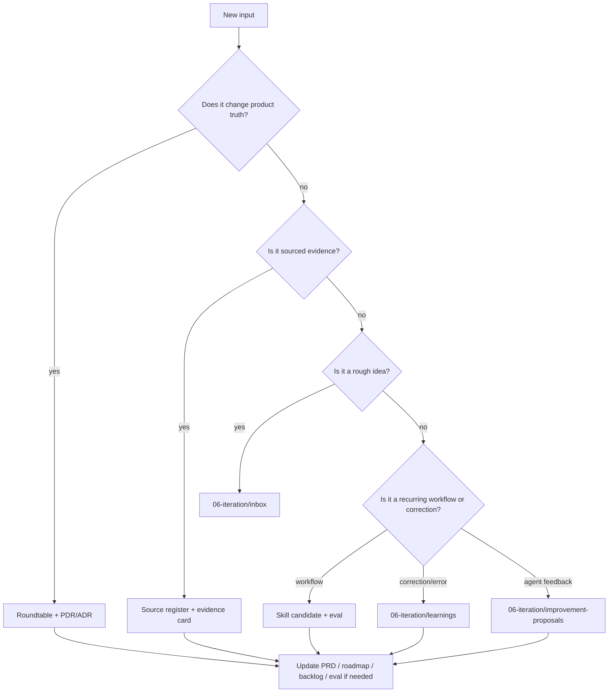

# t-agent Docs-as-Code 知识库治理规范

## 1. 目的

本规范回答一个具体问题：

> 后续随机打开一个 Codex section、补一个话题、塞一个外部链接、纠正一个结论时，应该按什么规则更新 t-agent 知识库。

核心原则：

- 文档像代码一样管理：可 diff、可 review、可回滚、可验收。
- 知识像产品资产一样管理：有来源、有状态、有 owner、有晋升路径。
- agent 不是自由发挥的写手，而是按 resident agent routing 进入可审计流程。

## 2. 状态模型

| 状态 | 含义 | 允许位置 |
|---|---|---|
| `raw` | 原始想法、未验证来源、用户口述片段 | `06-iteration/inbox/` |
| `candidate` | 已整理但未接受 | `06-iteration/review-queue/`, evidence card draft |
| `evidence` | 有明确来源和适用边界 | `04-sources/evidence-cards/` |
| `review` | 等待产品 / 架构 / eval 审查 | PDR/ADR/PRD/contract/eval draft |
| `accepted` | 当前版本可执行事实 | `agent.md`, roadmap, PRD, contracts, evals, decisions |
| `superseded` | 被新版本替代，保留历史 | 原位置标记 |
| `deprecated` | 明确废弃，不再引用为依据 | 原位置标记 |

## 3. 写入决策树



## 4. Random Codex Section 更新规则

当用户说“这里补一下”“把这个观点加进去”“参考这个链接”“刚才说错了”时：

1. 先读 `agent.md`。
2. 判断输入类型：raw idea、source、evidence、decision、PRD、contract、eval、learning、skill、feedback signal。
3. 选择最小 agent panel。
4. 写入最小正确位置。
5. 如果影响 accepted truth，必须更新对应 decision、backlog 或 eval。
6. 最后运行轻量校验：`git diff --check`、链接/路径检查、相关文件存在检查。
7. 如果改动影响知识库能力本身，运行 `python3 scripts/knowledge-base/eval-kb-capability.py`。

## 5. Agent Routing

| 更新类型 | 默认 agent panel | 主要输出 |
|---|---|---|
| 来源 / 链接 / repo | knowledge-librarian, red-team | source register, evidence card |
| 产品方向 / 版本范围 | product-lead, user-research, red-team | PDR, roadmap, PRD |
| 架构 / object / skill | agent-architect, data-product, eval-lead | ADR, contract, local skill, eval |
| 验收 / 失败样例 | eval-lead, data-product, product-lead | golden questions, failure cases |
| 用户纠正 / 错误 | knowledge-librarian, eval-lead, red-team | learning event, correction, regression check |
| 用户反馈 agent 行为 / 默认偏好 | knowledge-librarian, agent-architect, eval-lead, red-team | improvement proposal, skill/protocol patch, eval case |
| 高影响争议 | full roundtable | roundtable record, PDR/ADR |

## 6. 文件写作规则

- 重要文档默认中文。
- 新文档必须有清楚的 `type`、`status`、`created`、`updated`。
- 外部来源必须保留 URL。
- 结论区分 `evidence` / `assumption` / `unknown`。
- 改 canonical 文件前，先确认是否需要 PDR/ADR。
- 影响 eval 的改动必须补 `07-evals/`。
- 不把长篇外部资料复制进仓库，只保存摘要、链接、必要短摘录和判断。

## 7. 晋升路径

```text
raw input
  -> inbox / source register
  -> review queue / evidence card
  -> roundtable
  -> PDR / ADR
  -> PRD / roadmap / contract / eval / backlog
  -> release / iteration log
  -> git commit
```

## 8. Review Gate

以下改动不能只由单个 agent 直接写入 accepted truth：

- 改变 V1/V2/V3/V4 含义。
- 改变 V2/V3/V4 scope 或交付承诺。
- 引入新的 agent runtime / tool / framework。
- 改变数据权限、治理、action control。
- 改变 evaluation gate。
- 将外部开源项目变成默认依赖。

这些改动至少需要：

1. roundtable record；
2. PDR 或 ADR；
3. source register / evidence card；
4. backlog 或 eval 更新；
5. Git diff 可审计。

## 8.1 KB-1 操作资产

当前可操作能力包括：

| 能力 | 入口 |
|---|---|
| 知识输入 | `06-iteration/templates/knowledge-intake.md` |
| 晋升检查 | `06-iteration/templates/promotion-checklist.md` |
| 反馈改进提案 | `06-iteration/templates/improvement-proposal.md`、`06-iteration/improvement-proposals/` |
| 状态视图 | `06-iteration/views/knowledge-base-capability.base` |
| 本地验证 | `scripts/knowledge-base/eval-kb-capability.py` |
| 真实演练 | `06-iteration/reports/2026-06-15-kb1-self-improving-agent-rehearsal.md` |

## 9. 自我改进边界

本项目允许 self-improvement，但它是 review-gated 的：

- 可以记录错误、纠正、缺失能力、重复 workflow。
- 可以提出 skill / protocol / eval 更新。
- 可以把多次复现的问题晋升到 AGENTS.md 或 local skill。
- 不允许后台自动修改 canonical truth。
- 不允许把一次失败自动变成永久规则。

详细规则见 `09-agents/self-improvement-protocol.md`。

## 10. Feedback-Driven Improvement

当用户反馈的是 Codex / t-agent 自身行为，例如“以后都这样”“别再这样回答”“你总是漏掉用户视角”“这个 skill 触发条件要改”，默认进入 `09-agents/feedback-driven-improvement-protocol.md`。

执行顺序：

1. 当前会话先按反馈调整回答方式。
2. 判断是一次性偏好、重复模式、routing miss 还是 eval failure。
3. 一次性反馈只记录 learning event 或保留在会话上下文。
4. 影响默认行为、agent、skill、protocol 或 eval 的反馈，生成 `06-iteration/improvement-proposals/` 下的一文件 proposal。
5. proposal 被批准并通过相关 eval 后，才允许修改 accepted truth。

这条路径的目标是让工作台能学习，同时避免把偶发情绪、单次表扬或未经验证的偏好直接固化成全局规则。
