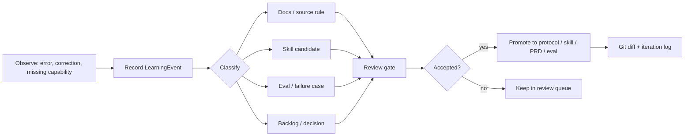

# t-agent Self-Improvement Protocol

## 1. 定义

t-agent 的 self-improvement 不是让 agent 自动重写自己。

它是一条 review-gated 的受控学习闭环：

```text
Error / Correction / Missing Capability / Recurring Pattern
  -> Learning Event
  -> Candidate Change
  -> Review Gate
  -> Eval / Regression Check
  -> Promotion to Protocol / Skill / Backlog / Decision
```

## 2. 可记录事件

| 事件 | 例子 | 默认位置 |
|---|---|---|
| user correction | 用户指出版本范围、事实、路线或风格错误 | `06-iteration/learnings/` |
| command / tool failure | 来源抓取失败、脚本失败、测试失败 | `06-iteration/learnings/` |
| missing capability | 用户要求一类当前流程覆盖不了的能力 | `06-iteration/learnings/` 或 backlog |
| recurring workflow | 同类更新、评审、来源处理多次出现 | skill candidate |
| outdated knowledge | 外部 API / 官方文档 / 项目事实变化 | evidence card + learning |
| better pattern | 发现更可靠的写入、评测、路由方式 | protocol candidate |
| feedback signal | 用户对回答风格、agent 行为、skill 路由、工作流提出正/负反馈 | learning event 或 improvement proposal |

## 3. Promotion Rules

| 候选改进 | 晋升目标 | 条件 |
|---|---|---|
| 一次性纠正 | learning event | 记录即可 |
| 重复 2 次以上的纠正 | AGENTS.md / protocol candidate | 有复现和边界 |
| 重复 workflow | `.agents/skills/` | 有触发、反触发、输出和 eval |
| 产品方向变化 | PDR | Product Lead + Red Team 通过 |
| 架构或工具变化 | ADR | Agent Architect + Eval Lead + Red Team 通过 |
| 质量门禁变化 | eval pack | 有 golden question 或 failure case |
| 交付范围变化 | backlog / PRD | 有 owner、版本和验收 |
| 风格 / agent / skill 反馈 | improvement proposal | 有 feedback source、target file、exact snippet、risk 和 review |

## 4. Self-Improvement Loop



## 5. Guardrails

- 不记录 secret、token、私密凭据、完整敏感日志。
- 不把用户一次口头纠正直接改成全局永久规则。
- 不自动写入 `agent.md`、roadmap、PRD、contract 或 eval。
- 不创建后台监控、定时任务或跨项目同步，除非用户明确要求。
- 所有晋升都要保留 diff、来源、理由和验收方式。
- 正向/负向反馈可立即影响当前会话表现，但持久化修改必须走 `09-agents/feedback-driven-improvement-protocol.md`。

## 6. Minimum Learning Event

每条 learning 至少包括：

- id；
- 时间；
- 类型；
- 来源；
- 发生了什么；
- 为什么重要；
- 建议动作；
- 是否需要 PDR/ADR/eval/backlog；
- 状态。

模板见 `06-iteration/templates/learning-event.md`。

## 7. Relationship to External `self-improving-agent`

外部 `peterskoett/self-improving-agent` 的价值在于：

- 明确哪些事件应该沉淀：错误、纠正、缺失能力、过期知识、重复模式；
- 区分 learning、error、feature request；
- 提醒不要记录敏感信息；
- 把成熟 learning 晋升到 agent instruction 或 workspace 文件。

t-agent 的增强点：

- 增加 source / evidence / decision / eval gate；
- learning 不放根目录 `.learnings/`，而纳入 `06-iteration/learnings/`；
- 所有改进必须经过 resident agents 和 review gate；
- 任何产品事实变化都受 `agent.md` 权威顺序约束。

## 8. Relationship to BerriAI `self-improving-agent`

BerriAI `self-improving-agent` 的价值在于：

- 把“用户批评 agent 自己”与普通产品反馈分开；
- 先生成最小 improvement proposal，而不是直接改 prompt；
- 每个 proposal 包含目标文件、唯一原始片段、替换片段、原因和风险；
- apply 需要明确批准，并通过 PR 保留审计链。

t-agent 的本地化规则：

- 当前不默认接入 GitHub PAT 或自动开 PR。
- 当前先用 `06-iteration/templates/improvement-proposal.md` 记录 proposal。
- 被批准后，按 docs-as-code / PDR / ADR / eval gate 应用。
- 若未来接入 BerriAI 工具，应只作为 proposal/apply transport，不替代 t-agent 的 source、decision、eval 和 review gate。
