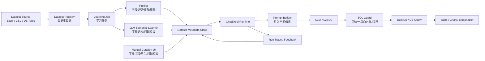
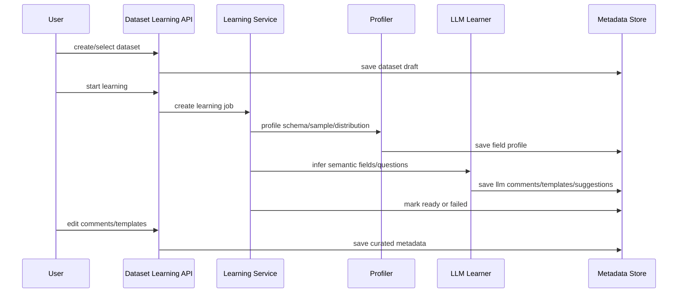

# DB-GPT ChatExcel 数据学习模块方案与投入评估

版本：v1.0  
日期：2026-05-26  
范围：基于当前 `AI_DB_GPT` / DB-GPT v0.4.2 代码库，评估在 ChatExcel 类应用中新增“数据集选择 + 数据集学习 + 字段注释调整 + 快捷提问初始化 + 引导问数分析闭环”的方案与排期。

## 1. 结论摘要

当前 DB-GPT 的 ChatExcel 已经具备“上传 Excel/CSV、抽样学习、基于 DuckDB 生成 SQL、返回表/图”的最小运行链路，但它不是 Quick BI 智能小Q意义上的“数据集学习”能力。现有 `ExcelLearning` 更接近一次性上传后的 LLM 摘要：字段含义、数据摘要和分析建议只进入当前会话历史，不形成可选择、可编辑、可复用、可评估、可权限治理的数据集语义资产。

如果要新增“数据学习”模块，建议不要重写 ChatExcel，而是在现有 ChatExcel 前面新增一个平台化 Dataset Learning 层：

1. 新增数据集资产模型：`Dataset / DatasetVersion / DatasetField / QuestionTemplate / LearningJob / DatasetProfile`。
2. 新增学习流水线：文件或库表接入后，完成 schema 识别、字段类型/维度度量识别、数据质量画像、字段语义解释、样例问题生成、人工校准、重新学习。
3. 改造 ChatExcel：从“只读取上传文件 + 历史消息”改为“选择已学习数据集 + 加载学习结果 + 生成受约束 SQL + 执行校验 + 返回分析结果”。
4. 新增配置界面：数据集选择、字段详情、字段注释编辑、维度/度量/时间字段标注、快捷提问模板、权限与学习状态。

MVP 可在 4-6 周内完成可演示闭环，约 55-80 人天。平台雏形建议 10-12 周，约 140-220 人天。若要接近 Quick BI 小Q的数据集学习完整体验，包括多数据集、权限、指标口径、同义词、评估运营、学习加速和大数据源治理，建议按 16-24 周以上规划。

## 2. 当前代码库审计

### 2.1 已有能力

ChatExcel 当前主要由以下代码组成：

| 能力 | 当前代码 | 现状 |
|---|---|---|
| ChatExcel 场景注册 | `pilot/scene/base.py` | `chat_excel` 对外可见，`excel_learning` 是内置 prepare 场景。 |
| 文件读取与 DuckDB 注册 | `pilot/scene/chat_data/chat_excel/excel_reader.py` | 支持 `.xlsx/.xls/.csv`，读取为 Pandas DataFrame，注册到内存 DuckDB 表 `excel_data`。 |
| 上传后学习 | `pilot/scene/chat_data/chat_excel/excel_learning/chat.py` | 抽样 5 行，调用 LLM 输出数据摘要、字段解释、分析建议。 |
| 学习提示词 | `pilot/scene/chat_data/chat_excel/excel_learning/prompt.py` | 要求输出 `DataAnalysis / ColumnAnalysis / AnalysisProgram` JSON。 |
| 问数分析 | `pilot/scene/chat_data/chat_excel/excel_analyze/chat.py` | 基于用户问题、表名和图表类型提示词生成 SQL，再执行 DuckDB 查询。 |
| 图表/表格输出 | `stream_plugin_call -> ApiCall.display_sql_llmvis` | LLM 生成 `<api-call>` 后执行 SQL 并渲染。 |
| 前端入口 | `pilot/server/static/_next/...` | 已有 ChatExcel 上传按钮和已选文件展示，但源码是构建产物，不利于二开维护。 |

### 2.2 与“数据集学习”目标的差距

| 目标能力 | 当前状态 | 差距判断 |
|---|---|---|
| 选择已有数据集 | 仅选择上传文件或 `select_param` 文件名 | 缺数据集目录、数据集状态、主题分类和预览。 |
| 学习结果持久化 | 学习结果写入当前对话历史 | 不能跨会话复用，不能版本化，不能人工校准。 |
| 字段注释手动调整 | 无 | 需要字段资产表和编辑 API。 |
| 维度/度量/时间字段识别 | 仅让 LLM 描述字段 | 缺结构化字段角色、聚合方式、日期粒度、枚举值画像。 |
| 快捷提问初始化 | LLM 给出 `AnalysisProgram` 文本 | 不能配置排序、启停、绑定字段和回填到 ChatExcel 输入。 |
| 数据集权限 | 无数据集层权限 | 至少需要按数据集控制可见、可学习、可问数。 |
| 学习评估 | 无 | 缺学习状态、质量分、字段覆盖率、样例问题可执行率。 |
| SQL 安全 | DuckDB 内存文件场景较低风险，但 SQL 主要由 LLM 生成 | 需要只读、限行、超时、AST 校验和字段白名单。 |
| 多数据集问数 | 无 | MVP 可不做；P2 再支持数据集组合或关联。 |

### 2.3 关键技术判断

当前最可复用的是 ChatExcel 的“文件读取、DuckDB 执行、LLM 问数、图表渲染”链路。最不能继续沿用的是“学习结果只放历史消息”的设计，因为新需求明确要求用户选择数据集、学习后手动调整字段注释，并让后续问数稳定使用学习信息。

因此，应把 `ExcelLearning` 从“ChatExcel prepare 阶段的一次性消息”升级为“可独立调用的数据集学习任务”，ChatExcel 只消费学习产物，不再把学习产物隐式依赖在历史对话里。

## 3. Quick BI 小Q对标要点

结合本地 `docs/dev/v1.0/screenshot` 截图和阿里云帮助文档，数据集学习应覆盖以下产品要点：

| 对标能力 | Quick BI 表现 | DB-GPT 建议实现 |
|---|---|---|
| 数据集选择 | 小Q问数页可查看全部/主题下数据集与上传文件，支持预览和基于数据集提问 | 新增 Dataset List + Preview + Ask 入口。 |
| 数据集类型 | 明细表、多指标周期表、键值对表等类型帮助小Q理解结构 | MVP 支持 `detail_table / period_metric_table / key_value_table` 三类枚举，影响学习 prompt 和 SQL 约束。 |
| 字段详情 | 可查看维度/指标字段、字段详细情况 | 新增字段画像和字段注释编辑页。 |
| 快捷提问 | 可在数据集预览和问数页快捷提问 | 新增 QuestionTemplate，学习自动生成 + 用户可编辑。 |
| 权限控制 | 小Q问数配置和资源权限影响可见/可问 | MVP 先做数据集可见/可问开关，后续接组织/角色。 |
| 学习评估 | 有学习状态、建议采纳、应用并重新学习等交互 | 新增 LearningJob 状态、质量评估、建议列表、重新学习。 |
| 学习失败处理 | 大数据集可能因查询超时失败，可通过过滤或学习加速表解决 | MVP 增加采样上限、超时、过滤条件；P1 支持维值加速表。 |

参考资料：

- 阿里云 Quick BI《[智能小Q Skill操作手册](https://help.aliyun.com/zh/quick-bi/user-guide/quick-bi-open-skill-manual)》说明小Q具备问数、报表、解读、报告等能力，并支持本地 Excel/CSV 和 Quick BI 数据集问数。
- 阿里云 Quick BI《[发起问数](https://help.aliyun.com/zh/quick-bi/user-guide/user-guide-for-smart-q-a)》说明小Q问数支持预览和选择数据集、字段详情、快捷提问、数据预览、数据集切换和多数据集选择。
- 阿里云 Quick BI《[通过小Q问数快速上手智能小Q数据分析](https://help.aliyun.com/zh/quick-bi/getting-started/)》提到数据集类型会帮助小Q理解数据结构特征，提升问答准确性。
- 阿里云 Quick BI《[智能小Q使用注意事项](https://help.aliyun.com/document_detail/425406.html)》提到字段同义词、字段新增后的重新训练、推荐问题配置等机制。
- 阿里云 Quick BI《[数据集学习失败](https://help.aliyun.com/zh/document_detail/719122.html)》案例说明大数据量和字段数较多时会出现查询超时，需要过滤或学习加速。

## 4. 目标用户流程

### 4.1 MVP 用户闭环

1. 用户进入 ChatExcel 类应用。
2. 用户选择已有数据集，或上传 Excel/CSV 生成临时数据集。
3. 系统展示数据集学习状态：未学习、学习中、学习成功、学习失败、需重新学习。
4. 用户点击“学习数据集”。
5. 系统完成字段识别、数据画像、字段注释、维度/度量/时间字段识别、快捷提问生成。
6. 用户进入字段详情页，手动调整字段注释、字段角色、是否可问、同义词和默认聚合方式。
7. 用户进入快捷提问配置页，编辑系统生成的问题模板。
8. 用户回到 ChatExcel，基于学习后的数据集提问。
9. ChatExcel 将学习结果注入 prompt，生成 SQL，执行校验，返回表格/图表/解释。
10. 每次问数记录 SQL、字段命中、执行状态和用户反馈，用于后续评估。

### 4.2 MVP 不建议做的内容

MVP 不建议同时做以下能力，否则排期和风险会失控：

- 多数据集自动关联和跨表 join。
- 企业级指标口径平台。
- 复杂权限组织树。
- 完整 BI 仪表板搭建。
- 自动归因洞察和报告生成深度闭环。
- 在线训练模型或微调模型。

## 5. 技术方案

### 5.1 总体架构



### 5.2 新增后端模块

建议新增独立包：

```text
pilot/server/dataset_learning/
├── api.py
├── service.py
├── dataset_db.py
├── request.py
├── response.py
└── profiler.py

pilot/scene/chat_data/chat_excel/dataset_learning/
├── learner.py
├── prompt.py
├── out_parser.py
├── prompt_builder.py
└── sql_guard.py
```

后端模块职责：

| 模块 | 职责 |
|---|---|
| `dataset_db.py` | 定义数据集、字段、学习任务、问题模板、运行记录的 ORM。 |
| `service.py` | 编排数据集创建、学习、保存人工修改、查询学习状态。 |
| `profiler.py` | 计算字段类型、空值率、唯一值数、TopN、数值范围、时间范围、样例值。 |
| `learner.py` | 调用 LLM 生成字段语义、维度度量识别、问题模板和学习建议。 |
| `prompt_builder.py` | 将数据集学习结果压缩成 ChatExcel 可用上下文。 |
| `sql_guard.py` | 校验只读 SQL、表名/字段白名单、limit、超时、危险函数。 |
| `api.py` | 提供数据集列表、学习、字段编辑、问题模板编辑、预览、问数绑定 API。 |

### 5.3 数据模型建议

MVP 可采用 DB-GPT 当前 SQLAlchemy DAO 风格，参考 `knowledge_document` 和 `prompt_manage`。

#### dataset

| 字段 | 类型 | 说明 |
|---|---|---|
| id | int | 主键 |
| dataset_uid | varchar | 对外稳定 ID |
| name | varchar | 数据集名称 |
| source_type | varchar | `file / db_table` |
| source_ref | text | 文件路径或库表引用 |
| dataset_type | varchar | `detail_table / period_metric_table / key_value_table` |
| status | varchar | `draft / learning / ready / failed / stale` |
| owner | varchar | 所有人 |
| description | text | 数据集说明 |
| row_count | int | 行数 |
| field_count | int | 字段数 |
| sample_policy | text | 采样配置 JSON |
| gmt_created/gmt_modified | datetime | 时间 |

#### dataset_field

| 字段 | 类型 | 说明 |
|---|---|---|
| id | int | 主键 |
| dataset_uid | varchar | 所属数据集 |
| field_name | varchar | 原始字段名 |
| normalized_name | varchar | 规范化字段名 |
| data_type | varchar | 字段类型 |
| semantic_type | varchar | `dimension / metric / date / id / text / unknown` |
| comment | text | 用户最终注释 |
| llm_comment | text | LLM 生成注释 |
| synonyms | text | 同义词 JSON |
| default_agg | varchar | `sum / avg / count / max / min / none` |
| date_granularity | varchar | 日期粒度 |
| nullable_rate | float | 空值率 |
| distinct_count | int | 唯一值数 |
| top_values | text | TopN JSON |
| sample_values | text | 样例值 JSON |
| is_queryable | bool | 是否允许问数 |
| is_sensitive | bool | 是否敏感 |

#### dataset_question_template

| 字段 | 类型 | 说明 |
|---|---|---|
| id | int | 主键 |
| dataset_uid | varchar | 所属数据集 |
| title | varchar | 模板标题 |
| question | text | 问题正文 |
| intent | varchar | `trend / compare / rank / distribution / detail / anomaly` |
| field_refs | text | 相关字段 JSON |
| enabled | bool | 是否启用 |
| sort_order | int | 排序 |

#### dataset_learning_job

| 字段 | 类型 | 说明 |
|---|---|---|
| id | int | 主键 |
| dataset_uid | varchar | 所属数据集 |
| job_type | varchar | `initial / relearn / profile_only` |
| status | varchar | `pending / running / success / failed` |
| progress | int | 进度 |
| result_summary | text | 学习摘要 |
| suggestions | text | 建议 JSON |
| error_msg | text | 失败原因 |
| started_at/finished_at | datetime | 时间 |

#### dataset_query_run

| 字段 | 类型 | 说明 |
|---|---|---|
| id | int | 主键 |
| dataset_uid | varchar | 所属数据集 |
| conv_uid | varchar | 会话 |
| user_question | text | 用户问题 |
| generated_sql | text | 生成 SQL |
| validated_sql | text | 校验后 SQL |
| used_fields | text | 命中字段 JSON |
| status | varchar | 成功/失败 |
| error_msg | text | 错误 |
| latency_ms | int | 耗时 |
| feedback | varchar | 用户反馈 |

### 5.4 学习任务流程



学习输出必须结构化，建议输出：

```json
{
  "dataset_summary": "该数据集描述销售订单明细，适合分析销售额、客单价、区域与品类表现。",
  "dataset_type_suggestion": "detail_table",
  "fields": [
    {
      "field_name": "order_date",
      "semantic_type": "date",
      "comment": "订单发生日期",
      "synonyms": ["下单日期", "日期"],
      "default_agg": "none",
      "date_granularity": "day",
      "is_queryable": true
    }
  ],
  "question_templates": [
    {
      "intent": "trend",
      "question": "最近12个月销售额趋势如何？",
      "field_refs": ["order_date", "sales_amount"]
    }
  ],
  "quality_warnings": [
    "字段 customer_id 唯一值较高，建议作为ID字段，不参与维度聚合。"
  ]
}
```

### 5.5 ChatExcel 改造点

#### 当前行为

`ChatExcel.prepare()` 首轮对话时调用 `ExcelLearning.nostream_call()`，学习结果作为一条 view message 存入会话。后续 `excel_analyze.prompt` 依赖历史消息中的字段分析信息。

#### 改造后行为

1. `select_param` 从文件名扩展为 `dataset_uid`。
2. 初始化时通过 `DatasetLearningService.get_ready_dataset(dataset_uid)` 加载字段、样例问题、画像和用户修订注释。
3. `generate_input_values()` 增加：
   - `dataset_context`
   - `field_catalog`
   - `question_templates`
   - `sql_constraints`
4. Prompt 不再只说“使用历史对话中的结构信息”，而是显式使用 `field_catalog`。
5. SQL 执行前进入 `sql_guard`：
   - 只允许 `SELECT`
   - 只允许当前数据集表名
   - 只允许 `is_queryable=true` 字段
   - 自动追加或校验 `LIMIT`
   - 拒绝 DDL/DML/文件读写函数
6. 执行后写入 `dataset_query_run`。

建议将当前 Prompt 改为以下结构：

```text
你是企业数据分析助手。你只能基于当前数据集回答问题。

数据集：
{dataset_context}

字段目录：
{field_catalog}

可用快捷问题：
{question_templates}

SQL 约束：
{sql_constraints}

用户问题：
{user_input}

请生成 DuckDB SQL，并选择展示类型。不要使用字段目录之外的字段。
```

### 5.6 前端改造点

当前前端源码在仓库中不可见，只能看到 Next.js 构建产物。因此二开前需要恢复或引入前端源码。如果短期只做后端能力，可先通过 API + 简单管理页验证。

建议页面：

| 页面/组件 | MVP 内容 |
|---|---|
| 数据集选择 | 数据集列表、状态、搜索、上传入口、预览、提问按钮。 |
| 数据集学习页 | 学习按钮、进度、失败原因、重新学习、学习摘要。 |
| 字段详情页 | 字段名、类型、语义角色、注释、同义词、默认聚合、是否可问。 |
| 快捷提问页 | 自动生成问题、手动新增/编辑/排序/启停。 |
| ChatExcel 问数页 | 当前数据集、字段预览、快捷提问按钮、问答区、SQL/图表/表格。 |

MVP 若不恢复完整前端源码，可先做两个低成本选择：

1. 在现有静态前端旁边新增一个简化管理页面，用于演示数据集学习配置。
2. 通过 API 先跑通后端，ChatExcel 问数页只增加数据集下拉和快捷提问。

## 6. API 设计建议

| API | 方法 | 说明 |
|---|---|---|
| `/api/v1/datasets` | GET | 数据集列表 |
| `/api/v1/datasets` | POST | 创建数据集，支持文件或库表引用 |
| `/api/v1/datasets/{dataset_uid}` | GET | 数据集详情 |
| `/api/v1/datasets/{dataset_uid}/preview` | GET | 数据预览 |
| `/api/v1/datasets/{dataset_uid}/learn` | POST | 启动学习 |
| `/api/v1/datasets/{dataset_uid}/learning-jobs/{job_id}` | GET | 查询学习进度 |
| `/api/v1/datasets/{dataset_uid}/fields` | GET | 字段列表 |
| `/api/v1/datasets/{dataset_uid}/fields/{field_id}` | PUT | 更新字段注释、角色、同义词 |
| `/api/v1/datasets/{dataset_uid}/questions` | GET | 快捷提问列表 |
| `/api/v1/datasets/{dataset_uid}/questions` | POST | 新增快捷提问 |
| `/api/v1/datasets/{dataset_uid}/questions/{id}` | PUT | 更新快捷提问 |
| `/api/v1/datasets/{dataset_uid}/ask` | POST | 基于学习数据集问数，可复用现有 chat completions |

## 7. 排期与投入评估

### 7.1 MVP：4-6 周，可演示闭环

目标：单数据集、Excel/CSV 优先，支持学习、人工修订字段注释、快捷提问、ChatExcel 问数闭环。

| 阶段 | 周期 | 工作内容 | 角色投入 |
|---|---:|---|---:|
| 方案细化与数据模型 | 0.5 周 | 明确数据模型、API、Prompt 输出格式、验收数据集 | 产品 2pd，后端 2pd，算法 1pd |
| Dataset 元数据后端 | 1 周 | ORM、DAO、Service、API、数据集创建/列表/详情/预览 | 后端 5-7pd |
| Profiler 与学习任务 | 1 周 | 字段类型、质量画像、LLM 学习、结构化解析、任务状态 | 算法 4-6pd，后端 3-4pd |
| 字段注释与问题模板 | 0.5-1 周 | 字段编辑、同义词、快捷提问 CRUD | 后端 3pd，前端 4-6pd |
| ChatExcel Runtime 改造 | 1 周 | 加载 dataset context、改 Prompt、SQL Guard、运行记录 | 算法 3-4pd，后端 4-5pd |
| 简化前端闭环 | 1-1.5 周 | 数据集选择、学习状态、字段编辑、快捷提问、问数入口 | 前端 8-12pd |
| 测试与演示数据 | 0.5 周 | 端到端测试、异常用例、演示脚本 | QA 3pd，产品 2pd，算法/后端 2pd |

MVP 总投入：约 55-80 人天。

推荐团队：后端 1 人、前端 1 人、算法/Prompt 1 人、产品 0.5 人、QA 0.5 人。

### 7.2 平台雏形：10-12 周

在 MVP 上补齐更接近企业场景的能力。

| 模块 | 增强内容 | 额外投入 |
|---|---|---:|
| DB 表数据集 | 支持选择数据库表或视图作为数据集，保存 source_ref 和采样 SQL | 15-25pd |
| 学习评估 | 字段覆盖率、样例问题 SQL 可执行率、学习质量分、失败重试 | 15-20pd |
| 权限 | 数据集可见、可学习、可问数、敏感字段不可问 | 15-25pd |
| 同义词和口径 | 字段同义词、指标默认聚合、业务术语补充 | 20-30pd |
| SQL 安全增强 | AST 校验、超时、限行、只读连接、审计 | 15-25pd |
| 前端体验 | 字段画像、建议采纳、应用并重新学习、问数侧栏 | 25-40pd |
| 运行反馈 | 用户点赞/纠错、失败原因聚类、问题模板优化 | 10-20pd |

平台雏形总投入：约 140-220 人天，周期 10-12 周，5-6 人小队。

### 7.3 企业增强：16-24 周+

若目标是对标小Q的生产级能力，需要继续投入：

| 方向 | 内容 | 投入级别 |
|---|---|---|
| 多数据集组合 | 数据集关联、主辅表、Join 关系、自动字段匹配 | 高 |
| 指标平台 | 指标目录、口径版本、派生指标、维度层级 | 高 |
| 主题域治理 | 分析主题、数据集分组、业务权限 | 中高 |
| 学习加速 | 维值表、采样策略、缓存、增量学习 | 中高 |
| 评测体系 | NL2SQL Golden Set、回归评测、模型对比 | 中 |
| 报告/洞察联动 | 问数结果进入解读、归因、报告生成 | 中高 |

企业增强投入：约 300-500+ 人天，取决于是否接入真实数仓、权限系统和指标平台。

## 8. 风险与应对

| 风险 | 影响 | 应对 |
|---|---|---|
| 当前前端源码缺失，只能看到构建产物 | 二开效率低，难以维护 | 优先找回前端源码；否则新增轻量管理页，不直接改构建产物。 |
| 学习结果依赖 LLM，结构化稳定性不足 | 字段解释和问题模板可能解析失败 | 使用严格 JSON schema、失败降级、人工可编辑、保存 LLM 原始输出。 |
| 大数据集学习超时 | 学习失败、体验差 | MVP 限制文件大小/字段数；P1 增加采样、过滤条件、维值加速表。 |
| SQL 安全不足 | 可能执行不期望 SQL | 加 SQL Guard，只读连接、字段白名单、limit、超时。 |
| 字段语义不准 | 问数准确率低 | 人工校准字段注释、同义词、默认聚合；建立样例问题评测。 |
| 多数据集需求提前进入 | 排期膨胀 | MVP 明确只做单数据集；多数据集作为 P2。 |
| DB-GPT v0.4.2 架构较旧 | 与现代前后端开发方式不一致 | 保持后端新增模块隔离，避免大改核心 Scene 和 DB-GPT 框架。 |

## 9. 验收标准

### 9.1 MVP 功能验收

| 验收项 | 标准 |
|---|---|
| 数据集创建 | 可上传 Excel/CSV 创建数据集，生成 `dataset_uid`。 |
| 数据集学习 | 点击学习后生成字段画像、字段注释、问题模板和学习摘要。 |
| 学习状态 | 可看到学习中、成功、失败和失败原因。 |
| 字段编辑 | 用户可修改字段注释、语义角色、同义词、是否可问。 |
| 快捷提问 | 自动生成不少于 5 个问题，用户可编辑启停。 |
| 问数闭环 | 用户选择数据集和快捷问题后，ChatExcel 返回 SQL、表格/图表和解释。 |
| SQL 安全 | 非 SELECT、未知字段、未知表名被拒绝。 |
| 运行记录 | 每次问数保存问题、SQL、状态、耗时和错误信息。 |

### 9.2 MVP 效果验收

建议准备 3 个演示数据集：

1. 销售订单明细：适合趋势、排行、区域/品类对比。
2. 财务经营月表：适合多指标周期表、环比/同比。
3. 人效或门店经营表：适合维度筛选、异常识别。

验收指标：

| 指标 | 目标 |
|---|---:|
| 字段识别覆盖率 | >= 90% 字段生成注释和类型 |
| 快捷问题可执行率 | >= 80% |
| 常见问数 SQL 成功率 | >= 80% |
| 端到端响应 | 小文件问数 <= 10 秒 |
| 人工修订生效 | 字段注释修改后，下一轮问数 prompt 可使用新注释 |

## 10. 推荐落地路线

### 第一阶段：先做“可学习的数据集资产”

不要一开始追求复杂 Agent。先把数据集学习结果从聊天历史中拿出来，变成可保存、可编辑、可复用的资产。这一步是后续问数准确率和平台化能力的基础。

### 第二阶段：把 ChatExcel 改成“消费学习资产”

ChatExcel 不再负责隐式学习，而是消费 `dataset_uid` 对应的字段目录、问题模板和 SQL 约束。这样同一个数据集可以服务多轮会话和多个用户入口。

### 第三阶段：补评估和反馈

没有评估闭环，数据学习很快会变成“看起来生成了很多说明，但问数仍不稳定”。MVP 后必须补样例问题评测、失败 SQL 归因和用户反馈。

## 11. 文件级改造清单

### 后端新增

```text
pilot/server/dataset_learning/api.py
pilot/server/dataset_learning/service.py
pilot/server/dataset_learning/dataset_db.py
pilot/server/dataset_learning/request.py
pilot/server/dataset_learning/response.py
pilot/server/dataset_learning/profiler.py
pilot/scene/chat_data/chat_excel/dataset_learning/learner.py
pilot/scene/chat_data/chat_excel/dataset_learning/prompt.py
pilot/scene/chat_data/chat_excel/dataset_learning/out_parser.py
pilot/scene/chat_data/chat_excel/dataset_learning/prompt_builder.py
pilot/scene/chat_data/chat_excel/dataset_learning/sql_guard.py
```

### 后端修改

```text
pilot/scene/chat_data/chat_excel/excel_analyze/chat.py
pilot/scene/chat_data/chat_excel/excel_analyze/prompt.py
pilot/scene/chat_data/chat_excel/excel_reader.py
pilot/scene/base.py
pilot/server/dbgpt_server.py 或现有 API router 注册处
```

### 前端修改

需要先确认前端源码位置。如果源码可恢复，建议新增：

```text
pages/dataset-learning/index.tsx
pages/dataset-learning/[dataset_uid].tsx
components/dataset/DatasetSelector.tsx
components/dataset/DatasetFieldEditor.tsx
components/dataset/QuestionTemplateEditor.tsx
components/chat/ChatExcelDatasetPanel.tsx
```

如果源码不可恢复，建议先新增独立轻量页面或后端模板页，不修改 `pilot/server/static/_next` 构建产物。

## 12. 需决策事项

| 决策 | 推荐 |
|---|---|
| MVP 数据源 | 先 Excel/CSV，P1 再支持 DB 表。 |
| 是否多数据集 | MVP 不做，P2 做。 |
| 是否接权限系统 | MVP 做数据集级开关，P1 接真实组织/角色。 |
| 是否接指标平台 | MVP 不做完整指标平台，只做字段默认聚合和口径说明。 |
| 前端策略 | 优先找回源码；找不到则做轻量独立管理页。 |
| 学习产物存储 | 使用 DB-GPT 现有 meta database + SQLAlchemy DAO。 |
| SQL 执行 | Excel/CSV 继续 DuckDB；DB 表数据集使用只读连接和查询超时。 |

## 13. 最小可交付范围建议

建议本轮立项的最小范围定义为：

1. 用户可以上传或选择一个 Excel/CSV 数据集。
2. 系统可以学习字段并生成字段注释、字段角色、样例问题。
3. 用户可以编辑字段注释和快捷问题。
4. ChatExcel 可以读取学习后的字段目录完成问数。
5. 每次问数可看到结果、SQL 和图表，失败时有明确错误原因。

这会形成“数据集学习 -> 人工校准 -> 快捷提问 -> ChatExcel 问数分析”的最小闭环，也能为后续 Quick BI 小Q式能力建设打下平台对象基础。
