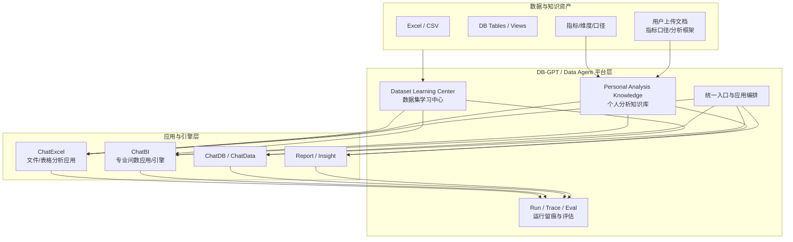
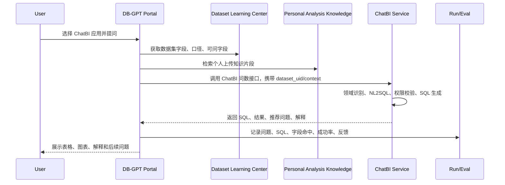
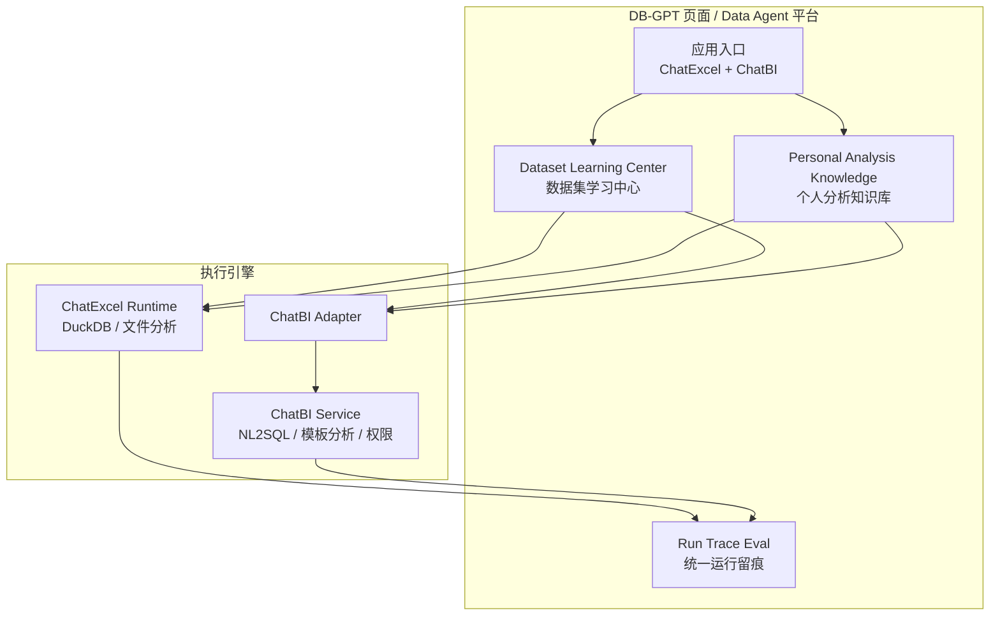
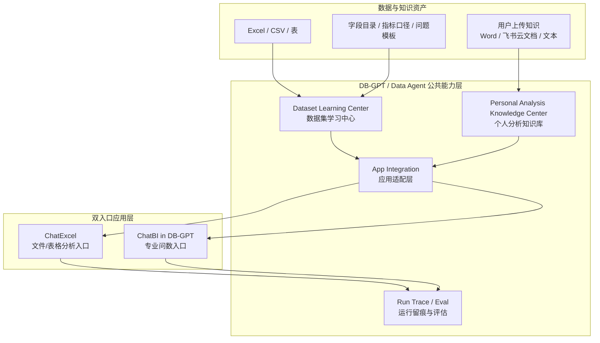
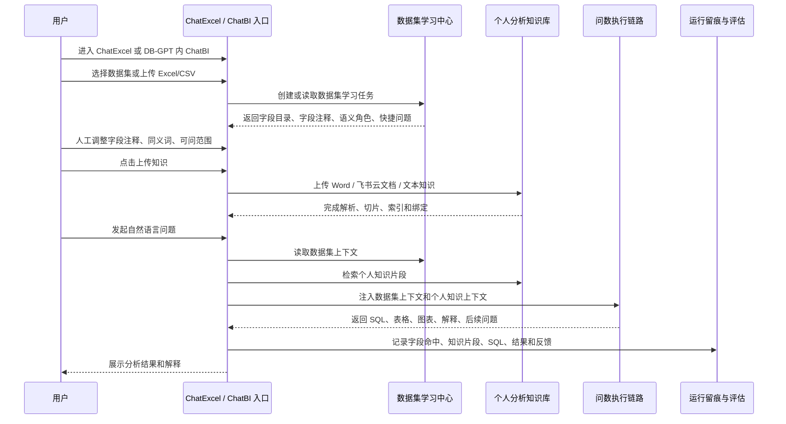

# ChatBI 与 DB-GPT 集成背景下的数据集学习与个人分析知识库建设方案

版本：v1.1  
日期：2026-05-27  
输出位置：`D:/Users/Desktop/项目/代码/AI_DB_GPT/docs/dev/v1.0/solution/`  
关联材料：

- `chat_excel_dataset_learning_solution.md`
- `dbgpt-chatexcel-dataset-learning-zoom-in.html`
- ChatBI 仓库：`D:\Users\Desktop\项目\代码\chatbi\data-ChatBI-service`

更新说明：

- 本版按 2026-05-27 讨论结论更新：本期不再按“先 ChatExcel 单入口、后 ChatBI 接入”的串行路线表达，而是按“DB-GPT 公共能力层 + ChatExcel/DB-GPT 内 ChatBI 双入口 MVP”表达。
- 本期知识库能力定义为“个人分析知识库上传”，不是 ChatBI 既有的模板化分析能力。用户在对话框上传 Word、飞书云文档或文本材料，用于补充指标口径、字段解释、分析思路、领域知识和分析框架。

## 1. 结论

如果未来希望 DB-GPT 和 ChatBI 都具备“通用的数据集学习 + 个人分析知识库上传”能力，不建议把这两块能力只开发在 ChatBI，也不建议只开发在 DB-GPT 的 ChatExcel 模块里。

推荐方案是：

1. **在 DB-GPT / Data Agent 平台侧建设通用能力中心**：包括数据集学习、数据集资产、字段语义、问题模板、个人分析知识库、运行留痕、评估反馈。
2. **ChatBI 作为一个被集成的问数应用或问数引擎**：保留它已有的 NL2SQL、指标维度识别、智能路由、模板分析和权限校验经验，通过 API/Adapter 接入 DB-GPT 的统一数据集资产和个人分析知识上下文。
3. **短期先在 DB-GPT 仓库内落地，但保持服务边界独立**：不要写死为 ChatExcel 私有模块，目录和 API 命名应从一开始就面向 `dataset_learning` / `personal_knowledge`，ChatExcel 和 ChatBI 都是消费者。
4. **中长期可独立为 Data Agent Core Service**：当 ChatBI、ChatExcel、ChatDB、报告服务都要复用时，再把能力抽出为独立服务或独立包。

一句话：**DB-GPT 做平台承载和资产治理，ChatBI 做专业问数引擎和领域能力沉淀；数据集学习与个人分析知识库应做成平台公共能力，而不是某一个应用的私有能力。**

## 2. 为什么不建议只放在 ChatBI 开发

ChatBI 当前已经有很多企业问数的有效积累：

| 能力 | ChatBI 现状 |
|---|---|
| NL2SQL | `service/ask_gpt.py` 的 `Seat.requestGpt()` 是核心问数链路。 |
| 智能路由 | `service/router_intelligent.py` 支持敏感问题、重点问题、问数问题、通用问题分类。 |
| 指标/维度识别 | `util/tool.py`、`util/info_extract_util.py`、`util/domain_select.py`、`util/jieba_util.py` 已有较多规则和词典能力。 |
| 模板化分析 | `service/template_analysis_service.py`、`service/template_data_analysis.py` 已有模板 SQL、描述报告和推荐问题能力。 |
| 向量检索 | `service/milvus.py`、`util/milvus_util.py` 支持相似问题和推荐。 |
| 权限/日志 | 问数链路中已有字段权限、数据权限、对话日志、用户反馈。 |

但它不适合作为未来通用数据学习中心的唯一承载点，原因是：

1. **定位上 ChatBI 是应用/引擎，不是平台资产中心**  
   数据集学习会服务 ChatExcel、ChatDB、报告生成、洞察分析、未来 Agent 市场。放在 ChatBI 会让其他入口依赖一个具体应用，平台边界会倒置。

2. **ChatBI 当前开发约束更偏生产服务**  
   `CLAUDE.md` 明确说明 `data-ChatBI-service/` 是生产服务代码，新功能开发应在 `../local/` 验证后集成。把平台公共能力直接塞进生产服务，会增加交付风险。

3. **ChatBI 数据资产目前更偏领域词典和问数规则**  
   它强在“如何问数”和“如何生成 SQL”，但通用数据集学习还需要数据集目录、字段画像、版本、手动校准、权限、评估、运行资产，这些更像平台底座。

4. **未来 DB-GPT 要集成多个入口**  
   如果 ChatBI 成为 DB-GPT 中的一个应用，则通用能力应在应用上方，而不是在某个应用内部。

## 3. 为什么也不建议只做在 ChatExcel 里

当前 zoom-in 文档以 ChatExcel 为第一阶段抓手，但这不等于能力归属 ChatExcel。

ChatExcel 适合作为第一阶段样板，因为：

- 现有 DB-GPT 已有 Excel/CSV 读取、DuckDB、LLM 问数和图表展示链路。
- 文件场景工程风险低。
- 用户能直接看到“字段学习、注释修改、快捷提问、问数效果提升”。

但如果把数据学习能力只写成 `pilot/scene/chat_data/chat_excel/...` 的私有能力，会有三个问题：

1. ChatBI 不能复用。
2. ChatDB / 报告 / 洞察不能复用。
3. 后续再抽平台公共能力会二次重构。

因此需要调整原方案的口径：

> ChatExcel 是第一消费场景，不是能力归属边界。  
> 数据集学习与个人分析知识库应从第一天按平台公共能力设计。

## 4. 推荐架构

### 4.1 目标架构



### 4.2 能力分层

| 层级 | 归属 | 主要职责 |
|---|---|---|
| 平台入口层 | DB-GPT | 应用集成、导航、会话、用户体验、统一权限入口。 |
| 数据集学习中心 | DB-GPT / Data Agent Core | 数据集目录、字段画像、字段语义、问题模板、学习任务、版本、评估。 |
| 个人分析知识库 | DB-GPT / Data Agent Core | 用户在 ChatBI / ChatExcel 对话框中上传 Word、文档或飞书云文档，补充指标口径、字段解释、分析思路、领域知识和分析框架。 |
| 专业问数引擎 | ChatBI | 领域识别、NL2SQL、模板 SQL、智能路由、权限校验、相似问推荐。 |
| 文件分析应用 | ChatExcel | 文件上传、表格分析、DuckDB 执行、图表结果展示。 |
| 运行治理层 | DB-GPT / Data Agent Core | Run、Trace、Artifact、Eval、反馈和运营指标。 |

## 5. 放在哪里开发

### 5.1 推荐开发位置

短期建议放在当前 DB-GPT 仓库中开发，但以独立平台模块组织：

```text
AI_DB_GPT/
├── pilot/server/dataset_learning/
│   ├── api.py
│   ├── service.py
│   ├── dataset_db.py
│   ├── request.py
│   ├── response.py
│   └── profiler.py
│
├── pilot/server/personal_knowledge/
│   ├── api.py
│   ├── service.py
│   ├── knowledge_db.py
│   ├── document_parser.py
│   ├── retriever.py
│   └── request.py
│
├── pilot/server/app_integration/
│   ├── chatbi_adapter.py
│   ├── chatexcel_adapter.py
│   └── contracts.py
│
└── pilot/scene/chat_data/chat_excel/
    └── dataset_runtime/
        ├── prompt_builder.py
        └── sql_guard.py
```

关键点：

- `dataset_learning` 不放在 `chat_excel` 下面。
- `personal_knowledge` 不放在 ChatBI 仓库里作为私有实现。
- `chatbi_adapter` 只负责对接 ChatBI 服务，不复制 ChatBI 核心问数逻辑。
- ChatExcel 的 `dataset_runtime` 只做消费端能力，比如 prompt 构造和 SQL Guard。

### 5.2 不推荐的开发位置

| 位置 | 不推荐原因 |
|---|---|
| `AI_DB_GPT/pilot/scene/chat_data/chat_excel/excel_learning/` | 会变成 ChatExcel 私有能力，ChatBI 和 ChatDB 难复用。 |
| `chatbi/data-ChatBI-service/service/` | 会把平台资产能力塞进应用服务，未来 DB-GPT 入口、ChatExcel、报告服务都要反向依赖 ChatBI。 |
| 两边各做一套 | 字段注释、问题模板、知识库和评估口径会分裂，后续治理成本最高。 |

### 5.3 中长期位置

当能力稳定后，可以从 DB-GPT 仓库抽出一个独立服务：

```text
data-agent-core-service/
├── dataset_learning/
├── personal_knowledge/
├── run_trace_eval/
├── adapters/
│   ├── chatbi/
│   ├── dbgpt_chatexcel/
│   └── chatdb/
└── openapi/
```

但不建议第一阶段就拆独立仓库，因为现在仍需要快速验证 MVP，过早拆仓库会增加部署、权限、CI、配置和联调成本。

## 6. ChatBI 与 DB-GPT 的集成方案

### 6.1 集成方式

推荐采用“DB-GPT 集成 ChatBI 应用 + ChatBI 消费平台学习资产”的模式。



### 6.2 ChatBI 需要提供的接口能力

短期可先不大改 ChatBI，只新增或包装以下 API：

| API 能力 | 说明 |
|---|---|
| `POST /chatbi/query` | 输入用户问题、用户身份、可选 `dataset_uid`、字段上下文，返回 SQL、结果、解释。 |
| `POST /chatbi/nl2sql` | 只返回 SQL 和解析过程，供 DB-GPT 做统一执行或审计。 |
| `POST /chatbi/query` 扩展 | 接收 DB-GPT 传入的 `dataset_context` 与 `personal_knowledge_context`，用于问数、结果解释和推荐后续分析方向。 |
| `GET /chatbi/capabilities` | 返回支持领域、数据源、模型、模板类型。 |
| `POST /chatbi/feedback` | 接收 DB-GPT 统一反馈，写回 ChatBI 的有用问题或向量库。 |

### 6.3 DB-GPT 需要新增的适配器

```text
pilot/server/app_integration/chatbi_adapter.py
```

职责：

1. 把 DB-GPT 的用户、会话、数据集上下文转换为 ChatBI 请求。
2. 把 ChatBI 的 SQL、结果、推荐问题、错误转换为 DB-GPT 统一返回结构。
3. 记录调用 trace 和运行状态。
4. 做降级处理：ChatBI 不可用时返回明确错误，不影响 ChatExcel。

## 7. 数据集学习如何被 ChatBI 和 ChatExcel 共用

### 7.1 统一对象

数据集学习中心应提供统一对象：

| 对象 | 说明 | ChatExcel 使用方式 | ChatBI 使用方式 |
|---|---|---|---|
| Dataset | 数据集目录、来源、状态、类型 | 选择数据集并注册 DuckDB 表 | 限定问数范围和业务领域 |
| DatasetField | 字段名、注释、语义类型、同义词、是否可问 | 注入 prompt，限制 SQL 字段 | 进入分词、实体识别、字段匹配 |
| DatasetProfile | 空值率、TopN、样例值、时间范围 | 帮助生成分析建议 | 帮助识别过滤条件和维度值 |
| QuestionTemplate | 快捷问题、意图、字段引用 | 初始化快捷提问 | 推荐问题和模板分析入口 |
| PersonalKnowledge | 用户上传的指标口径、字段解释、分析思路、领域知识、分析框架 | 作为当前对话和当前数据集的补充上下文 | 作为 ChatBI 问数和解释的补充上下文 |
| QueryRun | 问数运行记录 | 记录 SQL 和反馈 | 回流有用问题和失败样本 |

### 7.2 不同消费方式

ChatExcel 消费方式：

- 更偏“数据集上下文 + LLM SQL + DuckDB 执行”。
- 适合文件、临时表、轻量数据分析。
- 对字段注释、快捷问题、SQL Guard 依赖高。

ChatBI 消费方式：

- 更偏“指标/维度识别 + 领域选择 + 模板 SQL / NL2SQL + 权限校验”。
- 适合企业正式数据源、指标口径和复杂问数。
- 对字段同义词、指标字典、维度值、推荐问题、权限上下文依赖高。

因此同一套学习资产可以共用，但运行链路不必完全一致。

## 8. 个人分析知识库如何建设

这里的“知识库迭代”不是先做一个平台预置的企业级模板库，而是在 ChatBI 或 ChatExcel 这类应用的对话框中，允许用户上传个人级分析知识文档。

用户上传的知识文档可以包括：

- 指标口径。
- 字段解释补充。
- 分析思路。
- 领域知识。
- 分析框架。
- 业务规则或注意事项。
- 历史报告、Word 文档、飞书云文档等材料。

第一阶段的知识范围建议定义为：

> **个人级、当前用户、当前会话或当前数据集可用的分析知识补充。**

未来再演进为：

1. 领域级知识库：由领域负责人维护，可被同领域用户复用。
2. 企业级知识库：由平台或数据治理团队维护，作为企业统一口径和分析框架。

### 8.1 用户故事：在对话框中上传个人分析知识并增强问数

作为业务分析人员，  
我在 ChatExcel 或 DB-GPT 页面内的 ChatBI 应用中进行问数分析时，  
希望可以在当前对话框中点击“上传知识”，上传 Word 文档或飞书云文档，  
这些文档包含我自己的指标口径、字段解释、分析思路、领域背景和分析框架，  
这样系统在回答我的问题时，不仅使用数据集学习结果，还能结合我上传的个人知识来理解字段、解释结果和推荐后续分析方向。

端到端流程：

1. 用户进入 DB-GPT 页面中的 ChatExcel 或 ChatBI 应用。
2. 用户选择一个已学习数据集，或上传 Excel/CSV 后完成数据集学习。
3. 用户在对话框中点击“上传知识”。
4. 用户上传 Word 文档或飞书云文档链接。
5. 系统解析文档，抽取并索引其中的指标口径、字段解释、分析思路、领域知识和分析框架。
6. 系统将该知识绑定到当前用户、当前会话和可选数据集。
7. 用户提问，例如“近 12 个月销售额趋势如何，按我们部门的经营分析口径解释一下”。
8. 系统先读取数据集学习资产，理解字段和可问范围。
9. 系统再检索用户上传的个人分析知识，补充指标口径、分析框架和解释要求。
10. ChatExcel 或 ChatBI 执行问数后，回答中体现用户上传知识中的口径和分析思路。
11. 本次问数过程记录使用了哪些数据集字段、哪些个人知识片段、生成了什么 SQL、返回了什么结果。

### 8.2 MVP 范围

第一阶段建议只做最小闭环：

| 能力 | MVP 做法 |
|---|---|
| 上传入口 | 在 ChatExcel 和 DB-GPT 内 ChatBI 的对话框中提供“上传知识”。 |
| 文件类型 | Word 文档优先；飞书云文档先支持链接登记或文本抓取能力占位，视权限确定是否真抓取。 |
| 知识归属 | 个人级，绑定当前用户；可选绑定当前会话和当前数据集。 |
| 知识内容 | 指标口径、字段解释、分析思路、领域知识、分析框架。 |
| 知识使用 | 作为问数前的 RAG 上下文补充，不直接替代 SQL 生成规则。 |
| 展示反馈 | 回答中可提示“已参考个人知识”，并在运行记录中留痕。 |

MVP 不建议做：

- 企业级知识审批。
- 领域级知识发布。
- 知识版本治理。
- 复杂飞书权限集成。
- 知识自动改写字段注释。
- 让个人知识直接接管 SQL 生成。

### 8.3 与数据集学习的关系

两者职责不同：

| 能力 | 解决问题 | 例子 |
|---|---|---|
| 数据集学习 | AI 知道数据表和字段是什么、哪些字段可问、字段如何聚合。 | `sales_amount` 是销售额，默认求和；`order_date` 是日期字段。 |
| 个人分析知识库 | AI 知道用户希望按什么业务口径和分析框架解释数据。 | “销售额按剔除退货后口径解释”，“趋势分析先看同比，再看区域贡献”。 |

因此问数时应按顺序使用：

1. 先读取数据集学习资产，确定字段和查询边界。
2. 再读取个人分析知识，补充业务口径、解释框架和分析偏好。
3. 最后由 ChatExcel 或 ChatBI 执行问数和结果解释。

## 9. 对当前 zoom-in 方案是否需要更新

需要更新，但不是推翻。

### 9.1 原方案保留与更新边界

原 ChatExcel zoom-in 的能力拆解仍成立，但排期和范围口径需要更新：

- ChatExcel 仍是第一阶段落地样板。
- 单数据集、Excel/CSV、字段学习、字段注释编辑、快捷提问、问数闭环仍是 ChatExcel 工作包的核心内容。
- 原 4-6 周、55-80 人天只能作为“ChatExcel 单入口工作包”的历史基线，不再作为当前总体 MVP 承诺口径。
- 当前总体 MVP 已调整为 ChatExcel + DB-GPT 页面内 ChatBI 双入口，建议按 6-8 周、约 115-168 pd 毛工作量表达。

### 9.2 需要调整的口径

需要把原方案中的“ChatExcel 数据学习模块”调整为：

> 平台级 Dataset Learning Center 的第一消费场景是 ChatExcel。  
> 第一阶段通过 ChatExcel 验证数据集学习闭环，但代码和模型从一开始按 ChatBI、ChatExcel、ChatDB 可复用设计。

### 9.3 需要新增的内容

建议在 zoom-in 材料中新增或补充一页：

标题建议：

> ChatExcel 是文件分析落地场景，ChatBI 是专业问数引擎；两者共用 Data Agent 的数据学习和个人分析知识能力

核心表达：

| 能力 | 平台公共层 | ChatExcel | ChatBI |
|---|---|---|---|
| 数据集学习 | 统一建设 | MVP 同步消费 | MVP 轻量接入 |
| 字段注释/同义词 | 统一资产 | Prompt + SQL Guard | 分词 + 字段匹配 |
| 快捷问题 | 统一资产 | 初始提问按钮 | 推荐问题 |
| 个人分析知识 | 统一资产 | 上传文档补充字段解释、分析思路和结果解释 | 上传文档补充业务口径、领域知识和问数解释 |
| 问数执行 | 各自引擎 | DuckDB/轻量 SQL | ChatBI 专业 NL2SQL |
| 运行反馈 | 统一记录 | 反馈到评估 | 回流向量库/样例库 |

## 10. 当前实施路线口径

按 2026-05-27 的讨论结论，当前不再采用“ChatExcel 先单独做 4-6 周、ChatBI 再第二阶段接入”的串行路线作为宣讲口径。

当前路线应表达为：

> **平台公共能力先行 + ChatExcel/DB-GPT 内 ChatBI 双入口 MVP。**

原因：

1. 本期目标已经明确为 ChatExcel 和 DB-GPT 页面内 ChatBI 都要体验数据集学习与个人分析知识上传能力。
2. 如果先只做 ChatExcel 单入口，后续 ChatBI 接入时会重新讨论字段目录、知识上下文、运行留痕和接口契约，增加返工。
3. 双入口并不意味着同时重构两个应用内核，而是先建设一套公共能力，再让两个入口按最小方式消费。

当前执行路线详见第 15 节“调整后的实施路线”。第 15 节是本文件的最新排期依据。

仍可保留的历史结论：

- ChatExcel 仍是体验最直观的文件/表格分析落地场景。
- ChatBI 仍保持独立服务，通过 Adapter 接入 DB-GPT，不迁移核心代码。
- 个人分析知识库第一阶段先做个人级上传、解析、检索和上下文注入，不做领域级/企业级发布审批。

## 11. 备选方案

### 方案 A：平台优先，DB-GPT 承载公共能力

这是推荐方案。

优点：

- 平台边界清晰。
- ChatExcel、ChatBI、ChatDB、报告服务都能复用。
- 符合未来 DB-GPT 集成多个应用的目标。

缺点：

- 第一阶段需要设计公共对象，不能只做局部 prompt 改造。

适用条件：

- 未来明确要以 DB-GPT / Data Agent 做统一入口。
- ChatBI 会作为一个应用或引擎被集成。

### 方案 B：ChatBI 优先，先在 ChatBI 内增强

不推荐作为长期路线，但可作为短期验证。

优点：

- 可复用 ChatBI 现有问数、指标维度、模板分析能力。
- 对正式库表问数更快。

缺点：

- ChatExcel、报告服务、ChatDB 复用困难。
- 平台能力被应用绑架。
- 后续仍要抽公共能力，二次成本高。

适用条件：

- 近期唯一目标是增强现有 ChatBI 生产服务。
- DB-GPT 只是展示壳，不承担平台治理。

### 方案 C：独立 Data Agent Core Service

长期合理，但不建议第一阶段直接做。

优点：

- 架构最干净。
- DB-GPT 和 ChatBI 都是消费者。

缺点：

- 初期部署、接口、权限、联调成本更高。
- MVP 周期会变长。

适用条件：

- 已确定多个应用同时接入。
- 有独立后端团队维护平台服务。

## 12. 建议你确认的反问

为了进一步固化方案，需要确认以下选择：

1. **DB-GPT 的定位选择**  
   - A. 统一 Data Agent 平台入口和能力承载层。推荐。  
   - B. 只是集成多个应用的展示壳。  
   - C. 只作为当前实验仓库，不承担长期平台职责。

2. **ChatBI 的集成方式**  
   - A. 作为 DB-GPT 内的一个应用入口，后端仍独立服务。推荐。  
   - B. 把 ChatBI 核心代码迁入 DB-GPT。风险高。  
   - C. 只做外链跳转，不做能力级集成。价值低。

3. **数据集学习 MVP 的消费端**  
   - A. ChatExcel + DB-GPT 内 ChatBI 双入口轻量 MVP。当前推荐。  
   - B. 先 ChatExcel，作为范围收缩时的降级方案。  
   - C. 先 ChatBI，适合短期唯一目标是正式库表问数增强，但不适合作为当前双入口目标。

4. **个人分析知识库第一版范围**  
   - A. 先做对话框内个人知识上传，并作为问数上下文补充。推荐。  
   - B. 直接做领域级/企业级知识发布和审批。范围偏大。  
   - C. 先不做知识上传，只做字段学习。会削弱业务口径和分析思路补充能力。

## 13. 方案建议更新

2026-05-27 更新后，建议采用：

> **平台优先 + 双入口 MVP + ChatBI Adapter 集成 + 个人分析知识库上传。**

具体执行口径：

1. 数据集学习和个人分析知识库开发在 DB-GPT / Data Agent 平台侧。
2. 第一阶段同时打通 ChatExcel 与 DB-GPT 页面内 ChatBI 两个轻量消费端。
3. ChatBI 保持独立服务，先通过 Adapter 接入，不迁移核心代码。
4. ChatBI 的模板分析、指标维度、路由和 NL2SQL 能力作为平台能力的重要来源，但本期知识库迭代优先满足“用户上传个人分析知识文档”的应用内体验。
5. 后续如果多个应用都稳定接入，再抽独立 Data Agent Core Service。

## 14. 新约束下的方案调整：DB-GPT 页面内 ChatBI + ChatExcel 都要体验该能力

如果目标明确为：

> 用户在 DB-GPT 页面中进入 ChatBI 应用和 ChatExcel 应用时，都能体验“数据集学习 + 个人分析知识上传”能力。

那么方案需要从“ChatExcel 首场景验证，ChatBI 第二阶段接入”调整为：

> **平台公共能力先行 + 双消费端 MVP。**

也就是说，第一阶段不再只做 ChatExcel 单入口，而是同步打通两个轻量消费路径：

1. **ChatExcel 消费路径**：用于验证 Excel/CSV 数据集学习、字段注释编辑、快捷提问、表格分析闭环。
2. **DB-GPT 页面内 ChatBI 消费路径**：用于验证正式问数应用如何读取统一数据集学习资产、个人分析知识和推荐问题，并把 ChatBI 的问数结果回写到统一运行记录。

关键调整不是把能力开发到 ChatBI，而是把 ChatBI 在 DB-GPT 页面内变成第一阶段的第二个消费者。

### 14.1 调整后的能力边界

| 能力 | 开发归属 | ChatExcel 体验 | DB-GPT 内 ChatBI 体验 |
|---|---|---|---|
| 数据集目录 | DB-GPT / Data Agent 公共层 | 选择文件数据集 | 选择业务数据集 |
| 数据集学习 | DB-GPT / Data Agent 公共层 | Excel/CSV 字段学习 | 读取已学习字段、指标、同义词 |
| 字段注释编辑 | DB-GPT / Data Agent 公共层 | 用户修改字段语义 | ChatBI 用于字段匹配和解释 |
| 快捷问题 | DB-GPT / Data Agent 公共层 | 初始化提问按钮 | ChatBI 应用内推荐问题 |
| 个人分析知识 | DB-GPT / Data Agent 公共层 | 用户在对话框上传文档，补充字段解释、分析思路、领域知识 | 用户在对话框上传文档，补充指标口径、业务规则、分析框架 |
| 问数执行 | 各自应用引擎 | DuckDB / ChatExcel Runtime | ChatBI Service |
| 运行留痕 | DB-GPT / Data Agent 公共层 | 记录文件问数过程 | 记录 ChatBI 问数过程 |

### 14.2 架构调整



### 14.3 MVP 范围调整

历史基线，即 ChatExcel 单入口工作包：

- ChatExcel 单入口。
- 4-6 周。
- 55-80 人天。

调整后 MVP：

- ChatExcel + DB-GPT 内 ChatBI 双消费端。
- 建议 6-8 周。
- 约 85-120 净开发人天；考虑联调、测试、修复和管理缓冲后，按 115-168 pd 毛工作量评估。

增加的工作主要来自：

1. DB-GPT 页面内新增 ChatBI 应用入口和基础 UI。
2. 新增 ChatBI Adapter。
3. 定义 `dataset_uid / field_catalog / question_templates / personal_knowledge_context` 到 ChatBI 请求上下文的映射。
4. ChatBI 问数结果进入 DB-GPT 统一运行记录。
5. 两个应用共同使用一套数据集学习资产时的权限、状态和交互一致性。

## 15. 调整后的实施路线

### 阶段 0：双入口架构对齐，0.5-1 周

目标：

- 明确 DB-GPT 页面内的 ChatExcel 和 ChatBI 都是应用入口。
- 明确 Dataset Learning Center 和 Personal Analysis Knowledge 是公共能力。
- 明确 ChatBI 保持独立服务，不迁移核心代码。

交付：

- 双入口用户流程图。
- 公共 API Contract。
- ChatBI Adapter Contract。
- 第一批演示数据集和个人分析知识文档清单。

### 阶段 1：公共数据集学习底座，2 周

目标：

- 建立两个应用都能读取的数据集学习资产。

交付：

- Dataset、DatasetField、DatasetProfile、QuestionTemplate、LearningJob、QueryRun。
- Excel/CSV 数据集学习。
- 字段注释、同义词、语义角色、是否可问。
- 快捷问题生成和编辑。

### 阶段 2：ChatExcel 消费端，1.5-2 周

目标：

- 在 ChatExcel 中体验完整数据集学习闭环。

交付：

- 数据集选择。
- 字段学习结果注入 Prompt。
- 快捷问题入口。
- SQL Guard。
- 运行记录。

### 阶段 3：DB-GPT 内 ChatBI 应用消费端，2 周

目标：

- 用户在 DB-GPT 页面内进入 ChatBI，也能使用已学习数据集和个人上传分析知识。

交付：

- ChatBI 应用入口。
- ChatBI Adapter。
- 将 `dataset_uid`、字段目录、同义词、快捷问题、个人知识检索片段传给 ChatBI。
- ChatBI 返回 SQL、解释、推荐问题。
- ChatBI 运行结果写入统一 Run / Trace。

### 阶段 4：联调、验收和演示，1 周

目标：

- 两个应用使用同一套数据集学习资产完成演示。

交付：

- 双入口演示脚本。
- 端到端测试。
- 失败兜底。
- 验收指标。

## 16. 人员分工与资源排期

当前资源：

1. AI 产品经理 1 位。
2. 算法工程师 1 位。
3. 后端研发 2 位。
4. 前端研发 1 位。

### 16.1 推荐角色分工

| 角色 | 主责 | 具体工作 |
|---|---|---|
| AI 产品经理 | 范围、流程、验收、演示 | 双入口用户流程、数据集学习配置项、字段编辑交互、快捷问题规则、验收样例、演示脚本。 |
| 算法工程师 | 学习 Prompt、字段语义、知识上下文压缩 | 字段语义识别、维度/度量识别、问题模板生成、个人知识检索片段筛选、ChatExcel Prompt Builder、ChatBI 上下文压缩。 |
| 后端研发 A | 公共平台能力 | Dataset Learning API、元数据模型、学习任务、字段编辑、问题模板、运行记录。 |
| 后端研发 B | 应用集成能力 | ChatExcel Runtime 改造、ChatBI Adapter、SQL Guard、统一 Run Trace、接口联调。 |
| 前端研发 | DB-GPT 页面体验 | 数据集列表、学习状态、字段编辑、快捷问题配置、ChatExcel 入口改造、ChatBI 应用入口和基础问数页。 |

### 16.2 6-8 周排期建议

| 周期 | AI 产品经理 | 算法工程师 | 后端研发 A | 后端研发 B | 前端研发 |
|---|---|---|---|---|---|
| W0.5-W1 | 冻结范围、流程、验收数据集、双入口原型 | 定义学习输出 JSON、Prompt 方案 | 数据模型和 API 设计 | ChatBI Adapter Contract | 页面信息架构和交互草图 |
| W2 | 字段配置项和快捷问题规则 | 字段学习 Prompt、问题生成 Prompt | Dataset / Field / Profile / Job API | ChatExcel 消费接口设计 | 数据集列表、详情、学习状态页面 |
| W3 | 验收样例和演示问题 | 结构化解析和失败降级 | 字段编辑、问题模板、学习任务状态 | ChatExcel Prompt Builder、SQL Guard | 字段编辑、快捷问题配置 |
| W4 | ChatExcel 验收脚本 | ChatExcel 问数上下文调优 | QueryRun、反馈、权限占位 | ChatExcel 端到端联调 | ChatExcel 数据集选择和快捷提问入口 |
| W5 | ChatBI 体验流程和验收脚本 | ChatBI 上下文压缩、模板映射 | 公共 API 加固 | ChatBI Adapter、结果转换、Run Trace | DB-GPT 内 ChatBI 应用入口和问数页 |
| W6 | 双入口演示脚本 | 双入口效果调优 | 问题修复、接口补齐 | ChatBI 联调、异常兜底 | 双入口交互联调 |
| W7-W8 | 业务验收、汇报材料 | 准确率/成功率复盘 | 性能、日志、稳定性 | 运行留痕和反馈闭环 | UI polish、演示环境修复 |

### 16.3 资源是否够

在当前资源下，**6-8 周做双入口 MVP 是可行的，但必须严格控范围**。

可承诺范围：

- 一个统一数据集学习中心。
- Excel/CSV 数据集学习。
- 字段注释编辑。
- 快捷问题生成和编辑。
- ChatExcel 消费学习资产问数。
- DB-GPT 页面内 ChatBI 应用入口。
- ChatBI Adapter 调用现有 ChatBI 服务。
- ChatBI 消费字段目录、同义词、快捷问题和个人知识检索片段的最小上下文。
- 统一运行记录和基础反馈。

不建议纳入本阶段：

- 多数据集自动关联。
- 复杂组织权限。
- 指标平台完整建设。
- ChatBI 核心 NL2SQL 重构。
- ChatBI 服务迁移进 DB-GPT。
- 领域级/企业级知识发布审批。
- 复杂分析知识编排器。
- 自动归因洞察。

### 16.4 人天估算

| 模块 | 人天估算 | 主要角色 |
|---|---:|---|
| 产品方案、流程、验收、演示 | 12-18 pd | AI 产品经理 |
| 字段学习、问题模板、Prompt、上下文压缩 | 18-25 pd | 算法工程师 |
| Dataset Learning 后端 | 25-35 pd | 后端研发 A |
| ChatExcel Runtime + SQL Guard | 10-15 pd | 后端研发 B、算法 |
| ChatBI Adapter + Run Trace | 15-25 pd | 后端研发 B |
| 前端双入口体验 | 25-35 pd | 前端研发 |
| 联调、测试、修复 | 10-15 pd | 全员 |

合计：约 115-168 pd 的毛工作量。  
按 5 人团队并行，6-8 周可交付一个受控 MVP，但不适合再加大范围。

### 16.5 推荐排期口径

对管理层建议这样表达：

> 在现有 1 产品、1 算法、2 后端、1 前端配置下，建议用 6-8 周完成“DB-GPT 页面内 ChatExcel + ChatBI 双入口体验”的数据学习 MVP。第一阶段不做复杂权限、多数据集关联和 ChatBI 核心迁移，重点验证一套数据集学习资产被两个应用共同消费。

## 17. 调整后的最终建议

在你的新目标下，最终建议调整为：

> **DB-GPT / Data Agent 平台侧开发公共的数据集学习与个人分析知识库；第一阶段同时打通 ChatExcel 和 DB-GPT 页面内 ChatBI 两个消费端；ChatBI 原服务保持独立，通过 Adapter 接入。**

执行优先级：

1. 先做公共数据集学习模型和 API。
2. 同步设计两个消费端的最小体验。
3. ChatExcel 用于验证文件/表格分析链路。
4. DB-GPT 内 ChatBI 用于验证正式问数应用如何消费学习资产。
5. 个人分析知识库第一阶段先做用户在对话框内上传文档、解析、检索和上下文注入；未来再扩展到领域级/企业级知识沉淀。

## 18. 宣讲会补充页：总体架构

这一页用于在迭代宣讲会上说明“能力放在哪里、两个应用如何共用、为什么不是各做一套”。

核心口径：

> DB-GPT / Data Agent 提供公共能力层，ChatExcel 和 DB-GPT 页面内 ChatBI 是两个业务入口；数据集学习和个人分析知识库只建设一套，通过统一上下文被两个应用消费。



架构说明：

| 层级 | 职责 | 本期边界 |
|---|---|---|
| DB-GPT 公共能力层 | 管理数据集学习资产、个人分析知识、运行留痕和应用适配 | 本期先在 DB-GPT 仓库内建设，保持可抽成 Data Agent Core Service 的边界 |
| ChatExcel 入口 | 面向 Excel/CSV 的文件分析、字段学习、快捷问题、问数闭环 | 第一落地场景，验证数据集学习和知识增强是否能直接改善问表体验 |
| ChatBI 入口 | 面向正式业务数据源的专业问数入口 | 作为 DB-GPT 页面内应用，通过 Adapter 消费公共上下文，不迁移 ChatBI 核心服务 |
| 个人分析知识库 | 用户在对话框上传 Word、飞书云文档或文本知识 | 本期个人级，未来演进为领域级、企业级 |
| 运行留痕与评估 | 记录问题、字段命中、知识片段、SQL、结果、反馈 | 支撑后续准确率复盘和知识沉淀 |

本页要让研发明确三条原则：

1. ChatExcel 和 ChatBI 都是消费端，不是公共能力的归属边界。
2. 数据集学习和个人分析知识只做一套，避免字段解释、指标口径、知识检索重复建设。
3. ChatBI 保留原专业问数能力，通过 Adapter 接入 DB-GPT 上下文，短期不做核心迁移。

## 19. 宣讲会补充页：端到端用户流程

这一页用于说明用户从“选择数据集、学习数据、上传知识、发起问数、获得分析结果”到“运行留痕”的完整闭环。



用户流程拆解：

| 步骤 | 用户动作 | 系统动作 | 产出 |
|---|---|---|---|
| 1 | 进入 ChatExcel 或 DB-GPT 内 ChatBI | 初始化应用会话和用户身份 | 应用入口可用 |
| 2 | 选择数据集或上传 Excel/CSV | 注册数据集，触发学习任务 | Dataset / LearningJob |
| 3 | 查看学习结果 | 生成字段目录、字段注释、语义角色、样例值、快捷问题 | DatasetField / QuestionTemplate |
| 4 | 手动调整字段注释 | 保存用户校正后的字段解释、同义词、可问范围 | 可复用的数据集学习资产 |
| 5 | 点击上传知识 | 上传 Word、飞书云文档链接或文本材料 | PersonalKnowledge |
| 6 | 系统解析知识 | 抽取指标口径、字段补充解释、分析思路、领域知识、分析框架 | 可检索知识片段 |
| 7 | 发起问数 | 同时读取数据集学习资产和个人知识片段 | 结构化问数上下文 |
| 8 | ChatExcel / ChatBI 执行 | 生成 SQL、执行查询、组织解释和后续问题 | 表格、图表、解释 |
| 9 | 查看结果并反馈 | 记录命中字段、命中知识、SQL、结果、用户反馈 | QueryRun / Eval 数据 |

MVP 验收口径：

1. 用户可以在 ChatExcel 和 DB-GPT 页面内 ChatBI 两个入口完成同一类数据集选择/学习体验。
2. 用户可以在对话框中上传个人知识，至少支持 Word 文档；飞书云文档本期可先做链接登记或文本抓取占位。
3. 用户调整过的字段注释能进入后续问数上下文。
4. 用户上传的个人知识能被检索并影响回答解释和后续分析建议。
5. 每次问数都能记录使用了哪些字段、哪些知识片段、生成了什么 SQL、返回了什么结果。
