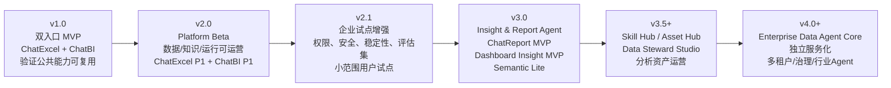
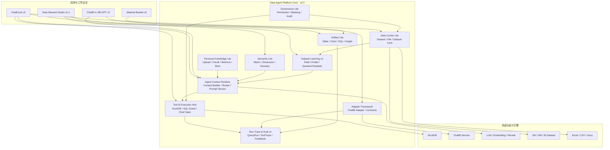

下面是一版  **Data Agent v2.0 / v3.0+ 迭代规划建议** 。我会从“产品专家团队 + 架构专家团队 + Agent 工程团队 + 交付负责人”四个视角综合给出。

核心判断先放前面：

> **v1.0 是“双入口 MVP 验证”：证明 ChatExcel 和 DB-GPT 内 ChatBI 可以共用一套平台公共能力。
> v2.0 不应该急着扩 ChatReport / Dashboard 全量能力，而应该把 v1.0 做成“可运营、可配置、可评估”的 Data Agent Platform Beta。
> v3.0+ 再进入 ChatReport、ChatDashboard、Skill Hub、Asset Hub、Semantic Center 深水区。**

---

# 1. 从 v1.0 回顾当前阶段到底在做什么

根据 v1.0 附件，当前方案已经从早期“先做 ChatExcel 单入口”调整为：

> **DB-GPT 公共能力层 + ChatExcel / DB-GPT 内 ChatBI 双入口 MVP。**

附件里明确提出：数据集学习、数据集资产、字段语义、问题模板、个人分析知识库、运行留痕、评估反馈应该在 DB-GPT / Data Agent 平台侧统一建设，而不是分别做在 ChatExcel 或 ChatBI 内部。

## 1.1 v1.0 的真实目标

v1.0 的核心目标不是“做完一个 ChatExcel”，而是验证这件事：

```text
一套平台公共能力
能否同时被 ChatExcel 和 ChatBI 两个应用消费？
```

也就是说，v1.0 的产品验证点是：

| 验证点         | 说明                                                       |
| -------------- | ---------------------------------------------------------- |
| 双入口         | ChatExcel 和 DB-GPT 内 ChatBI 都能作为消费端               |
| 公共数据集学习 | Dataset、Field、Profile、QuestionTemplate 等不归属单一应用 |
| 个人分析知识   | 用户上传知识作为问数和解释上下文                           |
| ChatBI Adapter | ChatBI 保持独立服务，通过 Adapter 接入 DB-GPT              |
| Run Trace      | ChatExcel / ChatBI 的问数过程统一留痕                      |
| 未来可抽象     | 后续可演进为 Data Agent Core Service                       |

## 1.2 v1.0 的核心交付物

按照附件中的方案，v1.0 应该交付以下内容：

| 类别      | v1.0 交付                                                                            |
| --------- | ------------------------------------------------------------------------------------ |
| 平台对象  | Dataset、DatasetField、DatasetProfile、QuestionTemplate、PersonalKnowledge、QueryRun |
| 公共能力  | Dataset Learning Center、Personal Analysis Knowledge、Run / Trace / Eval 雏形        |
| ChatExcel | Excel/CSV 数据学习、字段注释、快捷问题、DuckDB 问数、SQL Guard、运行记录             |
| ChatBI    | DB-GPT 页面内 ChatBI 入口、ChatBI Adapter、上下文传递、结果回写 Run Trace            |
| 知识能力  | 个人级知识上传、解析、检索、绑定用户/会话/数据集                                     |
| 评估能力  | 每次问数记录字段命中、知识片段、SQL、结果、反馈                                      |

## 1.3 v1.0 的资源基线与现实变化

附件里 v1.0 的资源估算是偏向：

```text
1 AI 产品经理
1 算法工程师
2 后端研发
1 前端研发
```

并建议用 **6-8 周**完成双入口 MVP，毛工作量大约  **115-168 人天** 。

你现在给出的实际资源是：

| 角色                            | 当前数量 | 备注                                                          |
| ------------------------------- | -------: | ------------------------------------------------------------- |
| AI 产品总负责人                 |        1 | 负责方向、优先级、验收、对外叙事                              |
| 初级 AI 产品经理                |        1 | 负责需求细化、流程、测试样例、文档                            |
| 后端工程师                      |        2 | 当前最关键瓶颈之一                                            |
| 前端工程师                      |        1 | 需要同时支撑多个应用入口和平台配置页面                        |
| 中级 Agent 研发                 |        1 | 负责学习、Prompt、上下文、Agent 编排                          |
| 初级 Agent 研发                 |        1 | 负责解析、Prompt 辅助、测试、Eval 样例                        |
| 未来 1 个月新增中级 Agent 研发  |        1 | v2.0 中后段可投入                                             |
| 未来 1 个月新增初级 AI 产品经理 |        1 | 可承担测试、样例、运营、知识资产整理                          |
| 可选后端外包                    |      1-2 | 建议用于 CRUD、资产管理、日志、低耦合接口，不建议碰核心 Agent |

这个资源结构有一个明显特点：

> **Agent 研发能力比 v1.0 假设更强，但后端平台工程能力仍然偏紧。**

所以 v2.0 的规划不能把大量能力压到后端核心服务上，也不能过早拆独立微服务。更合理的策略是：

```text
核心平台模型由内部后端掌控；
可独立 CRUD / 页面 / 日志 / 资产管理交给外包后端；
Agent 能力用于提升 Dataset Learning、Knowledge、Context Builder、Eval。
```

---

# 2. 总体 Roadmap Landscape

建议把接下来的迭代拆成 4 个层次：



一句话：

| 版本            | 阶段主题         | 核心目标                                                |
| --------------- | ---------------- | ------------------------------------------------------- |
| **v1.0**  | 双入口 MVP       | 证明一套公共能力能被 ChatExcel / ChatBI 共用            |
| **v2.0**  | Platform Beta    | 把 MVP 做成可配置、可运营、可评估的平台 Beta            |
| **v2.1**  | 企业试点增强     | 面向真实用户小范围试点，补安全、稳定性、权限、评估      |
| **v3.0**  | 洞察与报告 Agent | 做 ChatReport MVP、Dashboard Insight MVP、Semantic Lite |
| **v3.5+** | 技能与资产运营   | Skill Hub、Asset Hub、Data Steward Studio 成型          |
| **v4.0+** | 企业级平台化     | Data Agent Core Service 独立化、多租户、行业 Agent      |

---

# 3. 专家团队对 v2.0 的共同判断

## 3.1 v2.0 不应该做什么

先说边界。v2.0 不建议做这些：

| 不建议纳入 v2.0              | 原因                                                            |
| ---------------------------- | --------------------------------------------------------------- |
| 完整 ChatReport              | 会吞掉 Agent、后端、前端全部资源，导致平台底座不稳              |
| 完整 ChatDashboard           | 需要 Dashboard 资产模型、图表上下文、洞察算法，范围过大         |
| 完整指标平台                 | 指标治理涉及组织流程、审批、版本、Owner，不适合 v2.0 一次做重   |
| 多数据集自动关联             | 准确率和解释成本高，应等 Dataset Learning / Semantic 稳定后再做 |
| 企业级知识审批发布           | v2.0 先做个人级 / 项目级知识，企业级发布留到 v3.5+              |
| 独立 Data Agent Core Service | 当前团队和周期不适合过早拆服务                                  |
| ChatBI 核心迁移              | ChatBI 应继续作为独立专业问数引擎，通过 Adapter 集成            |

## 3.2 v2.0 应该做什么

v2.0 的定位应该是：

> **Data Agent Platform Beta：从“能演示”走向“能小范围试用、能配置、能追踪、能复盘、能持续优化”。**

v2.0 应该重点补齐 5 件事：

```text
1. Data Center Lite：数据资产能被管理
2. Dataset Learning v2：学习结果能被校正、复用、版本化
3. Knowledge Center Lite：个人知识能被管理、绑定、引用
4. Agent Context Runtime：数据、知识、语义、历史上下文能稳定组装
5. Run Trace & Eval：每次问数能被评估、复盘、优化
```

这也是符合数据管理最佳实践的：企业要真正从数据获得价值，不能只做一次性查询，而要管理数据资产、元数据、质量、安全、生命周期和使用反馈。DAMA-DMBOK 也强调数据管理需要覆盖治理、架构、建模、存储、安全、集成、内容管理、主数据、DW/BI、元数据、质量、大数据与数据科学等知识域。

---

# 4. v2.0 终点定义

## 4.1 v2.0 一句话目标

> **v2.0 的终点是：形成一个可小范围内测的 Data Agent Platform Beta，支持 ChatExcel 和 ChatBI 两个入口共用 Data Center、Dataset Learning、Personal Knowledge、Run Trace、Artifact Lite 等公共能力，并具备基础配置、评估和治理能力。**

## 4.2 v2.0 的业务目标

| 目标                 | 说明                                                |
| -------------------- | --------------------------------------------------- |
| 从 Demo 到 Beta      | 不只是跑通演示，而是让内部用户能持续试用            |
| 从单次问数到资产沉淀 | 问数结果、图表、SQL、知识、字段校正可以沉淀         |
| 从 Prompt 到平台能力 | 字段学习、知识检索、上下文组装、运行留痕要服务化    |
| 从黑盒回答到可解释   | 用户能看到字段、SQL、知识来源、运行过程             |
| 从人工调试到评估闭环 | 有标准问题集、反馈、错误复盘、Prompt / 模型版本追踪 |

## 4.3 v2.0 的产品验收标准

建议 v2.0 验收时不要只看“功能有没有”，而要看以下 8 个结果：

| 验收项         | 建议标准                                                       |
| -------------- | -------------------------------------------------------------- |
| 双入口可用     | ChatExcel 和 DB-GPT 内 ChatBI 都能使用统一数据集学习资产       |
| 数据资产管理   | 用户可查看、预览、重命名、删除、复用数据集                     |
| 字段学习可校正 | 字段含义、同义词、指标/维度角色、是否可问可人工调整            |
| 个人知识可用   | 至少支持 Word / 文本上传，能绑定用户、会话、数据集，并影响解释 |
| 问数可追踪     | 每次问数记录问题、字段命中、知识命中、SQL、结果、反馈          |
| 结果可沉淀     | 表格、图表、SQL、洞察摘要可保存为 Artifact                     |
| 安全有底线     | 只读 SQL、限行、超时、敏感字段标识、基础审计                   |
| 可做小范围试点 | 支持 2-3 个业务数据集、5-10 个内部用户、50-100 条问数样例      |

---

# 5. v2.0 能力范围：产品视角

v2.0 建议拆成 9 个产品工作包。

## WP1：Data Center Lite，数据资产中心轻量版

### 目标

把 v1.0 的 Dataset 从“技术对象”升级为“用户可管理的数据资产”。

### v2.0 功能

| L2 能力          | 具体功能                                     |
| ---------------- | -------------------------------------------- |
| 数据集列表       | 展示用户上传文件、已接入表、ChatBI 数据集    |
| 数据集详情       | 展示字段、样例、质量、快捷问题、绑定知识     |
| 文件资产管理     | 上传、预览、重命名、删除、复用               |
| Dataset Card     | 自动生成数据集说明卡                         |
| 数据集状态       | 未学习、学习中、已学习、学习失败、需人工校正 |
| 数据集标签       | 业务域、来源、Owner、敏感级别                |
| 数据集版本轻量版 | 字段学习结果变更有版本号                     |
| 数据集权限占位   | 个人、项目、团队可见范围占位                 |

### 不做

| 暂不做         | 原因                                 |
| -------------- | ------------------------------------ |
| 企业级数据目录 | 范围过大                             |
| 完整血缘       | v2.0 先做 Artifact / QueryRun 轻血缘 |
| 数据服务市场   | 留到 v3.5+                           |

---

## WP2：Dataset Learning v2，数据集学习中心增强

### 目标

把 v1.0 的字段学习能力做成可校正、可复用、可评估的平台能力。

### v2.0 功能

| L2 能力           | 具体功能                                       |
| ----------------- | ---------------------------------------------- |
| Learning Job 管理 | 发起、重跑、查看失败原因                       |
| 字段语义识别      | 时间、金额、地区、ID、枚举、文本、指标、维度   |
| 字段同义词        | 支持用户补充业务叫法                           |
| 字段可问范围      | 标记可问、不可问、敏感、仅解释不可查询         |
| 字段质量画像      | 空值率、唯一值、TopN、最大/最小、样例值        |
| 质量评分轻量版    | 缺失、重复、类型不一致、异常枚举               |
| 快捷问题生成      | 根据字段和业务域生成推荐问题                   |
| 快捷问题编辑      | 用户可修改、隐藏、发布到当前数据集             |
| 多 Sheet 支持     | 识别多个 Sheet，选择主 Sheet，支持简单合并占位 |
| 学习结果版本      | 每次人工校正可记录版本                         |
| 学习反馈回流      | 失败问数可标记原因，进入改进样例               |

### v2.0 的关键产品价值

```text
不是让模型“猜字段”，而是让系统逐步形成可复用的字段语义资产。
```

---

## WP3：Personal Knowledge Center Lite，个人分析知识中心轻量版

### 目标

让用户上传的指标口径、字段解释、分析框架、历史报告真正进入问数上下文。

### v2.0 功能

| L2 能力        | 具体功能                                         |
| -------------- | ------------------------------------------------ |
| 知识上传       | Word、TXT、Markdown 优先；PDF 可作为可选         |
| 链接知识占位   | 飞书 / Wiki 链接先做登记或手动粘贴文本           |
| 知识解析       | 标题、段落、表格文本、关键词                     |
| 切片与索引     | Chunk、Embedding、元数据                         |
| 知识绑定       | 绑定用户、会话、数据集、项目                     |
| 知识列表       | 查看、删除、重命名、标签                         |
| 知识检索       | 问数前检索相关片段                               |
| 引用提示       | 回答中提示参考了哪些知识片段                     |
| 知识作用类型   | 指标口径、字段解释、业务规则、分析框架、历史报告 |
| 知识命中 Trace | 记录每次问数命中的知识片段                       |

### 不做

| 暂不做               | 原因                       |
| -------------------- | -------------------------- |
| 企业级知识审批       | 涉及组织流程               |
| 领域级知识发布       | 需要 Owner 和治理机制      |
| 知识自动改写指标口径 | 风险高，容易污染正式语义层 |
| 复杂飞书权限集成     | v2.0 可做占位，后续接入    |

---

## WP4：Semantic Lite，轻量语义与指标口径

### 目标

不要一上来做完整指标平台，但 v2.0 必须给 ChatBI / ChatExcel 提供最小可用的语义约束。

### v2.0 功能

| L2 能力            | 具体功能                                   |
| ------------------ | ------------------------------------------ |
| 指标字段标记       | 字段可标记为指标                           |
| 维度字段标记       | 字段可标记为维度                           |
| 时间字段标记       | 支持日期、月份、周期字段                   |
| 默认聚合方式       | sum、count、avg、count distinct            |
| 指标口径文本       | 指标解释、使用注意事项                     |
| 默认过滤条件占位   | 如剔除测试数据、有效订单等，以文本方式维护 |
| 时间口径轻量版     | 同比、环比、近 N 月、自然月                |
| 字段到业务术语映射 | “销售额”“GMV”“成交金额”等同义词映射  |

### 不做

| 暂不做            | 原因                 |
| ----------------- | -------------------- |
| 完整 Metric Store | v2.0 资源不够        |
| 指标审批流        | v3.5+ 再做           |
| 跨数据集指标血缘  | 需要更成熟的数据模型 |

---

## WP5：Agent Context Runtime v2，上下文运行时

### 目标

让 Data Agent 不再是简单 Prompt 拼接，而是有稳定的上下文组装机制。

### v2.0 功能

| L2 能力              | 具体功能                                              |
| -------------------- | ----------------------------------------------------- |
| Context Builder      | 统一组装 dataset、field、semantic、knowledge、history |
| Intent Router        | 判断问数、解释、画图、保存素材、上传知识、字段配置    |
| Dataset Router Lite  | 单数据集优先，多数据集候选只做提示                    |
| Clarification        | 缺时间、指标、维度、口径时反问                        |
| Prompt Template 管理 | ChatExcel / ChatBI / Knowledge / Explanation 模板分离 |
| Prompt 版本          | 记录每次使用的 Prompt 版本                            |
| Structured Output    | 统一输出 SQL、chart_spec、answer、references、actions |
| Fallback             | 学习失败、知识检索失败、ChatBI 不可用时有明确降级     |
| Error Repair         | SQL 报错后一次自动修复                                |
| Context Token 控制   | 控制字段、知识、历史对话注入长度                      |

---

## WP6：Tool & Execution Hub v2，工具与执行增强

### 目标

统一 ChatExcel 和 ChatBI 的执行结果结构，增强安全和可解释性。

### v2.0 功能

| L2 能力         | 具体功能                                      |
| --------------- | --------------------------------------------- |
| DuckDB 执行增强 | ChatExcel 文件问数稳定执行                    |
| SQL Guard v2    | 只读、limit、timeout、危险函数拦截            |
| SQL AST 解析    | 支持字段命中、表命中、安全检查                |
| Chart Spec 统一 | 图表结果统一结构，便于保存 Artifact           |
| 结果缓存轻量版  | 同问题、同数据集短期缓存                      |
| SQL 解释        | 用户可查看 SQL 与字段映射                     |
| 执行错误解释    | 数据为空、字段不存在、类型不匹配等错误解释    |
| ChatBI 结果转换 | ChatBI 返回结果转成统一表格 / 图表 / 解释结构 |

---

## WP7：Run Trace & Eval v2，运行留痕与评估

### 目标

这是 v2.0 最重要的“平台化闭环”。没有 Eval，就没有持续优化。

### v2.0 功能

| L2 能力                | 具体功能                                           |
| ---------------------- | -------------------------------------------------- |
| QueryRun 详情          | 记录用户问题、数据集、SQL、结果、耗时、状态        |
| Field Hit Trace        | 记录命中了哪些字段、指标、维度                     |
| Knowledge Hit Trace    | 记录命中了哪些知识片段                             |
| Tool Trace             | 记录 DuckDB、ChatBI、Retriever、Chart 调用         |
| Feedback               | 点赞、点踩、问题原因、用户纠错                     |
| Eval Dataset           | 建立标准问题集、期望 SQL / 期望结果 / 期望解释     |
| Run Replay             | 可重放失败问题                                     |
| Prompt / Model Version | 记录模型、Prompt、参数版本                         |
| 运营看板               | 成功率、失败率、SQL 错误率、知识命中率、用户采纳率 |
| 失败归因               | 无字段、无权限、SQL 错、口径不清、知识未命中等分类 |

### v2.0 验收指标建议

| 指标                      |                建议目标 |
| ------------------------- | ----------------------: |
| QueryRun 留痕覆盖率       |                  ≥ 95% |
| 字段命中 Trace 覆盖率     |                  ≥ 90% |
| 知识命中 Trace 覆盖率     |                  ≥ 80% |
| 标准问题集规模            |            30-50 条起步 |
| ChatExcel 问数成功率      |         ≥ 70% 内测口径 |
| ChatBI Adapter 调用成功率 |                  ≥ 90% |
| 用户反馈采集率            | ≥ 50% 内测用户主动反馈 |

---

## WP8：Artifact Lite，分析素材与资产轻量版

### 目标

v2.0 不做完整 Asset Hub，但必须开始沉淀分析结果。

### v2.0 功能

| L2 能力       | 具体功能                                |
| ------------- | --------------------------------------- |
| 保存表格结果  | 问数结果保存为 Artifact                 |
| 保存图表      | 图表保存为 Artifact                     |
| 保存 SQL      | 成功 SQL 保存为可复用资产               |
| 保存洞察摘要  | LLM 解释结果保存为 Insight Note         |
| 报告素材篮    | 用户把表格、图表、结论加入“素材篮”    |
| Artifact 详情 | 记录来源数据集、问题、SQL、时间、创建人 |
| Artifact 复用 | 可在后续对话中引用                      |
| 轻量导出      | Markdown / 截图 / 简单文档导出占位      |

### 不做

| 暂不做          | 原因  |
| --------------- | ----- |
| 完整 Asset Hall | v3.5+ |
| 完整报告生成    | v3.0  |
| 资产审批发布    | v3.5+ |
| 资产市场        | v4.0+ |

---

## WP9：Governance & Security Lite，治理和安全轻量版

### 目标

v2.0 进入内测后，必须有基本安全底线。

### v2.0 功能

| L2 能力          | 具体功能                               |
| ---------------- | -------------------------------------- |
| 用户身份         | 复用现有登录态                         |
| Dataset 可见范围 | 个人 / 项目 / 团队占位                 |
| 敏感字段标记     | 手机号、身份证、客户名称等可手动标记   |
| 脱敏展示         | 敏感字段默认 mask                      |
| SQL 只读         | 禁止 DDL / DML                         |
| 查询限制         | limit、timeout、结果行数限制           |
| 导出控制         | 是否允许下载结果                       |
| 审计日志         | 用户、数据集、查询、导出、知识访问留痕 |

---

# 6. v2.0 垂直应用范围

## 6.1 ChatExcel v2.0

### 目标

从“文件问数 Demo”升级为“个人临时数据分析工作台”。

```text
ChatExcel v2.0
= 文件资产管理
+ 字段学习与校正
+ 快捷问题
+ 问数出表/图
+ 结果解释
+ 保存素材
+ Run Trace
```

### 功能范围

| 能力           | v2.0 内容                            |
| -------------- | ------------------------------------ |
| 文件资产化     | 上传、历史、预览、删除、重命名       |
| 多 Sheet       | 识别 Sheet，选择主 Sheet             |
| 字段学习       | 字段含义、同义词、指标/维度、质量    |
| 字段校正       | 用户手工编辑                         |
| 快捷问题       | 自动生成、人工编辑                   |
| 问数工作台     | 左侧字段、右侧问答、结果区表/图切换  |
| SQL / 过程查看 | 展示 SQL、命中字段、知识引用         |
| 图表切换       | 表格、柱状图、折线图、饼图等基础类型 |
| 保存素材       | 表、图、SQL、洞察加入素材篮          |
| 个人知识       | 上传知识影响解释和分析建议           |

---

## 6.2 ChatBI in DB-GPT v2.0

### 目标

从“Adapter 能调用”升级为“专业问数入口能稳定消费平台上下文”。

```text
ChatBI in DB-GPT v2.0
= ChatBI 应用入口
+ Dataset / Semantic Context
+ Personal Knowledge Context
+ ChatBI Adapter
+ 结果解释
+ 推荐问题
+ Run Trace
```

### 功能范围

| 能力            | v2.0 内容                                                |
| --------------- | -------------------------------------------------------- |
| ChatBI 应用入口 | 在 DB-GPT 内进入 ChatBI                                  |
| 选择数据集      | 选择已学习数据集 / ChatBI 数据集                         |
| 上下文传递      | dataset_uid、field_catalog、synonyms、question_templates |
| 知识传递        | personal_knowledge_context 注入 ChatBI 请求              |
| ChatBI Adapter  | 请求转换、结果转换、错误转换、降级                       |
| SQL 展示        | 可展示 SQL / 执行说明                                    |
| 推荐问题        | 来自 QuestionTemplate 和 ChatBI 推荐                     |
| 反问澄清        | 缺时间、指标、维度时引导用户                             |
| Run Trace       | ChatBI 问数写入统一 QueryRun                             |

---

## 6.3 Data Steward Studio v0.1

### 目标

给内部产品/分析师/数据管理员一个“校正数据学习结果”的地方。

v2.0 不做完整数据治理工作台，只做最小版。

| 能力               | v2.0 内容                        |
| ------------------ | -------------------------------- |
| 数据集学习结果查看 | 看字段、类型、质量、推荐问题     |
| 字段语义编辑       | 改字段解释、同义词、指标/维度    |
| 快捷问题管理       | 编辑、删除、排序                 |
| 质量问题查看       | 缺失、重复、异常枚举             |
| 发布到应用         | 保存后 ChatExcel / ChatBI 可消费 |

这个模块很关键，因为企业级 Data Agent 的准确率不能完全依赖模型自动推断。

---

## 6.4 ChatReport v0 占位：只做“报告素材篮”

v2.0 不建议做完整 ChatReport，但可以做一个非常小的报告前置能力：

```text
Report Material Basket
= 保存图表
+ 保存表格
+ 保存洞察摘要
+ 简单导出
```

这样 v2.0 为 v3.0 ChatReport 铺路，但不吞掉 v2.0 资源。

---

# 7. v2.0 技术架构目标

## 7.1 v2.0 技术架构图



## 7.2 v2.0 技术能力清单

| 技术能力          | 目标                                                                     |
| ----------------- | ------------------------------------------------------------------------ |
| 统一数据模型      | Dataset、Field、Profile、QuestionTemplate、Knowledge、QueryRun、Artifact |
| 服务边界          | 仍在 DB-GPT 仓库内，但按平台模块组织                                     |
| API Contract      | ChatExcel、ChatBI Adapter、Steward Studio 使用统一 API                   |
| Context Builder   | 统一拼装字段、指标、知识、历史、Prompt                                   |
| Prompt Versioning | 每次问数记录 Prompt 模板版本                                             |
| Retriever         | 个人知识检索可追踪、可调优                                               |
| SQL Guard         | DuckDB 和 ChatBI 路径都要有安全底线                                      |
| Trace Schema      | QueryRun、ToolTrace、KnowledgeTrace、FieldTrace                          |
| Artifact Schema   | 表、图、SQL、洞察统一保存                                                |
| Error Taxonomy    | 统一错误分类：无字段、SQL 错、知识未命中、权限不足、引擎失败             |
| Eval Harness      | 标准问题集、回放、结果对比                                               |
| Adapter Contract  | ChatBI 独立演进，DB-GPT 通过契约集成                                     |

---

# 8. v2.0 排期建议

建议 v2.0 按 **8 周**规划。
如果强压到 6 周，只能做 v2.0 的瘦身版。

## 8.1 v2.0 分阶段计划

| 阶段     |  周期 | 目标                                    | 关键交付                                            |
| -------- | ----: | --------------------------------------- | --------------------------------------------------- |
| Sprint 0 | W0-W1 | 架构冻结与范围锁定                      | v2.0 PRD、API Contract、数据模型、验收集            |
| Sprint 1 | W1-W2 | Data Center + Dataset Learning v2       | Dataset 管理、字段学习、字段编辑、快捷问题          |
| Sprint 2 | W3-W4 | Knowledge + ChatExcel P1                | 知识上传检索、Context Builder、ChatExcel 工作台增强 |
| Sprint 3 | W5-W6 | ChatBI P1 + Run Trace & Eval            | Adapter 加固、Trace、Feedback、Eval Dashboard 初版  |
| Sprint 4 | W7-W8 | Artifact Lite + Steward Studio + 稳定性 | 素材篮、学习校正台、联调、验收、演示脚本            |

---

# 9. v2.0 资源安排

## 9.1 角色分工建议

| 角色                 | v2.0 主责                                                               |
| -------------------- | ----------------------------------------------------------------------- |
| AI 产品总负责人      | 控制范围、确定优先级、定义验收口径、对齐长期路线                        |
| 初级 AI 产品经理 1   | 需求拆解、原型、用户故事、验收样例、演示脚本                            |
| 新增初级 AI 产品经理 | W5 后接手 Eval 样例、知识素材整理、测试反馈、文档运营                   |
| 后端工程师 A         | Data Center、Dataset Learning、Knowledge、Artifact 数据模型与 API       |
| 后端工程师 B         | ChatExcel Runtime、ChatBI Adapter、SQL Guard、Run Trace                 |
| 前端工程师           | ChatExcel 工作台、ChatBI 入口、Dataset 页面、Steward 页面、素材篮       |
| 中级 Agent 研发 1    | Dataset Learning Prompt、Context Builder、Clarification、Prompt Version |
| 初级 Agent 研发 1    | 知识解析、问题模板生成、Eval 样例、Prompt 测试                          |
| 新增中级 Agent 研发  | W5 后负责 ChatBI 上下文增强、Eval Harness、Report Material 前置能力     |
| 外包后端 1           | 建议加入，负责 Artifact CRUD、知识列表、审计日志、低耦合接口            |
| 外包后端 2           | 可选，仅当 v2.0 要做更多权限/数据源管理时加入                           |

## 9.2 推荐 RACI

| 工作包                | 产品负责人 | 后端 A | 后端 B | 前端 | 中级 Agent | 初级 Agent | 外包后端 |
| --------------------- | ---------- | ------ | ------ | ---- | ---------- | ---------- | -------- |
| v2.0 范围与验收       | A          | C      | C      | C    | C          | C          | -        |
| Data Center Lite      | C          | A/R    | C      | R    | C          | -          | R        |
| Dataset Learning v2   | C          | R      | C      | R    | A/R        | R          | C        |
| Knowledge Lite        | C          | R      | C      | R    | A/R        | R          | R        |
| Semantic Lite         | A/R        | R      | C      | R    | R          | C          | -        |
| Agent Context Runtime | C          | C      | R      | C    | A/R        | R          | -        |
| ChatExcel v2          | R          | C      | A/R    | A/R  | R          | C          | -        |
| ChatBI Adapter v2     | C          | C      | A/R    | R    | R          | C          | -        |
| Run Trace & Eval      | C          | R      | A/R    | R    | R          | R          | R        |
| Artifact Lite         | C          | R      | C      | R    | C          | -          | A/R      |
| Steward Studio v0.1   | R          | R      | C      | A/R  | C          | C          | R        |
| 联调验收              | A          | R      | R      | R    | R          | R          | C        |

说明：
A = Accountable，最终负责；R = Responsible，实际执行；C = Consulted，参与评审。

## 9.3 是否需要外包后端

我的建议是：

> **v2.0 至少增加 1 位外包后端；如果要同时做 Artifact Lite + Steward Studio + 审计日志，建议增加 2 位。**

但要注意边界：

| 外包后端适合做 | 外包后端不适合做        |
| -------------- | ----------------------- |
| CRUD API       | 核心数据模型设计        |
| Artifact 管理  | Agent Context Builder   |
| 知识列表管理   | Prompt / RAG 核心逻辑   |
| 审计日志       | ChatBI Adapter 核心契约 |
| 前端配套接口   | SQL Guard 规则设计      |
| 运维脚本       | 权限模型核心设计        |

核心原则：

```text
外包做外围工程；
内部掌握平台模型、Agent 编排、Adapter Contract、Trace Schema。
```

---

# 10. v2.0 人天粗估

## 10.1 按模块估算

| 模块                      | 粗估人天 | 主力角色                       |
| ------------------------- | -------: | ------------------------------ |
| 产品设计、PRD、原型、验收 | 25-35 pd | 产品负责人、AI PM              |
| Data Center Lite          | 25-35 pd | 后端 A、前端、外包             |
| Dataset Learning v2       | 35-50 pd | 后端 A、中级 Agent、初级 Agent |
| Knowledge Lite            | 30-45 pd | 后端 A、Agent、前端            |
| Semantic Lite             | 15-25 pd | 产品、Agent、后端              |
| Agent Context Runtime     | 30-45 pd | 中级 Agent、后端 B             |
| ChatExcel v2              | 30-45 pd | 后端 B、前端、Agent            |
| ChatBI Adapter v2         | 25-40 pd | 后端 B、Agent、前端            |
| Run Trace & Eval          | 30-45 pd | 后端 B、Agent、前端、产品      |
| Artifact Lite             | 20-35 pd | 后端、前端、外包               |
| Steward Studio v0.1       | 25-35 pd | 前端、后端、产品               |
| 联调、测试、修复、演示    | 25-40 pd | 全员                           |

合计约：

```text
v2.0 全量建议范围：295-475 pd 毛工作量
v2.0 受控 Beta 范围：220-300 pd 毛工作量
v2.0 瘦身范围：160-220 pd 毛工作量
```

以你当前团队规模，建议选择  **受控 Beta 范围** ，并增加  **1 位外包后端** 。

## 10.2 三种资源方案

| 方案     | 人力            | 可交付范围                                                                                       |
| -------- | --------------- | ------------------------------------------------------------------------------------------------ |
| 保守方案 | 不加外包        | Data Center Lite、Dataset Learning、Knowledge、ChatExcel、ChatBI、Trace；Artifact / Steward 缩小 |
| 推荐方案 | 加 1 位外包后端 | 完整 v2.0 受控 Beta：Artifact Lite、Steward v0.1、审计日志可以做                                 |
| 进取方案 | 加 2 位外包后端 | 可增加更多数据资产管理、权限、知识管理页面，但管理成本上升                                       |

我的建议：

> **采用推荐方案：当前团队 + 1 位外包后端。
> 第二位外包后端作为弹性资源，只有在 v2.0 中期确认要补权限/审计/数据源管理时再加。**

---

# 11. v2.0 详细 Sprint 资源排布

## Sprint 0：范围冻结与架构契约，W0-W1

| 角色            | 任务                                    |
| --------------- | --------------------------------------- |
| AI 产品总负责人 | 冻结 v2.0 目标、砍掉非必要范围          |
| AI PM           | PRD、用户流程、验收场景、标准问题集草案 |
| 后端 A/B        | 数据模型、API Contract、Trace Schema    |
| 前端            | 页面信息架构、低保真原型                |
| 中级 Agent      | Context Builder 设计、Prompt 模板拆分   |
| 初级 Agent      | 标准问题集、数据集样例、知识样例        |
| 外包后端        | 暂不进入或做环境熟悉                    |

交付：

```text
v2.0 PRD
v2.0 Architecture Contract
Dataset / Knowledge / QueryRun / Artifact 数据模型
ChatBI Adapter Contract
验收样例清单
```

---

## Sprint 1：Data Center + Dataset Learning v2，W1-W2

| 角色       | 任务                                                       |
| ---------- | ---------------------------------------------------------- |
| 后端 A     | Dataset、Field、Profile、LearningJob、QuestionTemplate API |
| 后端 B     | ChatExcel Runtime 对接新 Dataset Context                   |
| 前端       | 数据集列表、详情、学习状态、字段编辑页面                   |
| 中级 Agent | 字段语义识别、指标/维度识别、问题模板 Prompt               |
| 初级 Agent | 样例数据测试、字段学习结果评估                             |
| AI PM      | 字段配置交互、快捷问题规则、验收用例                       |

交付：

```text
数据集管理
字段学习
字段编辑
快捷问题生成
学习任务状态
Dataset Card 初版
```

---

## Sprint 2：Knowledge + ChatExcel P1，W3-W4

| 角色       | 任务                                          |
| ---------- | --------------------------------------------- |
| 后端 A     | Knowledge 上传、解析、索引、绑定              |
| 后端 B     | ChatExcel 问数链路、SQL Guard、Chart Spec     |
| 前端       | ChatExcel 工作台、知识上传入口、结果展示      |
| 中级 Agent | Context Builder v1、知识检索注入、解释 Prompt |
| 初级 Agent | 知识切片、检索测试、问数样例                  |
| AI PM      | ChatExcel 验收脚本、演示路径                  |

交付：

```text
ChatExcel v2 工作台
个人知识上传
知识检索与引用
字段学习结果进入问数上下文
表格/图表输出
SQL/过程查看
```

---

## Sprint 3：ChatBI P1 + Run Trace & Eval，W5-W6

此时新增中级 Agent 和新增初级 PM 可以加入。

| 角色           | 任务                                              |
| -------------- | ------------------------------------------------- |
| 后端 B         | ChatBI Adapter v2、错误转换、结果转换、Trace 写入 |
| 后端 A         | QueryRun、ToolTrace、KnowledgeTrace、Feedback API |
| 前端           | DB-GPT 内 ChatBI 页面、Run 详情页、Feedback       |
| 中级 Agent 1   | ChatBI 上下文压缩、澄清、Prompt 调优              |
| 新增中级 Agent | Eval Harness、标准问题回放、失败归因              |
| 初级 Agent     | Eval 数据集维护、失败样例整理                     |
| 新增初级 PM    | 用户测试、反馈收集、知识素材整理                  |
| 外包后端       | Trace / Artifact / 审计日志 CRUD                  |

交付：

```text
ChatBI in DB-GPT v2
ChatBI Adapter 加固
QueryRun 详情
字段命中 / 知识命中 Trace
Feedback
Eval Dataset 初版
```

---

## Sprint 4：Artifact Lite + Steward Studio + 稳定性，W7-W8

| 角色       | 任务                                    |
| ---------- | --------------------------------------- |
| 后端 A     | Artifact API、字段学习发布、数据集版本  |
| 后端 B     | Run Replay、错误兜底、SQL Guard 加固    |
| 前端       | 素材篮、Steward Studio v0.1、运营看板   |
| 中级 Agent | 答案质量优化、失败归因、Prompt 版本回归 |
| 初级 Agent | 标准问题回归测试                        |
| AI PM      | 验收、演示脚本、用户手册                |
| 产品负责人 | v2.0 评审、v2.1 / v3.0 范围决策         |

交付：

```text
Artifact Lite
Material Basket
Data Steward Studio v0.1
Eval Dashboard 初版
v2.0 内测演示环境
```

---

# 12. v2.0 必须砍掉的内容清单

为了避免范围失控，建议 v2.0 明确写入“不做清单”。

| 不做项                       | 放到哪个版本 |
| ---------------------------- | ------------ |
| 完整 ChatReport 自动生成     | v3.0         |
| Dashboard 异常检测 / 归因    | v3.0         |
| Skill Hub 市场               | v3.5         |
| Asset Hub 大厅               | v3.5         |
| 企业级知识审批发布           | v3.5         |
| 完整指标平台 / Metric Store  | v3.0-v3.5    |
| 多数据集自动 Join            | v3.5+        |
| 完整多租户                   | v4.0         |
| 独立 Data Agent Core Service | v4.0         |
| 行业 Agent                   | v4.0+        |

---

# 13. v2.0 成功指标

建议用三类指标验收。

## 13.1 产品可用性指标

| 指标                      |                                 目标 |
| ------------------------- | -----------------------------------: |
| 内测用户数                |                              5-10 人 |
| 内测数据集                | 2-3 个业务数据集 + 3-5 个 Excel 样例 |
| 标准问题集                |                             30-50 条 |
| ChatExcel 完整链路成功率  |                               ≥ 70% |
| ChatBI Adapter 调用成功率 |                               ≥ 90% |
| 用户能完成字段校正        |                                   是 |
| 用户能上传知识并被引用    |                                   是 |
| 用户能保存图表/表格为素材 |                                   是 |

## 13.2 技术质量指标

| 指标                    |                目标 |
| ----------------------- | ------------------: |
| QueryRun 留痕覆盖率     |              ≥ 95% |
| ToolTrace 覆盖率        |              ≥ 90% |
| 字段命中 Trace 覆盖率   |              ≥ 90% |
| 知识命中 Trace 覆盖率   |              ≥ 80% |
| SQL Guard 覆盖率        |       100% 问数路径 |
| 错误分类覆盖            | ≥ 80% 常见失败类型 |
| Prompt / Model 版本记录 |     100% Agent 调用 |

## 13.3 平台化指标

| 指标                                       | 目标 |
| ------------------------------------------ | ---- |
| ChatExcel / ChatBI 是否共用 Dataset 对象   | 是   |
| ChatExcel / ChatBI 是否共用 Knowledge 对象 | 是   |
| ChatExcel / ChatBI 是否共用 QueryRun       | 是   |
| 字段学习结果是否可人工校正并复用           | 是   |
| 结果是否能沉淀为 Artifact                  | 是   |
| 是否为 v3.0 ChatReport 提供素材基础        | 是   |

---

# 14. v2.1 建议：企业试点增强

v2.0 后不建议马上进入 v3.0 大功能扩张。建议先有一个  **v2.1 企业试点增强版** ，周期 4-6 周。

## v2.1 目标

> **让 v2.0 Beta 能在一个真实业务小团队里持续使用。**

## v2.1 重点

| 能力       | 内容                           |
| ---------- | ------------------------------ |
| 稳定性     | 修复 v2.0 内测问题，提升成功率 |
| 权限增强   | 项目级数据集权限、知识权限     |
| 审计增强   | 查询、导出、知识访问审计       |
| Eval 增强  | 标准问题集扩展到 100+          |
| 知识增强   | 项目级知识库，暂不做企业级审批 |
| 数据集模板 | 典型业务数据集配置模板         |
| 用户运营   | 使用手册、内测反馈、问题分类   |
| 性能优化   | 缓存、上下文压缩、查询优化     |
| 部署运维   | Dev/UAT/Prod 环境基本隔离      |

## v2.1 资源

v2.1 可以继续使用 v2.0 团队，但建议增加：

| 新增角色             | 原因                                      |
| -------------------- | ----------------------------------------- |
| 兼职 QA / 测试       | 现在团队没有专职测试，v2.1 开始会成为瓶颈 |
| 兼职数据分析 SME     | 帮助构建真实业务问题集                    |
| 1 位外包后端继续保留 | 修复和补齐平台 CRUD / 日志能力            |

---

# 15. v3.0+ 高层规划

下面进入长期路线。

---

# 15.1 v3.0：Insight & Report Agent

## v3.0 主题

```text
从“问数”进入“洞察与报告”
```

## v3.0 目标

> **基于 v2.0 的数据、知识、Artifact、Run Trace，建设 ChatReport MVP 和 ChatDashboard Insight MVP。**

## v3.0 主要能力

| 能力域                   | 具体内容                                                     |
| ------------------------ | ------------------------------------------------------------ |
| ChatReport MVP           | 报告意图理解、大纲生成、大纲编辑、分章节撰写、引用数据和知识 |
| Report Planner           | 把报告大纲拆成待查询问题、所需图表、所需素材                 |
| Data Query Orchestration | 调用 ChatBI、ChatExcel、Artifact 取数和取素材                |
| Material Basket 增强     | 素材分组、引用、排序、章节绑定                               |
| Citation                 | 报告结论引用数据集、SQL、图表、知识片段                      |
| Report Renderer          | Markdown / Word / PPT 至少一种导出                           |
| Dashboard Insight MVP    | 单图解读、整看板摘要、趋势解释、异常解释                     |
| Insight Algorithm Lite   | 同比、环比、TopN 贡献、简单异常检测                          |
| Semantic Lite 增强       | 指标口径、时间口径、默认过滤条件增强                         |
| Eval for Report          | 报告事实一致性、引用完整性、数字准确性检查                   |

## v3.0 为什么这么排

因为 v3.0 的 ChatReport 依赖 v2.0 的成果：

```text
没有 Dataset Learning，报告不知道数据字段。
没有 Knowledge Center，报告没有业务口径。
没有 Artifact，报告没有素材。
没有 Run Trace，报告没有引用和证据。
没有 Semantic Lite，报告数字口径不可信。
```

所以 v2.0 打基础，v3.0 才能做报告。

## v3.0 资源建议

| 角色                   |    建议数量 |
| ---------------------- | ----------: |
| AI 产品总负责人        |           1 |
| 平台 AI PM             |           1 |
| Report / Insight AI PM |           1 |
| 后端工程师             |         3-4 |
| 前端工程师             |           2 |
| 中级/高级 Agent 研发   |         2-3 |
| 初级 Agent / Eval 工程 |         1-2 |
| QA / 测试              |           1 |
| 数据分析 / BI SME      |           1 |
| UI/UX 设计             | 兼职或 1 人 |

如果不增加前端和 QA，v3.0 会很痛苦。ChatReport 和 Dashboard 的体验复杂度明显高于 ChatExcel / ChatBI。

---

# 15.2 v3.5：Skill Hub + Asset Hub + Data Steward Studio

## v3.5 主题

```text
从“应用功能”进入“分析资产运营”
```

## v3.5 目标

> **把用户在 ChatExcel、ChatBI、ChatDashboard、ChatReport 中产生的分析过程沉淀为技能和资产。**

## v3.5 能力

| 能力域                     | 具体内容                                           |
| -------------------------- | -------------------------------------------------- |
| Skill Hub                  | 技能定义、技能模板、技能发布、技能调用、技能评估   |
| Skill Extraction           | 从历史问数 / 报告流程中提取分析技能                |
| 官方 Skill                 | 趋势分析、同比环比、漏斗分析、贡献度分析、经营报告 |
| Asset Hub                  | 数据集、图表、SQL、洞察卡片、报告素材、报告资产    |
| Case Library               | 官方分析案例、行业案例、优秀报告案例               |
| Analysis Framework Library | 经营分析框架、财务分析框架、销售分析框架           |
| Data Steward Studio P1     | 字段语义、指标映射、知识发布、学习效果评估         |
| Knowledge Governance       | 个人级 → 项目级 → 领域级知识发布                 |
| Asset Lineage              | 数据集、SQL、图表、报告之间的轻量血缘              |
| Asset Search               | 搜数据集、搜图表、搜报告、搜案例、搜技能           |

## v3.5 资源建议

| 角色              | 建议数量 |
| ----------------- | -------: |
| 产品负责人        |        1 |
| 平台产品经理      |        1 |
| 资产/技能产品经理 |        1 |
| 后端工程师        |        4 |
| 前端工程师        |        2 |
| Agent 研发        |        3 |
| 搜索 / RAG 工程   |        1 |
| QA / Eval         |      1-2 |
| 数据治理 SME      |        1 |
| 业务分析 SME      |        1 |

---

# 15.3 v4.0：Enterprise Data Agent Core Service

## v4.0 主题

```text
从 DB-GPT 内平台模块，升级为企业级 Data Agent Core Service
```

## v4.0 目标

> **将 v2.0 / v3.0 中稳定的平台能力抽象为独立 Core Service，支持多应用、多租户、多组织、多模型、多环境。**

## v4.0 能力

| 能力域              | 具体内容                                                           |
| ------------------- | ------------------------------------------------------------------ |
| Core Service 独立化 | dataset_learning、knowledge、run_trace_eval、asset、skill 独立服务 |
| OpenAPI             | 对 ChatExcel、ChatBI、Report、Dashboard 提供统一 API               |
| 多租户              | 组织、空间、项目、用户隔离                                         |
| IAM / SSO           | 企业统一登录、角色、权限                                           |
| RBAC / ABAC         | 数据集、字段、知识、工具、导出权限                                 |
| 模型网关            | 多模型路由、成本控制、质量评估                                     |
| AgentOps            | Prompt 发布、模型切换、Agent Trace、回归测试                       |
| FinOps              | Token、模型、查询、存储成本                                        |
| DevOps              | CI/CD、灰度、回滚、环境隔离                                        |
| Security            | 脱敏、审计、数据访问风险告警                                       |
| Marketplace         | Skill、Asset、Connector 市场化                                     |

## v4.0 资源建议

v4.0 已经不是小团队项目，建议是平台产品线规模：

| 角色               | 建议数量 |
| ------------------ | -------: |
| 产品负责人         |        1 |
| 平台 PM            |        2 |
| 应用 PM            |        2 |
| 架构师             |        1 |
| 后端工程师         |      5-7 |
| 前端工程师         |        3 |
| Agent / LLM 工程师 |      4-5 |
| 数据工程 / BI 工程 |        2 |
| QA / 自动化测试    |        2 |
| DevOps / SRE       |      1-2 |
| 安全 / 合规        | 兼职或 1 |
| 数据治理 SME       |        1 |
| 行业 / 业务 SME    |      1-2 |

---

# 15.4 v4.5+：Domain Data Agent

## 主题

```text
从通用 Data Agent 平台，走向行业 / 职能垂直 Agent
```

## 方向

| Domain Agent         | 示例                               |
| -------------------- | ---------------------------------- |
| 财务经营分析 Agent   | 预算执行、利润、费用、现金流       |
| 销售运营 Agent       | 线索、商机、订单、回款、转化       |
| 客户运营 Agent       | 拉新、留存、复购、流失             |
| 金融风控 Agent       | 逾期率、通过率、风险分层、贷后监控 |
| 高管经营驾驶舱 Agent | 经营摘要、风险预警、行动建议       |
| 制造质量 Agent       | 良率、缺陷、返工、产能             |
| 供应链 Agent         | 库存、交付、采购、周转             |

长期护城河来自：

```text
行业指标体系
+ 行业知识库
+ 行业分析技能
+ 行业报告模板
+ 行业数据模型
```

而不是单纯的 Text2SQL。

---

# 16. 建议的版本路线总表

| 版本  | 时间建议 | 核心目标       | 关键能力                                                                                              | 资源建议                   |
| ----- | -------: | -------------- | ----------------------------------------------------------------------------------------------------- | -------------------------- |
| v1.0  | 当前阶段 | 双入口 MVP     | Dataset Learning、Personal Knowledge、ChatExcel、ChatBI Adapter、Run Trace                            | 当前团队可完成             |
| v2.0  |     8 周 | Platform Beta  | Data Center Lite、Learning v2、Knowledge Lite、Semantic Lite、Trace/Eval、Artifact Lite、Steward v0.1 | 当前团队 + 1 外包后端      |
| v2.1  |   4-6 周 | 企业试点增强   | 权限、安全、稳定性、Eval 扩展、项目级知识                                                             | 保留 v2.0 团队 + QA        |
| v3.0  |  8-10 周 | 洞察与报告     | ChatReport MVP、Dashboard Insight MVP、Report Planner、Citation                                       | 需增前端、后端、QA、BI SME |
| v3.5  |  8-12 周 | 技能与资产运营 | Skill Hub、Asset Hub、Case Library、Data Steward P1                                                   | 产品线小团队               |
| v4.0+ |     长期 | 企业级平台化   | Core Service、多租户、模型网关、AgentOps、FinOps、治理                                                | 平台产品线规模             |

---

# 17. 我给专家团队的最终建议

## 17.1 产品专家视角

v2.0 要回答的问题不是：

> “我们还能加哪些功能？”

而是：

> “用户能否围绕一个数据集持续完成学习、问数、解释、保存、复盘、优化？”

所以 v2.0 的产品关键词应该是：

```text
可管理
可校正
可追踪
可复用
可评估
```

## 17.2 架构专家视角

v2.0 要避免能力继续散落在应用里。

必须坚持：

```text
Dataset Learning 不属于 ChatExcel
Personal Knowledge 不属于 ChatBI
Run Trace 不属于某个应用
Artifact 不属于某个结果页
```

这些都应该是 Data Agent Platform Core 的公共对象。

## 17.3 Agent 工程专家视角

v2.0 不要只做 Prompt。

应该形成：

```text
Context Builder
+ Prompt Template Version
+ Retriever
+ Tool Trace
+ Eval Harness
+ Error Taxonomy
```

否则 v3.0 做 Report Agent 时会不可控。

## 17.4 交付负责人视角

当前资源可以做 v2.0，但必须控范围。

我的推荐是：

```text
v2.0 = 8 周
当前团队 + 1 外包后端
不做完整 ChatReport
不做完整 Dashboard
不做完整指标平台
不拆独立 Core Service
```

v2.0 只要把平台公共能力打稳，后面 v3.0 才有资格做真正的洞察和报告。
