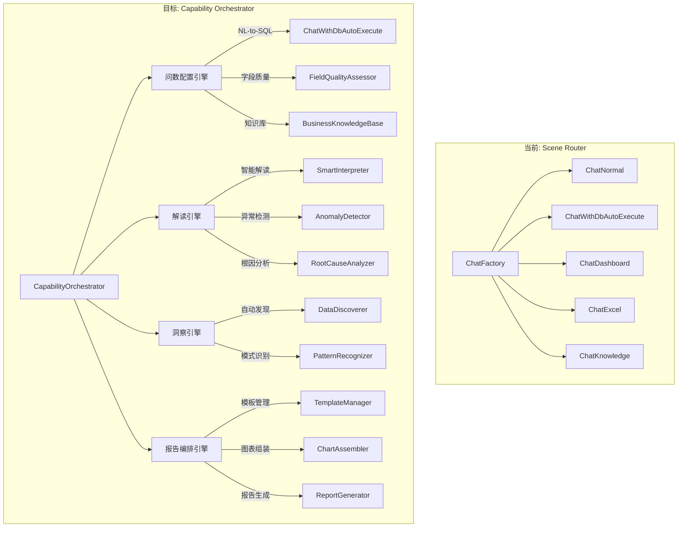
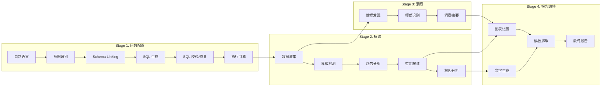
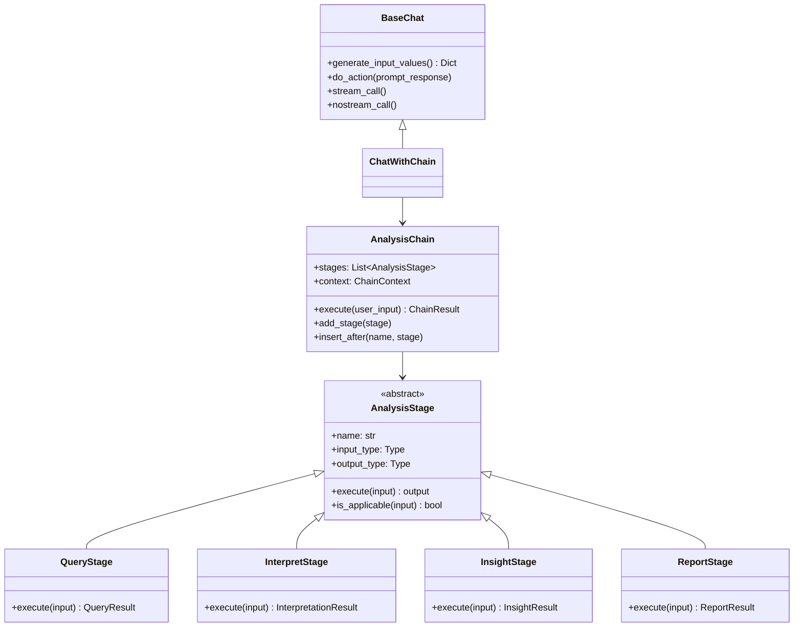
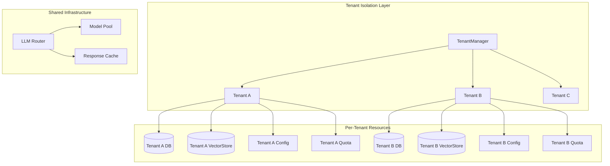
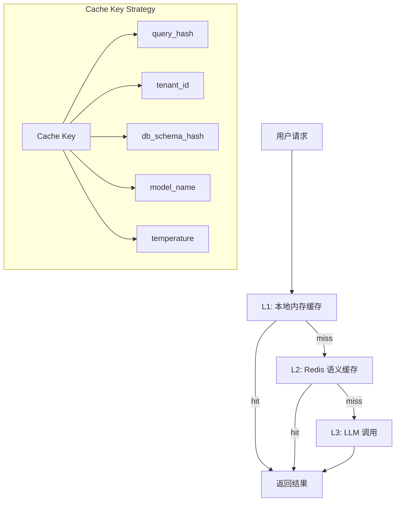
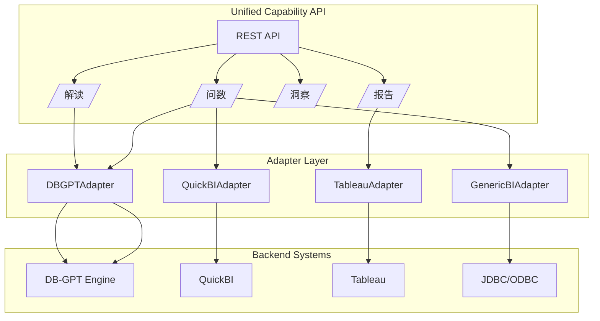
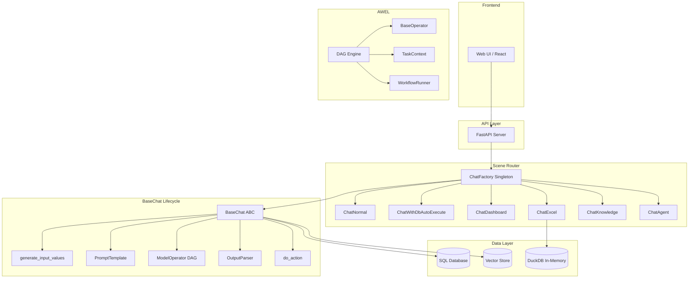
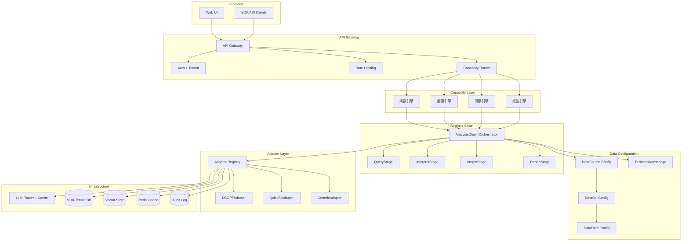
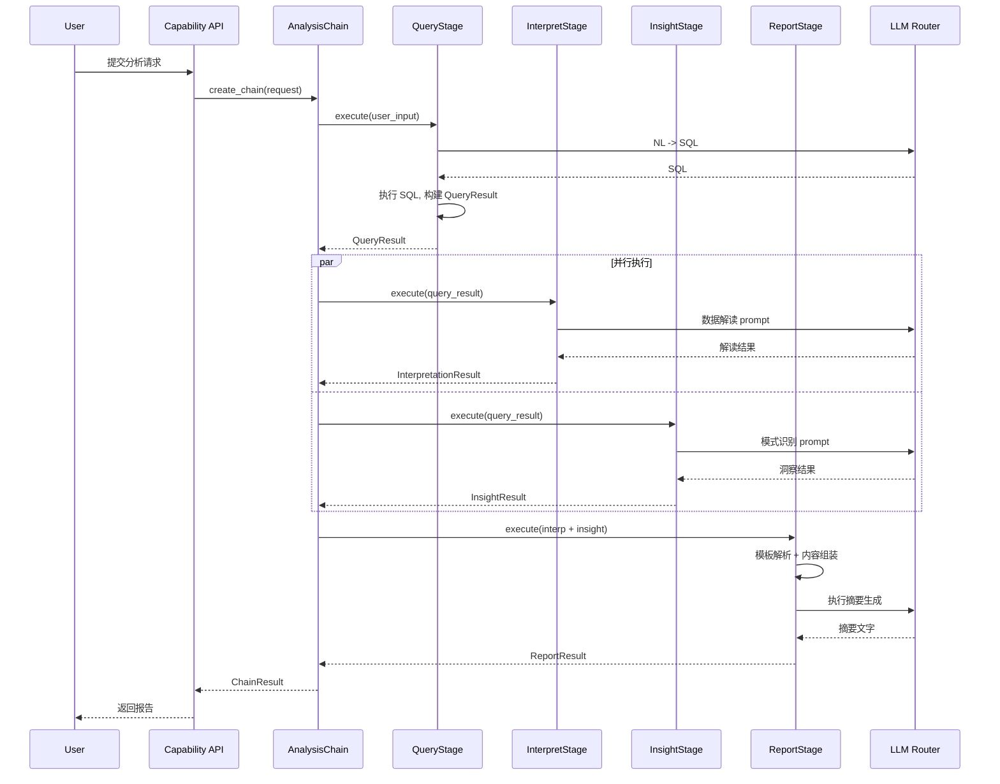

# CC-ARCH: DB-GPT v0.4.2 企业级数据分析平台架构评估

> 文档编号: CC-ARCH-001
> 版本: 1.0
> 日期: 2026-05-20
> 状态: Draft
> 目标对标: Alibaba QuickBI 小Q (问数/解读/洞察/报告)

---

## 目录

1. [当前架构评估](#1-当前架构评估)
2. [目标企业架构](#2-目标企业架构)
3. [架构决策记录 (ADR)](#3-架构决策记录-adr)
4. [技术风险评估](#4-技术风险评估)
5. [附录: Mermaid 架构图](#5-附录-mermaid-架构图)

---

## 1. 当前架构评估

### 1.1 Scene 架构: 企业级扩展的优劣势

#### 架构概览

DB-GPT v0.4.2 采用 **Scene-Based Architecture**, 核心路由机制为 ChatFactory 单例模式, 通过 `BaseChat.__subclasses__()` 遍历匹配 `chat_scene` 字符串, 实例化对应的 Scene 实现。

```python
# chat_factory.py - 当前路由机制
chat_classes = BaseChat.__subclasses__()
for cls in chat_classes:
    if cls.chat_scene == chat_mode:
        implementation = cls(**kwargs)
```

**当前已注册 Scene (共 12 个):**

| Scene | 功能 | 复杂度 |
|-------|------|--------|
| ChatNormal | 通用 LLM 对话 | 低 |
| ChatWithDbAutoExecute | NL-to-SQL 自动执行 | 中 |
| ChatWithDbQA | 数据库元数据问答 | 中 |
| ChatDashboard | 多维度图表分析 | 高 |
| ChatExcel | Excel 上传分析 | 中 |
| ChatKnowledge | 知识库问答 | 中 |
| ChatAgent | Agent 工具调用 | 高 |
| ChatWithPlugin | 插件执行 | 中 |
| InnerChatDBSummary | 内部 DB 摘要生成 | 低 |
| ExtractTriplet/Entity/Summary | 知识抽取 | 低 |

#### 优势分析

1. **扩展简单直观**: 新增 Scene 只需继承 `BaseChat`, 实现 `generate_input_values()` 和 `do_action()`, 注册 ChatScene 枚举即可
2. **模板驱动**: PromptTemplate 体系支持中英文模板、response_format 约束、temperature/max_new_tokens 独立配置
3. **生命周期完整**: `__call_base()` -> `stream_call()`/`nostream_call()` 路径清晰, 包含 tracer span 全链路追踪
4. **历史对话管理**: `OnceConversation` + `ChatHistory` factory 提供可插拔存储, `chat_retention_rounds` 控制上下文窗口

#### 劣势分析

1. **ChatFactory 是硬编码单例**: 所有 Scene import 写死在 `get_implementation()` 中, 无法动态注册/卸载, 无法支持插件化扩展
2. **Scene 之间无编排能力**: 每个 Scene 是独立处理单元, 无法串联组合 (如: 先问数 -> 再解读 -> 再洞察 -> 最后生成报告)
3. **路由基于字符串匹配**: `chat_scene == chat_mode` 无优先级、无 fallback、无条件路由
4. **BaseChat 职责过重**: 同时承担 prompt 组装、消息历史管理、模型调用、输出解析、view 渲染, 违反单一职责
5. **无权限模型**: ChatScene 枚举无租户/角色概念, 所有用户看到相同的 Scene 列表

### 1.2 BaseChat 生命周期可扩展性分析

#### 当前生命周期

```
__init__(chat_param)
    -> load prompt_template
    -> init memory (ChatHistory)
    -> build model_operator (DAG with cache)

generate_input_values() [abstract]
    -> 子类实现, 返回 Dict[str, Any]
    -> 用于 template.format(**input_values)

__call_base()
    -> generate_input_values()
    -> prompt_template.format(**input_values)
    -> generate_llm_messages() (system + examples + history + user)
    -> build payload

nostream_call()
    -> __call_base()
    -> model_operator.call(payload)
    -> output_parser.parse_model_nostream_resp()
    -> output_parser.parse_prompt_response() [structured output]
    -> do_action(prompt_response) [子类覆写]
    -> get_llm_speak() [提取对用户说的话]
    -> output_parser.parse_view_response(speak, result)
    -> memory.append(current_message)

stream_call()
    -> __call_base()
    -> model_stream_operator.call_stream(payload)
    -> output_parser.parse_model_stream_resp_ex() [逐 token 解析]
    -> stream_plugin_call(msg) [子类可覆写]
    -> memory.append(current_message)
```

#### 扩展性瓶颈

**瓶颈 1: 单次 LLM 调用限制**

BaseChat 的生命周期设计为 **一次请求 -> 一次 LLM 调用 -> 一次 action**。无法支持多轮链式推理 (Chain-of-Thought across multiple LLM calls)。以解读引擎为例, 完整的解读流程需要:
- 第 1 轮: NL-to-SQL 生成查询
- 第 2 轮: 执行 SQL 获取数据
- 第 3 轮: 基于数据进行异常检测
- 第 4 轮: 基于异常进行根因分析

当前架构下需要将这些步骤强行压缩到单次 prompt + `do_action()` 中, 或在 `do_action()` 中内嵌多次 LLM 调用 (破坏了 BaseChat 的追踪和缓存机制)。

**瓶颈 2: 输出解析器耦合**

`output_parser` 同时承担三重职责:
- `parse_model_nostream_resp()`: 从模型原始输出中提取文本
- `parse_prompt_response()`: 将文本解析为结构化对象 (如 ChartItem, SqlAction)
- `parse_view_response()`: 将结构化对象渲染为前端展示格式 (如 XML, JSON)

这三者应该解耦为独立的 pipeline stage。

**瓶颈 3: 无中间状态传递**

`generate_input_values()` 和 `do_action()` 之间通过 `prompt_response` 传递数据, 但 `generate_input_values()` 无法获取上一次 `do_action()` 的结果, 无法实现迭代式分析。

### 1.3 AWEL 工作流引擎成熟度评估

#### 架构设计 (设计水准: 7/10)

AWEL (Agentic Workflow Expression Language) 采用 DAG 模型, 核心抽象层次清晰:

```
DAG (有向无环图)
  -> DAGNode (节点基类, 支持 >> 和 << 操作符连接)
    -> BaseOperator (可执行节点, 泛型 OUT)
      -> MapOperator, BranchOperator, JoinOperator
      -> ModelOperator, ModelStreamOperator
    -> TriggerOperator (触发器节点)
  -> TaskContext (任务上下文)
    -> TaskOutput (支持 stream/non-stream)
    -> InputContext (支持 map/reduce/filter)
  -> WorkflowRunner (执行引擎)
    -> DefaultWorkflowRunner (本地执行)
```

**设计亮点:**
- `>>` / `<<` 操作符重载实现直观的 DAG 拓扑定义
- `TaskOutput` 统一抽象 stream 和 non-stream 输出
- `ModelCacheBranchOperator` 实现缓存命中/未命中的分支路由
- `contextvars.ContextVar` + `threading.local` 双栈支持 async/sync 上下文

#### 成熟度不足

| 维度 | 评估 | 说明 |
|------|------|------|
| **API 稳定性** | 低 | 源码明确标注 "experimental feature" |
| **DAG 可视化** | 缺失 | 无 DAG 拓扑可视化/调试工具 |
| **错误处理** | 薄弱 | 无 DAG 级别的重试/回滚/补偿机制 |
| **持久化** | 缺失 | DAG 定义仅内存存在, 无版本管理 |
| **监控** | 基础 | 仅有 tracer span, 无 DAG 执行 metrics |
| **并行执行** | 有限 | 无显式的并行分支执行优化 |
| **动态 DAG** | 不支持 | 运行时无法修改 DAG 拓扑 |

#### 当前使用场景

AWEL 在 v0.4.2 中仅用于内部模型调用管线:

```
InputNode -> CacheCheckBranch
              -> ModelNode -> SaveCache -> JoinNode
              -> CachedNode -------------> JoinNode
```

这意味着 AWEL 的生产验证范围极小, 尚未承载业务逻辑编排。

### 1.4 数据层评估

#### 数据库连接层

`Database` 类基于 SQLAlchemy 封装, 提供统一查询接口:

**优势:**
- 支持多种数据库: MySQL, PostgreSQL, SQLite, DuckDB, ClickHouse, MSSQL
- `query_ex()` 返回 `(field_names, values)` 元组, 接口简单
- `from_uri()` 工厂方法支持灵活连接

**不足:**
- 无连接池配置暴露 (依赖 SQLAlchemy 默认 pool)
- 无查询超时控制
- 无读写分离/分库分表支持
- `LOCAL_DB_MANAGE.get_connect(db_name)` 全局单例, 无租户隔离

#### 向量检索层

`DBSummaryClient` 实现了数据库元数据的向量化索引:

**流程:**
```
db_summary_embedding():
  RdbmsSummary(dbname, db_type) -> 生成表结构摘要
  StringEmbedding -> embedding -> vector_store
  (FAST 模式: 按表粒度索引 / DEFAULT 模式: LLM 辅助路由)

get_db_summary():
  EmbeddingEngine.similar_search(query, topk) -> 返回相关表信息
```

**不足:**
- 向量索引在进程启动时全量构建, 无增量更新
- 仅索引表结构, 不索引数据质量、业务含义、使用频率等元数据
- 无 embedding 模型热切换能力
- `SUMMARY_CONFIG == "FAST"` vs DEFAULT 的路由策略过于简单

#### Excel 分析层

`ExcelReader` 基于 DuckDB 内存数据库:

**优势:**
- 自动编码检测 (`chardet`)
- 中文列名处理 (`add_quotes_to_chinese_columns`)
- 自动类型推断 (`pd.to_numeric`)

**不足:**
- 每次上传创建新 DuckDB 实例, 无持久化
- 无大文件分片处理 (>100MB 场景未考虑)
- 中文列名处理依赖 `sqlparse` 正则, 鲁棒性有限

### 1.5 多租户能力差距分析

| 能力维度 | 当前状态 | 企业要求 | 差距 |
|----------|----------|----------|------|
| 租户隔离 | 无 | 数据/配置/权限完全隔离 | **严重** |
| 数据权限 | 无 | 行级/列级权限控制 | **严重** |
| Scene 权限 | 全量可见 | 按角色/套餐分配 Scene | **高** |
| 配置隔离 | 全局 Singleton Config | 租户独立配置 | **严重** |
| 资源配额 | 无 | LLM token 配额、并发限制 | **高** |
| 审计日志 | tracer (无持久化) | 操作审计 + 数据访问日志 | **高** |
| 连接池隔离 | 共享连接池 | 租户独立连接池 | **中** |
| 模型选择 | 全局模型 | 租户可用模型列表 | **中** |

---

## 2. 目标企业架构

### 2.1 ChatFactory 演进: 从 Scene Router 到 Capability Orchestrator

#### 演进策略

将 ChatFactory 从 **1:1 路由器** (一个 Scene 对应一个实现) 演进为 **capability-based orchestrator**, 支持四个核心能力的组合与编排。



#### 核心 Capability 定义

**Capability 1: 问数 (Data Q&A)**

对标 QuickBI 小Q 的问数能力, 需要以下子模块:

| 子模块 | 职责 | 当前对应 | 差距 |
|--------|------|----------|------|
| NL-to-SQL 引擎 | 自然语言转 SQL | ChatWithDbAutoExecute | 需要增强: schema linking, SQL 校验, 修复 |
| 字段质量评估 | 评估字段完整性/准确性 | 无 | **新增** |
| 学习加速 | 基于用户反馈优化 NL-to-SQL | 无 | **新增** |
| 业务知识库 | 业务术语 -> SQL 映射 | DBSummaryClient (仅表结构) | **增强** |
| 正则知识库 | 高频查询模板 | 无 | **新增** |
| 权限管理 | 数据行/列级权限 | 无 | **新增** |
| 数据集分类 | 查询意图分类 | 无 | **新增** |

**Capability 2: 解读 (Interpretation)**

| 子模块 | 职责 | 当前对应 | 差距 |
|--------|------|----------|------|
| 智能解读 | 一键生成数据解读文案 | 无 | **新增** |
| 多模式解读 | 智能/简单/复合模式 | 无 | **新增** |
| 异常检测 | 统计异常自动发现 | 无 | **新增** |
| 趋势分析 | 时序趋势 + 预测 | 无 | **新增** |
| 根因分析 | 异常原因下钻 | 无 | **新增** |

**Capability 3: 洞察 (Insights)**

| 子模块 | 职责 | 当前对应 | 差距 |
|--------|------|----------|------|
| 自动数据发现 | 无监督发现数据特征 | 无 | **新增** |
| 模式识别 | 关联规则/聚类/周期性 | 无 | **新增** |

**Capability 4: 报告 (Reports)**

| 子模块 | 职责 | 当前对应 | 差距 |
|--------|------|----------|------|
| 模板管理 | 报告模板 CRUD | dashboard.json 静态文件 | **增强** |
| 图表组装 | 多图表排版 + 联动 | ChatDashboard.do_action() | **增强** |
| 报告生成 | 文字 + 图表 + 分析 | 无 (仅有图表) | **新增** |

### 2.2 数据管线架构: 从原始查询到报告

#### 目标 Pipeline



#### Stage 间数据契约

```python
# Stage 1 输出 -> Stage 2 输入
@dataclass
class QueryResult:
    sql: str                          # 生成的 SQL
    data: pd.DataFrame               # 查询结果
    field_metadata: List[FieldMeta]  # 字段元数据 (类型/含义/统计摘要)
    query_context: QueryContext      # 原始意图/schema linking 信息

# Stage 2 输出 -> Stage 3/4 输入
@dataclass
class InterpretationResult:
    summary: str                      # 智能解读文案
    anomalies: List[Anomaly]         # 异常点
    trends: List[Trend]              # 趋势描述
    root_causes: List[RootCause]     # 根因分析
    confidence: float                # 置信度

# Stage 3 输出 -> Stage 4 输入
@dataclass
class InsightResult:
    patterns: List[Pattern]           # 发现的模式
    correlations: List[Correlation]  # 关联关系
    recommendations: List[str]       # 行动建议
    data_quality_score: float        # 数据质量评分

# Stage 4 输出
@dataclass
class ReportResult:
    title: str
    sections: List[ReportSection]    # 报告章节
    charts: List[ChartData]          # 图表数据
    executive_summary: str           # 执行摘要
    metadata: ReportMetadata         # 生成时间/模型/token 用量
```

### 2.3 BaseChat 扩展方案: 多阶段分析链

#### 方案: AnalysisChain 抽象层

在 BaseChat 之上引入 `AnalysisChain`, 将多个 Stage 串联:



**关键设计原则:**

1. **每个 Stage 独立可测试**: 明确的 input/output 类型, 纯函数式语义
2. **Stage 可组合**: 通过 `AnalysisChain.add_stage()` 自由组装管线
3. **条件跳过**: `is_applicable(input)` 允许某些 Stage 在特定数据下跳过
4. **共享上下文**: `ChainContext` 在 Stage 之间传递累积状态
5. **兼容 BaseChat**: `ChatWithChain` 继承 `BaseChat`, 在 `do_action()` 中驱动 chain 执行

### 2.4 多租户数据隔离策略

#### 租户模型



#### 隔离层级

| 层级 | 策略 | 实现 |
|------|------|------|
| **数据库连接** | 租户独立连接池 | `TenantConnectionManager` 管理 `Dict[tenant_id, Database]` |
| **向量存储** | namespace 隔离 | 每个租户 `vector_store_name` 前缀 `{tenant_id}_` |
| **Prompt 配置** | 租户级覆盖 | `PromptTemplateRegistry` 支持 tenant-specific 模板 |
| **Scene 权限** | 角色-能力映射 | `TenantScenePolicy.filter_scenes(tenant_id, roles)` |
| **模型访问** | 白名单制 | `TenantModelWhitelist.get_available_models(tenant_id)` |
| **Token 配额** | 令牌桶 | `TokenQuotaManager.check_and_consume(tenant_id, tokens)` |
| **审计日志** | 租户维度写入 | `AuditLogger.log(tenant_id, action, resource, result)` |

#### Config 单例演进

当前 `Config` 是全局 Singleton, 必须演进为 `TenantConfigProvider`:

```python
class TenantConfigProvider:
    def get_config(self, tenant_id: str) -> TenantConfig:
        """获取租户配置, 支持层级继承"""
        global_config = self._global_config
        tenant_overrides = self._store.get(tenant_id)
        return TenantConfig.merge(global_config, tenant_overrides)
```

### 2.5 缓存与性能架构

#### 多级缓存策略



#### 性能优化关键点

| 优化维度 | 措施 | 预期收益 |
|----------|------|----------|
| **SQL 缓存** | 相似 NL 查询命中历史 SQL, 跳过 LLM | 延迟降低 90%+ |
| **Embedding 缓存** | 表结构 embedding 预计算, 避免实时检索 | 首次查询加速 |
| **模型响应缓存** | AWEL `ModelCacheBranchOperator` 已有基础 | 重复查询零延迟 |
| **流式输出** | `stream_call()` 逐 token 返回 | 首字延迟 < 200ms |
| **并行执行** | 异常检测 + 趋势分析并行 | 多 Stage 管线耗时减少 |
| **连接池预热** | 启动时建立数据库连接池 | 首次查询无冷启动 |
| **Prompt 压缩** | 压缩表结构信息, 减少 token 消耗 | 成本降低 30-50% |

---

## 3. 架构决策记录 (ADR)

### ADR-1: 如何扩展 BaseChat 支持多阶段分析链

#### Decision

采用 **AnalysisChain + AnalysisStage 抽象层**, 在 BaseChat 之上构建多阶段编排, 而非修改 BaseChat 内部生命周期。

#### Context

当前 BaseChat 设计为 "单次 LLM 调用" 模型。企业级数据分析平台需要多阶段链式处理: 问数 -> 解读 -> 洞察 -> 报告, 每个阶段可能涉及独立 LLM 调用、数据处理、和外部 API 交互。

#### Options Considered

| 方案 | 描述 | 优势 | 劣势 |
|------|------|------|------|
| **A: 继承 BaseChat, do_action 内嵌多轮调用** | 在 `do_action()` 中内嵌多次 LLM 调用 | 改动最小 | 破坏 tracer/cache/memory 机制; 无法独立测试各阶段 |
| **B: 修改 BaseChat 支持多轮 lifecycle** | 在 BaseChat 中增加 `stages` 概念 | 统一生命周期 | 所有 Scene 被迫适配; BaseChat 进一步膨胀 |
| **C: AnalysisChain 独立编排层** | 新建 AnalysisChain, BaseChat 仅做入口适配 | 各层职责清晰; Stage 可独立测试; 不影响现有 Scene | 增加抽象层; 需要实现 Chain 的 tracing/cache 适配 |
| **D: 纯 AWEL DAG 编排** | 用 AWEL DAG 替代 BaseChat 生命周期 | 可视化编排; 灵活 | AWEL 不成熟; 与现有 Scene 体系完全断裂 |

#### Recommendation

**选择方案 C: AnalysisChain 独立编排层**

理由:
1. 最小侵入: 现有 Scene (ChatNormal, ChatKnowledge 等) 无需改动
2. 新增 Capability Scene (ChatInterpretation, ChatInsight, ChatReport) 通过 `ChatWithChain` 适配 BaseChat
3. AnalysisStage 可以逐步验证, 不需要一次性实现全部 Stage
4. 为未来 AWEL 成熟后迁移到方案 D 保留空间

#### Consequences

- **正面**: 职责清晰, 可独立演进, 兼容现有架构
- **负面**: 新增一层抽象, Chain 的 tracing/cache 需要额外适配
- **风险**: 如果 Stage 粒度划分不当, 会导致 Stage 间数据传递过于复杂

---

### ADR-2: 问数配置层数据架构

#### Decision

采用 **三层配置模型**: DataSource -> DataSet -> DataField, 配合独立的 BusinessKnowledge 模块。

#### Context

问数能力 (NL-to-SQL) 的核心在于 "让 LLM 理解数据"。当前 ChatWithDbAutoExecute 直接从数据库 schema 获取表结构信息, 缺少业务语义层。QuickBI 小Q 的问数配置包含: 字段质量评估、业务知识库、正则模板、权限控制、数据集分类。这些都需要一个结构化的配置层。

#### Options Considered

| 方案 | 描述 | 优势 | 劣势 |
|------|------|------|------|
| **A: 直接增强 DBSummaryClient** | 在现有向量索引中增加业务元数据 | 改动最小 | 向量检索不适合精确匹配; 无法管理复杂配置 |
| **B: 配置文件 + 向量混合** | YAML/JSON 配置文件描述业务语义 + 向量检索辅助 | 灵活可编辑 | 配置文件管理复杂; 缺少运行时 API |
| **C: 三层配置模型 + 配置服务** | DataSource/DataSet/DataField 三层关系型存储 + RESTful API | 结构化、可管理、支持 UI 配置 | 开发量较大; 需要额外的存储层 |

#### Recommendation

**选择方案 C: 三层配置模型**

```
DataSource (数据源)
  -> 连接信息 (URI, 认证)
  -> 数据库类型 (MySQL/PG/ClickHouse)
  -> 租户绑定

  DataSet (数据集)
    -> SQL 或表名
    -> 业务描述 (NL)
    -> 字段列表
    -> 权限策略
    -> 查询模板

    DataField (字段)
      -> 物理名 / 业务名 / 描述
      -> 数据类型 / 语义类型 (维度/度量)
      -> 质量评分
      -> 值域约束
      -> 关联字段
```

配合独立模块:
- `BusinessKnowledgeRegistry`: 业务术语 -> SQL 片段映射, 支持正则模板
- `FieldQualityAssessor`: 评估字段完整性、唯一性、分布特征
- `QueryIntentClassifier`: 将用户查询分类为不同数据集/查询模式

#### Consequences

- **正面**: 结构化配置支持 UI 管理, 支持权限, 支持数据质量治理
- **负面**: 开发量较大, 需要设计存储 schema 和 API
- **依赖**: 需要 ADR-1 的 AnalysisChain 支持多阶段问数处理

---

### ADR-3: 报告编排管线

#### Decision

采用 **模板驱动 + LLM 辅助生成** 的混合模式, 报告结构由模板定义, 具体内容 (文字描述/图表选择) 由 LLM 生成。

#### Context

当前 ChatDashboard 的报告能力仅限于: 用户输入 -> LLM 生成多个图表 SQL -> 执行查询 -> 返回图表数据。缺少:
- 报告结构编排 (章节/目录)
- 文字分析内容 (仅有 `thoughts` 简短描述)
- 模板管理 (当前硬编码为 dashboard.json)
- 图表与文字的混合排版

#### Options Considered

| 方案 | 描述 | 优势 | 劣势 |
|------|------|------|------|
| **A: 纯 LLM 生成** | LLM 一次性生成完整报告 | 最灵活 | 不可控; token 消耗巨大; 质量不稳定 |
| **B: 纯模板填充** | 预定义报告结构, LLM 仅填充数据槽位 | 可控性强 | 灵活性差; 无法适应不同分析场景 |
| **C: 模板 + LLM 混合** | 模板定义结构和约束, LLM 生成内容 | 平衡可控性和灵活性 | 需要设计模板 DSL |
| **D: AWEL DAG 编排** | 用 AWEL DAG 定义报告生成流程 | 可视化编排 | AWEL 不成熟; 开发成本高 |

#### Recommendation

**选择方案 C: 模板 + LLM 混合**

报告模板结构:

```yaml
report_template:
  name: "经营分析月报"
  sections:
    - title: "执行摘要"
      type: "llm_generated"           # LLM 生成文字
      context: "基于全部图表数据的综合分析"
      max_tokens: 500

    - title: "关键指标概览"
      type: "chart_grid"              # 图表网格
      chart_hints:                    # 引导 LLM 生成 SQL
        - "核心 KPI 趋势图"
        - "同比环比对比"
      chart_type_whitelist: ["LineChart", "IndicatorValue"]
      columns: 2

    - title: "异常分析"
      type: "llm_with_charts"         # 文字 + 图表混合
      analysis_chain: "anomaly_detection"
      max_tokens: 800

    - title: "根因下钻"
      type: "drill_down"              # 交互式下钻
      dimensions: ["region", "product", "channel"]
```

报告生成 Pipeline:

```
1. TemplateResolver: 解析模板, 识别 section 类型和依赖
2. DataCollector: 并行执行各 section 的数据查询
3. ChartGenerator: 为 chart 类型 section 生成图表
4. TextGenerator: 为 llm 类型 section 生成文字
5. AnomalyDetector: 为异常分析 section 执行异常检测
6. ReportAssembler: 组装所有 section, 生成最终报告
```

#### Consequences

- **正面**: 报告结构可控, 内容灵活, 支持多种 section 类型
- **负面**: 需要设计模板 DSL, 前端需要支持丰富的渲染组件
- **关键依赖**: 需要 ADR-1 的 AnalysisChain 执行多阶段处理

---

### ADR-4: 与现有 ChatBI 产品的集成架构

#### Decision

采用 **Adapter Pattern + 统一 Capability API**, 通过适配器层对接现有 ChatBI 产品, 而非替换。

#### Context

企业环境中通常已存在多种数据工具 (QuickBI, Tableau, PowerBI, 自研 BI)。目标不是替换这些工具, 而是为其提供 AI 增强能力。同时, DB-GPT 自身的 ChatDashboard 和 ChatWithDbAutoExecute 也需要保留和增强。

#### Options Considered

| 方案 | 描述 | 优势 | 劣势 |
|------|------|------|------|
| **A: 独立系统, 对外 API** | 作为独立 AI 层, 通过 API 对外服务 | 解耦彻底; 不影响现有系统 | 集成成本高; 数据需要同步 |
| **B: 插件/嵌入式** | 以 SDK/Plugin 形式嵌入现有 BI | 用户体验统一 | 每个宿主都需要适配; 升级困难 |
| **C: Adapter + 统一 API** | 统一 Capability API + 各产品的 Adapter | 兼容性好; 渐进式接入 | Adapter 维护成本 |

#### Recommendation

**选择方案 C: Adapter + 统一 Capability API**



Adapter 接口定义:

```python
class BICapabilityAdapter(ABC):
    @abstractmethod
    def query_data(self, nl_query: str, dataset_id: str) -> QueryResult:
        """问数能力"""

    @abstractmethod
    def interpret_data(self, data: QueryResult, mode: str) -> InterpretationResult:
        """解读能力"""

    @abstractmethod
    def discover_insights(self, data: QueryResult) -> InsightResult:
        """洞察能力"""

    @abstractmethod
    def generate_report(self, template_id: str, data: dict) -> ReportResult:
        """报告能力"""
```

#### Consequences

- **正面**: 渐进式接入, 不替换现有系统, 支持多 BI 产品并存
- **负面**: 每个 BI 产品需要一个 Adapter 实现; Adapter 需要随 BI 产品版本升级
- **关键成功因素**: Capability API 的稳定性, 需要版本化和向后兼容

---

## 4. 技术风险评估

### 风险矩阵

| # | 风险 | 可能性 | 影响 | 等级 | 缓解策略 |
|---|------|--------|------|------|----------|
| R1 | **NL-to-SQL 准确率不达标** | 高 | 高 | **High** | 分阶段实施: 先支持简单查询, 逐步增加复杂度; 建立 SQL 校验层; 用户反馈闭环 |
| R2 | **多阶段 LLM 调用延迟过高** | 高 | 中 | **High** | 并行执行独立 Stage; 缓存中间结果; 采用更小/更快的模型处理简单 Stage |
| R3 | **LLM 输出解析不稳定** | 高 | 中 | **High** | 强化 response_format 约束; 多次重试 + 降级策略; 结构化输出 (function calling) |
| R4 | **多租户数据泄露** | 低 | 极高 | **High** | 租户 ID 全链路传递; 数据库连接严格隔离; 定期安全审计; 渗透测试 |
| R5 | **AWEL 引入导致系统不稳定** | 中 | 中 | **Medium** | AWEL 仅用于新功能; 保留 BaseChat 作为 fallback; 充分的集成测试 |
| R6 | **报告模板 DSL 过于复杂** | 中 | 中 | **Medium** | 从简单模板开始; 预设常用模板; 提供模板验证工具 |
| R7 | **Token 成本失控** | 高 | 中 | **Medium** | 实施多级缓存; Token 配额管理; Prompt 压缩; 小模型处理简单任务 |
| R8 | **中文场景 LLM 理解偏差** | 中 | 中 | **Medium** | 中文专属 prompt 优化; 中文 few-shot 示例; 中文列名映射层 |
| R9 | **DuckDB 内存溢出 (大 Excel)** | 中 | 低 | **Low** | 文件大小限制; 分片加载; 持久化到磁盘数据库 |
| R10 | **向量检索质量不足** | 低 | 中 | **Low** | Hybrid search (向量 + 关键词); Reranking; 用户反馈优化 embedding |

### 风险缓解详细策略

#### R1: NL-to-SQL 准确率

分三个阶段提升:

```
Phase 1 (MVP): 支持 SELECT + WHERE + GROUP BY + ORDER BY
  - 准确率目标: 80% (在预定义数据集上)
  - 措施: 强化 prompt, 增加 few-shot

Phase 2: 支持 JOIN + 子查询 + 窗口函数
  - 准确率目标: 70%
  - 措施: Schema linking 增强, SQL 校验/自动修复

Phase 3: 复杂分析 SQL (CTE, 复杂聚合)
  - 准确率目标: 60%
  - 措施: 多轮对话式 SQL 构建, 用户确认机制
```

#### R2: 多阶段 LLM 调用延迟

```
目标: 端到端延迟 < 10s (简单查询), < 30s (完整报告)

优化手段:
1. Stage 并行化: 异常检测和趋势分析可并行执行
2. 流式输出: 每个 Stage 的文字输出流式返回前端
3. 增量渲染: 前端收到部分数据即开始渲染
4. 缓存: 相同查询的数据缓存, 仅重新执行分析 Stage
5. 模型路由: 简单任务用小模型 (fast), 复杂推理用大模型 (accurate)
```

#### R4: 多租户数据安全

```
安全架构原则:
1. Zero Trust: 每个 API 请求都必须验证 tenant_id
2. 最小权限: 数据库连接仅授予必要权限
3. 审计追踪: 所有数据访问记录到审计日志
4. 静态隔离: 不同租户的数据存储物理隔离或逻辑隔离
5. 定期审查: 每季度进行安全审查和渗透测试
```

---

## 5. 附录: Mermaid 架构图

### A. 当前架构总览



### B. 目标架构总览



### C. AnalysisChain 执行流程



---

## 修订历史

| 版本 | 日期 | 作者 | 变更说明 |
|------|------|------|----------|
| 1.0 | 2026-05-20 | Claude (LLM Architect) | 初始版本: 架构评估 + 目标设计 + ADR + 风险评估 |
