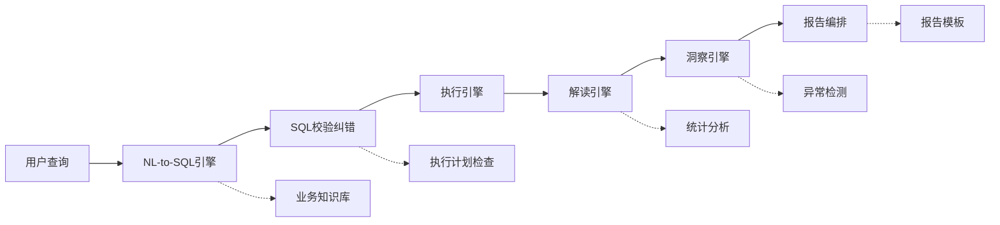

# DB-GPT v0.4.2 企业级数据分析平台改造总体规划

> **文档编号**: CC-MASTER-2026-001
> **版本**: v1.0
> **日期**: 2026-05-20
> **状态**: Draft
> **依据文档**:
> - CC-ARCH-001: 架构评估报告
> - CC-PM-2026-001: 产品能力差距分析
> - CC-ENG-2026-001: 工程工作量估算
> **对标产品**: Alibaba QuickBI 小Q (问数/解读/洞察/报告)

---

## 目录

1. [执行摘要](#1-执行摘要)
2. [现状诊断：三方视角收敛](#2-现状诊断三方视角收敛)
3. [架构决策：跨角色共识](#3-架构决策跨角色共识)
4. [模块改造规划](#4-模块改造规划)
5. [时间线与里程碑](#5-时间线与里程碑)
6. [资源投入与团队配置](#6-资源投入与团队配置)
7. [风险矩阵与应对](#7-风险矩阵与应对)
8. [差异化竞争策略](#8-差异化竞争策略)
9. [附录：子文档索引](#9-附录子文档索引)

---

## 1. 执行摘要

### 1.1 核心结论

经过架构师、产品经理、研发负责人三个角色的独立评估与交叉验证，形成以下共识：

| 维度 | 结论 |
|------|------|
| **当前覆盖率** | DB-GPT 对标 QuickBI 小Q 整体能力覆盖率约 **22%** |
| **改造总工时** | **517 人天**（含技术债务清理），约 **103 人周** |
| **建议团队** | 13.5 FTE（3 高级后端 + 2 中级后端 + 2 高级前端 + 1 中级前端 + 2 ML + 1 DevOps + 1 QA + 0.5 PM + 1 架构师） |
| **总工期** | 32 周（7 个月 + 15% buffer），分 3 个 Phase 交付 |
| **最大风险** | NL-to-SQL 准确率（当前预估 60-70%，目标 85%+） |
| **差异化方向** | 深度报告生成 + 私有化部署 + 模型自由度，而非全面追赶 QuickBI 数据准备管线 |

### 1.2 三方评估一致发现的 Top 5 问题

| 排名 | 问题 | 架构师评估 | PM 评估 | 工程评估 | 优先级 |
|------|------|-----------|---------|---------|--------|
| 1 | **NL-to-SQL 无校验纠错** | BaseChat 单次 LLM 调用不支持链式推理 | ChatDB 仅 Prompt 约束"仔细检查 SQL" | Critical 技术债务 | **P0** |
| 2 | **解读能力几乎为零** | 缺少多阶段分析编排（AnalysisChain） | 覆盖率约 10% | 需新建完整管道 | **P0** |
| 3 | **无数据集配置概念** | 缺少 DataSource/DataSet/DataField 三层模型 | ChatDB 直接查表，无业务语义层 | 需新建元数据模型 | **P0** |
| 4 | **BaseChat 职责过重** | 同时承担 6 项职责，违反 SRP | 用户无法获得引导式配置体验 | 代码质量 5/10，扩展前必须重构 | **P0** |
| 5 | **ChatFactory 硬编码** | 无法动态注册/卸载 Scene | 无法按租户定制 Scene | 代码质量 4/10，违反 OCP | **P1** |

---

## 2. 现状诊断：三方视角收敛

### 2.1 模块能力对标 QuickBI 小Q（三方交叉验证）

```
                    问数       解读       洞察       报告
                 (Q&A)    (Interpret) (Insight)  (Report)
ChatExcel       [35%]        --          --        --
ChatDB/ChatData [25%]      [10%]        --        --
ChatBI           --          --         [0%]       --
ChatDashboard    --          --         --       [20%]
                 ↑ PM覆盖率评估，架构师/工程负责人交叉验证
```

### 2.2 代码质量基线（工程评估 + 架构验证）

| 模块 | 质量评分 | 关键债务 | 重构工时 |
|------|---------|---------|---------|
| BaseChat | 5/10 | `__call_base()` 职责过重，全局 CFG 耦合 | 8 pd |
| ChatFactory | 4/10 | 硬编码 import，O(n) 遍历 | 3 pd |
| ChatDashboard | 5/10 | 模板格式固定，无章节编排 | 5 pd |
| ChatWithDbAutoExecute | 6/10 | 仅 Prompt 约束 SQL 正确性 | 4 pd |
| ExcelReader | 4/10 | 200+ 行死代码，类型推断脆弱 | 6 pd |
| DBSummaryClient | 6/10 | 启动时全量构建向量索引，无增量更新 | 4 pd |
| PromptTemplate | 7/10 | 设计良好，可直接扩展 | 2 pd |
| **小计** | **5.0/10** | **1 Critical + 14 High** | **~45 pd** |

### 2.3 产品体验关键差距（PM 评估 + 架构验证）

**当前用户流程（ChatDB）**:
```
选择数据库 → 输入自然语言 → 生成 SQL → 执行 → 返回结果(thoughts + sql)
```

**QuickBI 小Q 引导式流程**:
```
配置数据源 → 字段质量评估 → 定义业务指标 → 知识库配置 → 引导查询 → 结果校验 → 智能解读
```

**DB-GPT 缺失环节**: 数据配置向导、查询校验引擎、解读管道、根因下钻。

---

## 3. 架构决策：跨角色共识

### 3.1 四项 ADR 决策摘要

三份文档独立评估后，在以下关键架构决策上达成一致：

| ADR | 决策 | 共识方案 | 理由 |
|-----|------|---------|------|
| ADR-1 | 多阶段分析编排 | **AnalysisChain 独立编排层**，不修改 BaseChat 内部 | BaseChat 672 行已过重；AnalysisChain 可独立迭代、测试、组合 |
| ADR-2 | 数据配置层架构 | **DataSource/DataSet/DataField 三层模型** | DBSummaryClient 是向量检索层，非语义配置层；需独立建模 |
| ADR-3 | 报告编排管道 | **YAML 模板 DSL + LLM 混合生成** | MVT fin-report 已验证 Markdown 报告路径；模板保证结构一致性 |
| ADR-4 | ChatBI 集成方式 | **适配器模式 + 统一 Capability API** | ChatBI 是外部产品，需解耦集成而非嵌入式开发 |

### 3.2 目标架构总览

```
┌─────────────────────────────────────────────────────┐
│                    用户接入层                         │
│  Web UI (React)  │  REST API  │  WebSocket (stream)  │
└────────────┬────────────┬────────────┬───────────────┘
             │            │            │
┌────────────▼────────────▼────────────▼───────────────┐
│              Capability Orchestrator                  │
│  ┌──────────┐ ┌──────────┐ ┌──────────┐ ┌─────────┐ │
│  │  问数引擎 │ │ 解读引擎  │ │ 洞察引擎  │ │报告编排  │ │
│  └────┬─────┘ └────┬─────┘ └────┬─────┘ └────┬────┘ │
│       │            │            │             │       │
│  ┌────▼────────────▼────────────▼─────────────▼────┐ │
│  │            AnalysisChain 编排层                   │ │
│  │  Stage 1 → Stage 2 → Stage 3 → ... → Stage N   │ │
│  └───────────────────┬─────────────────────────────┘ │
└──────────────────────┼───────────────────────────────┘
                       │
┌──────────────────────▼───────────────────────────────┐
│                   基础设施层                           │
│  ┌──────────┐ ┌──────────┐ ┌──────────┐ ┌─────────┐ │
│  │ LLM 路由  │ │数据配置层 │ │ 向量检索  │ │缓存层   │ │
│  │(多模型)  │ │(三层模型) │ │(DBSummary)│ │(3级)   │ │
│  └──────────┘ └──────────┘ └──────────┘ └─────────┘ │
│  ┌──────────┐ ┌──────────┐ ┌──────────┐             │
│  │ 连接池   │ │Prompt注册 │ │ 多租户   │             │
│  │(6方言)  │ │  中心     │ │ 隔离     │             │
│  └──────────┘ └──────────┘ └──────────┘             │
└─────────────────────────────────────────────────────┘
```

### 3.3 数据管道：查询 → 解读 → 洞察 → 报告



---

## 4. 模块改造规划

### 4.1 Module A: ChatExcel 升级（个人级）

**对标**: QuickBI 小Q 问数 -- 个人数据分析

| 改造项 | 当前状态 | 目标状态 | 优先级 | 工时 |
|--------|---------|---------|--------|------|
| 字段质量评估 | 无 | 空值率/异常值/重复率评估仪表盘 | P1 | 15 pd |
| 学习加速 | ExcelLearning 基础采样 | 增量学习 + 元数据缓存 | P1 | 10 pd |
| 多表关联 | 仅单文件 | 多文件 JOIN（DuckDB） | P2 | 20 pd |
| 智能图表推荐 | Prompt 引导 LLM | 数据驱动推荐 + LLM 辅助 | P1 | 12 pd |
| 前端体验优化 | 基础上传分析 | 引导式分析流程 | P1 | 18 pd |
| **小计** | | | | **75 pd** |

**架构决策**: 在 ExcelReader 之上新建 `ExcelAnalysisEngine`，不修改 ExcelReader 核心。ExcelReader 负责数据加载，ExcelAnalysisEngine 负责分析和质量评估。

### 4.2 Module B: ChatDB/ChatData 问数配置（数据准备）

**对标**: QuickBI 小Q 问数配置

| 改造项 | 当前状态 | 目标状态 | 优先级 | 工时 |
|--------|---------|---------|--------|------|
| DataSource/DataSet/DataField 三层模型 | 无 | 完整元数据管理 | P0 | 25 pd |
| 字段质量评估（DB 级） | 无 | 采样统计 + 质量报告 | P0 | 15 pd |
| 业务知识库 | ChatKnowledge 独立 | 集成到 ChatDB 查询流程 | P0 | 20 pd |
| SQL 校验纠错引擎 | 仅 Prompt 约束 | AST 校验 + 执行计划检查 + 自动纠错 | P0 | 20 pd |
| 数据集类型管理 | 直接查表 | 单表/多表 JOIN/聚合指标 | P0 | 12 pd |
| 数据配置向导（前端） | 无 | 引导式配置 UI | P1 | 25 pd |
| **小计** | | | | **117 pd** |

**架构决策**: 新建 `pilot/capability/data_preparation/` 独立模块，通过 Adapter 桥接到 ChatWithDbAutoExecute。不修改 ChatFactory 路由逻辑。

### 4.3 Module C: ChatDB/ChatData 数据解读（解读引擎）

**对标**: QuickBI 小Q 解读

| 改造项 | 当前状态 | 目标状态 | 优先级 | 工时 |
|--------|---------|---------|--------|------|
| AnalysisChain 编排层 | 无 BaseChat 多阶段支持 | 独立编排层，支持链式分析 | P0 | 20 pd |
| 智能解读管道 | 仅 thoughts 字段 | 结构化解读：统计摘要 + 异常 + 趋势 | P0 | 25 pd |
| 异常检测 | 无 | 统计方法 + LLM 辅助解释 | P1 | 18 pd |
| 趋势分析 | 无 | 时序分析 + 预测 | P2 | 15 pd |
| 根因分析 | 无 | 下钻式多维根因 | P2 | 20 pd |
| 解读结果渲染（前端） | 无 | 多模式解读视图 | P1 | 15 pd |
| **小计** | | | | **113 pd** |

**架构决策**: AnalysisChain 作为独立编排层，每个分析阶段（InterpretationStage, AnomalyStage, TrendStage）可独立组合。不继承 BaseChat，而是被 BaseChat 的 `do_action()` 调用。

### 4.4 Module D: ChatBI 集成

**对标**: QuickBI 小Q 问数 + 洞察

| 改造项 | 当前状态 | 目标状态 | 优先级 | 工时 |
|--------|---------|---------|--------|------|
| Capability API 设计 | 无 | 统一 REST API 接口 | P1 | 8 pd |
| 数据格式桥接 | 无 | 适配器模式转换 | P1 | 10 pd |
| 洞察发现引擎 | 无 | 自动数据洞察 + Pattern 识别 | P2 | 16 pd |
| **小计** | | | | **34 pd** |

**架构决策**: 适配器模式，ChatBI 作为外部数据源接入，不嵌入 DB-GPT 内核。

### 4.5 Module E: ChatDashboard → 报告编排

**对标**: QuickBI 小Q 报告

| 改造项 | 当前状态 | 目标状态 | 优先级 | 工时 |
|--------|---------|---------|--------|------|
| 报告编排引擎 | 无（仅 ChartData 列表） | 多章节 Markdown 报告生成 | P0 | 30 pd |
| 报告模板系统 | dashboard.json 固定格式 | YAML 模板 DSL + LLM 混合 | P1 | 20 pd |
| 数据驱动叙事 | 无 | 章节内容由数据 + LLM 联合生成 | P0 | 25 pd |
| 报告编辑器（前端） | 无 | 可视化报告编辑/预览 | P1 | 25 pd |
| 导出/分享 | 无 | PDF/Word/链接分享 | P2 | 15 pd |
| **小计** | | | | **115 pd** |

**架构决策**: 复用 MVT fin-report 的 chapter_writer 模式（已验证 4 章节 Markdown 报告生成），扩展为通用报告编排引擎。

### 4.6 技术债务清理（Phase 0）

| 任务 | 工时 |
|------|------|
| BaseChat 拆分重构（`__call_base()` → 3 个独立方法） | 8 pd |
| ChatFactory Registry 模式改造 | 3 pd |
| ChatDashboard 章节编排扩展点 | 5 pd |
| ChatWithDbAutoExecute SQL 注入防护 | 4 pd |
| ExcelReader 死代码清理 + 类型推断加固 | 6 pd |
| DBSummaryClient 增量更新 | 4 pd |
| 全局 CFG → 构造函数注入 | 8 pd |
| 其他（测试覆盖、文档） | 5 pd |
| **小计** | **43 pd** |

### 4.7 总工时汇总

| 模块 | 工时 | 占比 |
|------|------|------|
| Phase 0: 技术债务清理 | 43 pd | 8% |
| Module A: ChatExcel 升级 | 75 pd | 15% |
| Module B: 问数配置 | 117 pd | 23% |
| Module C: 数据解读 | 113 pd | 22% |
| Module D: ChatBI 集成 | 34 pd | 7% |
| Module E: 报告编排 | 115 pd | 22% |
| 项目管理 & 集成测试 | 20 pd | 4% |
| **总计** | **517 pd** | **100%** |

---

## 5. 时间线与里程碑

### 5.1 Phase 1: 核心基建（Month 1-3）

**目标**: 用户能体验基础问数配置 + 简单解读 + 报告原型

```
Week 1-4:  Phase 0 技术债务清理 + ArchitectureChain 基础框架
Week 5-8:  Module B 问数配置核心（三层模型 + SQL 校验 + 知识库集成）
Week 9-10: Module C 解读引擎基础（统计摘要 + 异常检测 v1）
Week 11-12: Module E 报告编排原型（复用 fin-report，3 章节报告）
```

**用户可体验**:
- ChatDB: 配置数据集 → 查询 → 获得 SQL 校验反馈 → 基础解读
- ChatDashboard: 生成 3 章节 Markdown 格式数据分析报告

**交付标准**:
- SQL 校验引擎将 NL-to-SQL 准确率从 60% 提升到 75%
- 报告生成端到端跑通（输入数据 → 输出报告）

### 5.2 Phase 2: 能力增强（Month 4-6）

**目标**: 用户能体验完整解读 + 模板化报告 + ChatBI 接入

```
Week 13-16: Module C 完整解读（趋势分析 + 根因分析 v1）
Week 17-20: Module E 报告增强（模板系统 + 叙事生成 + 前端编辑器）
Week 21-24: Module D ChatBI 集成 + Module A ChatExcel 增强
```

**用户可体验**:
- ChatDB: 查询结果 → 一键解读（异常高亮 + 趋势图 + 根因提示）
- ChatDashboard: 选择模板 → 生成多章节报告 → 在线编辑 → 导出
- ChatBI: 接入现有 ChatBI 数据 → 在 DB-GPT 中查询和分析
- ChatExcel: 字段质量报告 + 智能图表推荐

**交付标准**:
- NL-to-SQL 准确率达到 82%
- 报告模板支持 3+ 种行业模板
- ChatBI 数据桥接跑通

### 5.3 Phase 3: 企业级扩展（Month 7-8）

**目标**: 用户能体验洞察发现 + 企业级权限 + 洞察订阅

```
Week 25-28: 洞察引擎 + 企业级权限 + 多租户隔离
Week 29-32: 全模块集成测试 + 性能优化 + 文档完善
```

**用户可体验**:
- 洞察: 自动发现数据中的异常和模式，主动推送给用户
- 企业级: 多租户隔离、行列级权限、审计日志
- ChatExcel: 多表关联分析

**交付标准**:
- 全模块集成测试通过
- 系统响应时间 P95 < 5s
- 洞察推送准确率 > 70%

### 5.4 里程碑时序图

```
2026-05 ──── 2026-07 ──── 2026-08 ──── 2026-10 ──── 2026-12
  │            │            │            │            │
  │ Phase 0    │ Phase 1    │            │ Phase 2    │ Phase 3
  │ 债务清理    │ 核心基建    │            │ 能力增强    │ 企业级
  │            │            │            │            │
  ▼            ▼            │            ▼            ▼
 M0: 项目      M1: 问数配置   │           M2: 完整解读   M3: 洞察引擎
     启动      +SQL校验      │           +报告编辑器    +企业权限
               +基础解读     │           +ChatBI
               +报告原型     │
                            ▼
                      用户首次可体验
                      (Month 3 Demo)
```

---

## 6. 资源投入与团队配置

### 6.1 推荐团队配置

| 角色 | 人数 | 参与阶段 | 职责 |
|------|------|---------|------|
| 架构师 | 1 | 全程（50%） | 架构设计、Code Review、技术决策 |
| 高级后端 | 3 | 全程 | AnalysisChain、数据配置层、报告引擎 |
| 中级后端 | 2 | Phase 1 起 | SQL 校验、知识库集成、API 开发 |
| 高级前端 | 2 | Phase 1 起 | 数据配置向导、解读视图、报告编辑器 |
| 中级前端 | 1 | Phase 2 起 | ChatExcel 增强、ChatBI 集成 UI |
| ML/提示词工程师 | 2 | 全程 | Prompt 优化、解读/洞察模型、异常检测 |
| DevOps | 1 | Phase 1 起 | CI/CD、多租户基础设施、监控 |
| QA | 1 | Phase 1 起 | 集成测试、性能测试、安全测试 |
| 产品经理 | 0.5 | 全程 | 需求管理、用户验收、优先级调整 |
| **合计** | **13.5 FTE** | | |

### 6.2 工时分布（按角色）

```
后端 (5人)     ████████████████████████████  234 pd (45%)
前端 (3人)     ████████████████             128 pd (25%)
ML/Prompt (2人)████████████                 83 pd (16%)
架构师 (1人)   █████                         42 pd (8%)
DevOps (1人)   ███                           20 pd (4%)
QA (1人)       ██                            10 pd (2%)
```

### 6.3 关键路径

```
BaseChat 重构 → AnalysisChain 框架 → 解读管道 → 根因分析 → 报告编排引擎 → 报告编辑器
     8pd            20pd            25pd        20pd         30pd          25pd
                                                                        ↓
                                                              总关键路径 ≈ 128 pd (16.4 周)
```

**关键路径上的任务无法并行，必须串行执行。** 非关键路径任务（ChatExcel 增强、ChatBI 集成）可并行推进。

---

## 7. 风险矩阵与应对

### 7.1 Top 5 风险（三方共识）

| # | 风险 | 概率 | 影响 | 等级 | 应对策略 |
|---|------|------|------|------|---------|
| R1 | NL-to-SQL 准确率不达标（目标 85%） | High | Critical | **Critical** | SQL 校验纠错引擎 + 执行计划检查 + 多轮自纠错；如果仍不达标，引入 Few-shot 示例库 + 用户反馈学习 |
| R2 | LLM 输出格式不稳定（JSON 解析失败） | High | High | **High** | 结构化输出（function calling / JSON mode）+ 输出校验层 + 降级重试 |
| R3 | 多阶段 LLM 调用延迟过高 | Medium | High | **High** | 缓存策略（三级缓存）+ 流式输出 + 异步管道 + 模型路由（简单任务用小模型） |
| R4 | 报告生成 LLM 调用量驱动成本飙升 | Medium | Medium | **Medium** | 模板优先策略（YAML DSL 生成结构化内容，LLM 仅填充叙事）+ 缓存 + 成本监控 |
| R5 | 多租户数据泄露 | Low | Critical | **High** | 逐租户连接池 + 向量存储命名空间隔离 + 行级权限 + 安全审计 + 渗透测试 |

### 7.2 风险预算

建议在 32 周工期基础上预留 **15% buffer（~5 周）**，主要分配给：
- NL-to-SQL 准确率调优（2 周）
- LLM 输出稳定性修复（1 周）
- 集成测试发现的问题修复（2 周）

---

## 8. 差异化竞争策略

### 8.1 DB-GPT vs QuickBI 小Q 定位对比

| 维度 | QuickBI 小Q | DB-GPT 目标定位 |
|------|-----------|----------------|
| 数据准备 | 成熟（字段质量、学习加速、知识库） | 够用（基础配置 + 业务知识库） |
| NL-to-SQL | 高准确率（阿里云基础设施） | 中等准确率 + 开源可调优 |
| 解读 | 完整（多模式解读 + 异常 + 趋势 + 根因） | 渐进式（先基础解读，后根因分析） |
| 报告 | 标准化报告 | **深度叙事报告**（杀手级特性） |
| 部署 | SaaS（阿里云绑定） | **私有化部署**（杀手级特性） |
| 模型 | 通义千问绑定 | **模型无关**（杀手级特性） |
| 生态 | 阿里云全家桶 | 开源社区 + 可定制 |
| 价格 | 企业级定价 | 开源免费 + 增值服务 |

### 8.2 三大差异化支柱

1. **深度报告生成**: 复用 fin-report 的多章节 Markdown 报告能力，做 QuickBI 不擅长的深度叙事分析。MVT 已验证可行。

2. **私有化部署**: 金融、政务、能源等行业数据不能上云，DB-GPT 的本地部署能力是 QuickBI 无法覆盖的市场。

3. **模型自由度**: 企业可接入自有模型（私有化大模型、行业微调模型），不被锁定在单一 LLM 提供商。

### 8.3 战略建议

**不做**: 全面追赶 QuickBI 的数据准备管线（ROI 低，QuickBI 已建立壁垒）

**做深**: 报告生成（已有 MVT 验证）+ 数据解读（差异化体验）+ 私有化部署（市场空白）

**做轻**: 洞察发现（Phase 3 才启动，依赖前序模块成熟）

---

## 9. 附录：子文档索引

| 文档 | 文件名 | 核心内容 | 页数 |
|------|--------|---------|------|
| 架构评估 | `CC-ARCH-architecture-evaluation.md` | 当前架构评估、目标架构设计、4 项 ADR、技术风险、Mermaid 图 | ~1047 行 |
| 产品差距 | `CC-PM-product-capability-gap.md` | 能力差距矩阵、用户故事分解、3 Phase 路线图、竞争定位 | ~634 行 |
| 工程估算 | `CC-ENG-effort-estimation.md` | 技术债务评估、65 项 WBS 任务、资源排期、风险登记册、技术栈决策 | ~797 行 |
| **总体规划（本文档）** | `CC-MASTER-enterprise-transformation-plan.md` | 三方收敛、模块规划、时间线、资源投入、差异化策略 | ~300 行 |

---

## 变更记录

| 版本 | 日期 | 变更内容 |
|------|------|---------|
| v1.0 | 2026-05-20 | 初始版本，基于架构师/PM/工程负责人三方评估收敛 |
