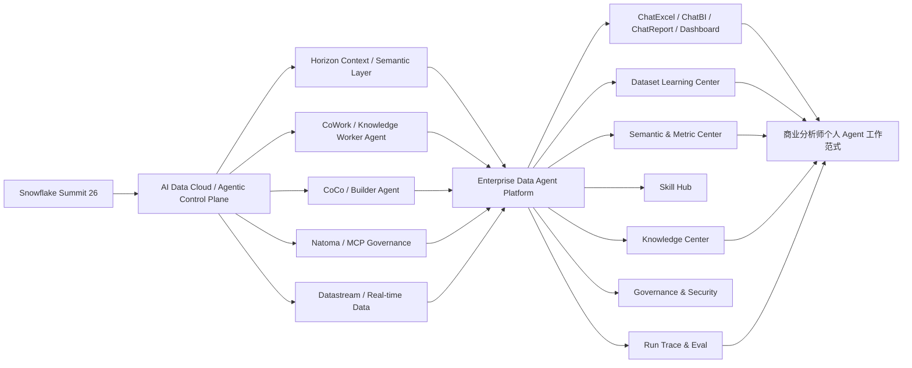

# 万象链接映射

本文件用于把新主题库与当前知识库中已有 Data Agent、DB-GPT、ChatBI、Quick BI、企业分析平台规划文档建立链接。

## 1. 核心主题图谱

## 2. 与已有文件的映射

| 新主题 | 已有知识文件 | 关系 |
|---|---|---|
| Data Agent 不是聊天入口 | [gather/基本共识.md](../../gather/基本共识.md) | 已有 Top 10 共识，作为本报告的平台定义基础 |
| 通用平台能力树 | [gather/能力清单.md](../../gather/能力清单.md) | A1-A13 能力树可直接复用为 Data Agent 平台蓝图 |
| DB-GPT 企业分析平台计划 | [plan/dbgpt-enterprise-analytics-platform-plan.md](../../plan/dbgpt-enterprise-analytics-platform-plan.md) | 提供 DB-GPT、Quick BI 小Q、ChatExcel、ChatReport 的建设拆解 |
| v2.0 需求边界 | [gather/v2/v2.0需求收敛与版本边界.md](../../gather/v2/v2.0需求收敛与版本边界.md) | 对第一阶段双入口、数据集、知识、权限、飞书输出提供边界 |
| v2 迭代方向 | [gather/v2/v2迭代方向.md](../../gather/v2/v2迭代方向.md) | 提供 Dataset Learning、Knowledge Lite、Agent Context Runtime、ChatBI Adapter 路线 |
| 企业 Data Agent 分享稿 | [transsion-enterprise-data-agent-sharing-draft.md](../../transsion-enterprise-data-agent-sharing-draft.md) | 已包含大数据部门从报表交付到分析资产交付的论述 |
| Quick BI 对标与平台建设 | [enterprise-buildups.md](../../enterprise-buildups.md) | 对小Q问数、解读、洞察、报告和 DB-GPT 定位有拆解 |
| ChatExcel 数据集学习方案 | [gather/v1/solution/chat_excel_dataset_learning_solution.md](../../gather/v1/solution/chat_excel_dataset_learning_solution.md) | 可作为 Dataset Learning 的 MVP 来源 |
| ChatBI + DB-GPT 架构决策 | [gather/v1/solution/chatbi_dbgpt_dataset_learning_architecture_decision.md](../../gather/v1/solution/chatbi_dbgpt_dataset_learning_architecture_decision.md) | 支撑“ChatBI 是专业问数引擎，平台管公共资产”的边界 |

## 3. 概念映射

| Snowflake 2026 概念 | 本地 Data Agent 概念 | 解释 |
|---|---|---|
| Horizon Context | Semantic & Metric Center + Knowledge Center | 统一业务上下文，防止 Agent 猜指标 |
| Horizon Catalog | Data Center + Governance | 数据目录、权限、血缘、治理控制面 |
| CoWork | ChatReport / 知识工作者 Agent | 面向业务用户从洞察到行动 |
| CoCo | Builder Agent / Agent Runtime | 面向开发、数据工程、分析构建工作流 |
| Datastream | 实时数据接入 / Data Center | 让 Agent 能使用新鲜数据做实时分析和行动 |
| Natoma MCP Gateway | Tool & Execution Hub + Agent Governance | 控制 Agent 连接工具和执行动作 |
| Cortex Training | Eval Harness + Domain Model Training | 企业专属模型、模拟环境、评测闭环 |
| Auto-gen Agents for Data Shares | Dataset Card + Data Product Agent | 把共享数据变成可对话、可治理的数据产品 |

## 4. 案例链接

- 案例卡：[[专业知识/04-分析师个人Agent工作范式案例]]
- 报告章节：[[完整报告-大数据技术演进与企业数据智能范式迭代#5. 案例引用：商业分析师个人 Agent 工作范式]]
- 原始图片路径：`C:/Users/Administrator/AppData/Roaming/LarkShell-ka-transsion/sdk_storage/df3bfc79b2088f868bdf2405c1e5a589/resources/images/img_v3_0212f_9184584d-1238-4851-97d2-04b6b23ada8g.jpg`

